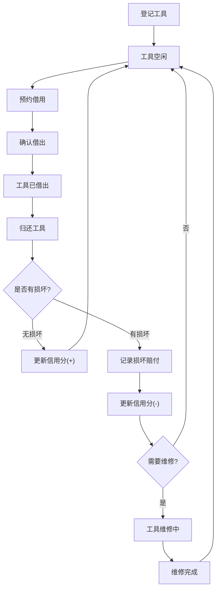

## 1. 产品概述

邻里工具借还柜是一个社区共享工具平台，让小区居民可以互相借用不常用的工具（如电钻、梯子、打气筒、扳手等），减少重复购买、促进邻里互助。

- 解决问题：家庭偶尔需要的工具购买成本高、使用频率低，邻里间缺乏便捷的共享渠道
- 目标用户：小区居民，尤其是需要临时使用工具但不想购买的人群，以及愿意共享闲置工具的热心居民

## 2. 核心功能

### 2.1 用户角色

| 角色 | 注册方式 | 核心权限 |
|------|----------|----------|
| 居民 | 手机号注册 | 登记工具、预约借用、查看统计、信用管理 |

### 2.2 功能模块

1. **首页（工具柜）**：工具柜视觉展示，按状态（空闲/已借出/维修中）分类浏览，快速搜索和筛选
2. **工具登记页**：登记新工具，填写名称、分类、照片、押金、可借时长、取还地点和使用注意事项
3. **工具详情页**：查看工具详情、预约借用、查看借用历史
4. **我的借用页**：管理借出和借入记录，处理归还、逾期提醒
5. **统计页**：最受欢迎工具排行、贡献最多居民排行、工具使用热力图

### 2.3 页面详情

| 页面名称 | 模块名称 | 功能描述 |
|----------|----------|----------|
| 首页 | 工具柜视图 | 网格/柜子式布局展示所有工具，按空闲（绿色）、已借出（橙色）、维修中（红色）分状态标识 |
| 首页 | 搜索与筛选 | 按分类、状态、关键词搜索工具 |
| 首页 | 快捷操作 | 快速登记工具、查看我的借用 |
| 工具登记页 | 基本信息 | 填写工具名称、选择分类（电动工具、手动工具、测量工具、其他） |
| 工具登记页 | 详细信息 | 上传照片、设置押金金额、可借时长、取还地点 |
| 工具登记页 | 注意事项 | 填写使用注意事项和特殊说明 |
| 工具详情页 | 工具信息 | 展示工具完整信息和照片 |
| 工具详情页 | 预约借用 | 选择借用时间段、留言用途说明 |
| 工具详情页 | 借用历史 | 展示该工具的借还记录 |
| 我的借用页 | 借入记录 | 查看自己借入的工具、归还操作、上传归还照片 |
| 我的借用页 | 借出记录 | 查看自己借出的工具、确认归还、记录损坏赔付 |
| 我的借用页 | 信用分 | 展示个人信用分、信用变动记录 |
| 统计页 | 工具排行 | 最受欢迎工具TOP10、按分类统计 |
| 统计页 | 贡献排行 | 贡献工具最多的居民排行 |
| 统计页 | 使用概览 | 工具使用频次、逾期率等数据 |

## 3. 核心流程

**工具借还主流程**：
1. 工具拥有者登记工具 → 工具出现在首页"空闲"状态
2. 借用者浏览首页 → 选择工具 → 预约借用（选时间段、留言用途）
3. 拥有者确认预约 → 工具状态变为"已借出" → 记录借用人、预计归还时间
4. 借用者使用完毕 → 归还时上传工具照片确认状态
5. 如有损坏 → 记录损坏情况、赔付或维修费用
6. 准时归还加分、损坏扣分 → 更新信用分
7. 工具恢复"空闲"状态

## 4. 用户界面设计

### 4.1 设计风格

- **主色调**：暖木色 + 草绿色，营造社区邻里温馨感和工具柜质感
- **辅助色**：状态色 — 空闲(绿)、已借出(琥珀)、维修中(红)、信用金(金色)
- **按钮风格**：圆角矩形，带轻微阴影和hover微动效
- **字体**：标题使用 Noto Serif SC（人文感），正文使用 Noto Sans SC
- **布局风格**：卡片式布局，工具柜网格展示，顶部导航
- **图标风格**：线条式图标(Lucide)，工具类使用实心图标增强辨识度

### 4.2 页面设计概述

| 页面名称 | 模块名称 | UI元素 |
|----------|----------|--------|
| 首页 | 工具柜视图 | 网格卡片，每张卡片含工具图、名称、状态标签、分类标签，状态以色条标识 |
| 首页 | 搜索筛选栏 | 顶部搜索框+分类下拉+状态筛选胶囊按钮 |
| 工具登记页 | 表单 | 分步表单，带图标引导，照片上传区域带预览，地图选点取还地点 |
| 工具详情页 | 详情卡 | 大图轮播、信息标签组、预约日历选择器、用途留言输入 |
| 我的借用页 | 借用列表 | 时间线式布局，每条记录含状态徽章、操作按钮 |
| 统计页 | 排行榜 | 柱状图+头像列表，TOP3用金银铜色标识 |

### 4.3 响应式设计

- 桌面优先设计，大屏4列网格、中屏3列、小屏2列
- 触屏优化：按钮最小44px触控区域，滑动切换分类
- 移动端底部导航栏，桌面端顶部导航

### 4.4 动效设计

- 工具卡片hover浮起效果 + 状态色边框高亮
- 页面切换淡入过渡
- 预约成功时工具卡片翻转动画（空闲→已借出）
- 信用分变化时数字跳动动画
- 统计图表加载时从0增长的动画
