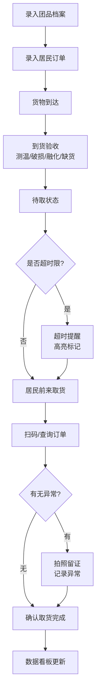

## 1. 产品概述
社区团购冷冻品交接管理系统，解决团长在冻虾、牛排、冰淇淋等冷冻品到货后管理混乱、取货催促遗漏、温度异常无法追溯等问题。
- 目标用户：社区团购团长
- 核心价值：冷冻品全流程可追溯、取货提醒自动化、异常情况可视化、数据看板一目了然

## 2. 核心功能

### 2.1 用户角色
| 角色 | 注册方式 | 核心权限 |
|------|----------|----------|
| 团长 | 无需注册，直接使用 | 全部功能：团品管理、订单录入、到货检查、取货确认、数据看板 |

### 2.2 功能模块
1. **数据看板**：总览待取、超时、温度异常、缺货补偿、各时段取货压力
2. **团品档案**：品名、规格、温区、到货时间、供应商、保温箱编号、照片管理
3. **居民订单**：姓名、手机号后四位、数量、取货时段、是否自带冰袋
4. **到货验收**：箱内温度、破损情况、融化情况、缺货情况记录
5. **取货确认**：扫码/手动确认取货、异常拍照留证
6. **超时提醒**：超过取货时限自动高亮提醒

### 2.3 页面详情
| 页面名称 | 模块名称 | 功能描述 |
|-----------|-------------|---------------------|
| 数据看板 | 统计概览卡片 | 显示待取数量、超时数、温度异常数、缺货补偿金额 |
| 数据看板 | 时段取货压力图 | 柱状图展示各时段取货订单量分布 |
| 数据看板 | 异常订单列表 | 展示超时、温度异常、缺货的订单，快速操作 |
| 团品档案 | 团品列表 | 卡片式展示所有团品，支持搜索筛选 |
| 团品档案 | 团品表单 | 新增/编辑团品：品名、规格、温区（冷冻/冷藏/常温）、到货时间、供应商、保温箱编号、照片上传 |
| 居民订单 | 订单列表 | 按团品分组展示订单，显示取货状态 |
| 居民订单 | 订单表单 | 新增/编辑订单：姓名、手机号后四位、数量、取货时段、是否自带冰袋 |
| 到货验收 | 验收列表 | 展示各保温箱验收状态 |
| 到货验收 | 验收表单 | 记录箱内温度、破损、融化、缺货情况，支持拍照 |
| 取货确认 | 取货扫描 | 输入/扫描订单编号或手机号查询订单 |
| 取货确认 | 取货详情 | 显示订单信息，确认取货，异常情况拍照留证 |

## 3. 核心流程
团长录入团品档案 → 录入居民订单 → 货物到达后进行到货验收（测温、检查破损/融化/缺货）→ 系统监控取货时限 → 居民取货时扫码确认 → 异常情况拍照留证 → 数据看板实时更新统计

## 4. 用户界面设计
### 4.1 设计风格
- **主色调**：冷色系深蓝(#0F172A) + 冷链蓝(#0EA5E9)，传达低温、专业、可信赖的感觉
- **辅助色**：温度警告橙(#F59E0B)、异常红色(#EF4444)、成功绿色(#10B981)
- **按钮风格**：圆角矩形，微立体阴影，hover状态上浮效果
- **字体**：展示字体用具有科技感的窄体无衬线，正文用清晰易读的无衬线字体
- **布局风格**：左侧导航栏 + 右侧内容区，卡片式布局，数据网格
- **图标风格**：使用lucide-react线性图标，配合温度、冷链、箱子等主题元素

### 4.2 页面设计概述
| 页面名称 | 模块名称 | UI元素 |
|-----------|-------------|-------------|
| 数据看板 | 统计概览卡片 | 深色渐变背景卡片、大号数字、趋势箭头、图标装饰 |
| 数据看板 | 时段压力图 | 彩色柱状图、hover显示详情、动画加载 |
| 数据看板 | 异常列表 | 条纹行、状态标签色、快速操作按钮 |
| 团品档案 | 团品卡片 | 图片缩略图、温区色标、状态徽章 |
| 团品档案 | 表单弹窗 | 毛玻璃背景、分步表单、图片预览 |
| 取货确认 | 扫描界面 | 大输入框、扫描动画、结果高亮显示 |

### 4.3 响应式
桌面端优先设计，平板端自适应布局，移动端导航折叠为底部tab栏，表格转为卡片列表展示。

### 4.4 视觉特效
- 页面加载时数字滚动动画
- 状态变化时卡片高亮闪烁
- 温度异常时脉冲警告动画
- 取货确认成功时的打勾动画
