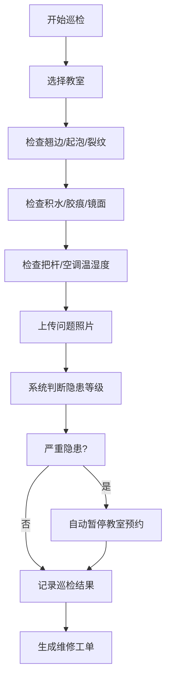
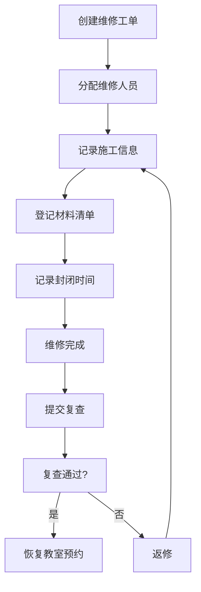

## 1. 产品概述

舞蹈教室地胶巡检管理系统，用于管理舞蹈教室地胶的日常巡检、问题上报、维修跟踪和数据看板。系统解决地胶翘边、起泡、积水等安全隐患导致学生滑倒的问题，通过规范化巡检流程和自动预警机制，保障舞蹈教学安全。

- 目标用户：舞蹈老师、社团负责人、后勤维修人员、管理员
- 核心价值：规范化巡检流程、自动预警严重隐患、跟踪维修进度、延长地胶使用寿命

## 2. 核心功能

### 2.1 用户角色

| 角色 | 登录方式 | 核心权限 |
|------|---------|---------|
| 管理员 | 账号登录 | 教室档案管理、巡检分配、维修审核、数据看板 |
| 老师/社团负责人 | 账号登录 | 提交巡检记录、上报问题照片、查看维修进度 |
| 维修人员 | 账号登录 | 查看维修任务、更新维修记录、提交复查结果 |

### 2.2 功能模块

1. **数据看板**：待巡检统计、停用教室、重复隐患、课程受影响、地胶寿命提醒
2. **教室档案**：楼层、面积、地胶品牌、安装日期、使用社团、照片管理
3. **巡检管理**：8项巡检指标、问题照片上传、严重隐患自动暂停预约
4. **维修管理**：施工人、材料、封闭时间、复查结果记录
5. **预约管理**：教室预约状态控制、自动暂停/恢复

### 2.3 页面详情

| 页面名称 | 模块名称 | 功能描述 |
|---------|---------|---------|
| 数据看板 | 统计卡片 | 待巡检数、停用数、重复隐患、课程受影响、寿命提醒 |
| 数据看板 | 隐患分布图 | 按教室/楼层展示隐患分布 |
| 数据看板 | 近期动态 | 最新巡检、维修记录时间线 |
| 教室档案 | 教室列表 | 卡片式展示所有教室，支持筛选搜索 |
| 教室档案 | 教室详情 | 档案信息、照片轮播、巡检历史、维修记录 |
| 教室档案 | 档案编辑 | 新增/编辑教室档案信息 |
| 巡检管理 | 巡检列表 | 按日期/状态筛选巡检记录 |
| 巡检管理 | 巡检表单 | 8项巡检评分、问题描述、照片上传 |
| 维修管理 | 维修列表 | 待维修、维修中、已完成分类展示 |
| 维修管理 | 维修详情 | 施工信息、材料清单、封闭时间、复查结果 |

## 3. 核心流程

### 3.1 巡检流程

巡检人员进入巡检页面，选择教室后逐项检查8项指标（翘边、起泡、裂纹、积水、胶痕、镜面、把杆、空调温湿度），对异常项拍摄照片并描述问题。系统自动判断隐患等级，严重隐患自动触发教室预约暂停。

### 3.2 维修流程

维修人员接单后记录施工信息和材料，维修完成后提交复查申请，由巡检人员复查确认后恢复教室预约。

## 4. 用户界面设计

### 4.1 设计风格

- 主色调：深青色（#0D9488），专业安全的视觉感受
- 辅助色：琥珀色（#F59E0B）用于预警，玫红色（#E11D48）用于严重警告
- 中性色：石板灰系列，保证信息可读性
- 按钮风格：圆角8px，悬停轻微上浮效果
- 字体：思源黑体 + Lora 标题字体，专业稳重
- 布局：左侧导航 + 顶部状态栏 + 主内容区
- 图标：Lucide 线性图标，简约现代

### 4.2 页面设计概览

| 页面名称 | 模块名称 | UI元素 |
|---------|---------|-------|
| 数据看板 | 统计卡片 | 渐变背景卡片、数字动画、状态标签 |
| 数据看板 | 隐患分布 | 热力图样式、楼层切换、悬浮提示 |
| 教室档案 | 教室卡片 | 封面图、状态角标、关键信息网格 |
| 巡检表单 | 巡检项 | 图标+状态切换、评分滑块、照片上传区 |
| 维修详情 | 时间线 | 垂直时间线、状态节点、操作按钮 |

### 4.3 响应式

- 桌面端优先设计，1440px 基准宽度
- 平板端（768-1024px）：侧边栏折叠为图标导航
- 移动端（<768px）：底部Tab导航，卡片单列布局
- 巡检表单支持触屏操作，增大点击区域

### 4.4 动效与交互

- 页面加载：卡片渐入+上移动画，错落延迟
- 状态切换：平滑过渡动画
- 悬停效果：卡片轻微上浮、阴影加深
- 数据变化：数字滚动动画
- 危险操作：确认弹窗 + 红色警示
