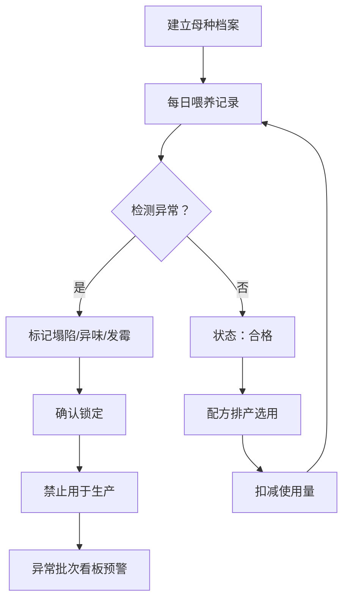
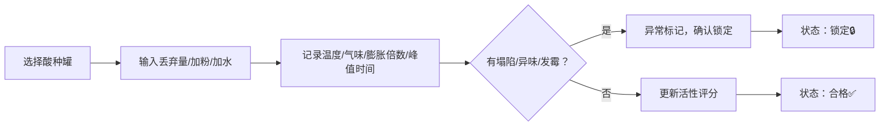

## 1. 产品概述

酸种喂养记录系统，为面包店后厨提供专业的酸种（天然酵母）全生命周期管理。解决酸种状态漂移导致整批欧包失败的问题，通过数字化记录、异常预警和生产管控，保障面包品质稳定。

- 核心目标：建立酸种档案、追踪喂养过程、锁定异常批次、规范生产使用
- 目标用户：面包店后厨师傅、生产主管、质量管理人员

## 2. 核心特性

### 2.1 用户角色

| 角色 | 注册方式 | 核心权限 |
|------|----------|----------|
| 后厨师傅 | 系统账号 | 记录喂养、查看看板、执行排产 |
| 生产主管 | 系统账号 | 管理母种档案、审批异常、查看报表 |
| 质量管理员 | 系统账号 | 质检锁定、异常追溯 |

### 2.2 功能模块

1. **看板总览**：今日待喂提醒、活性趋势、异常批次、受影响订单
2. **母种档案**：新建/编辑母种信息、照片上传、状态管理
3. **喂养记录**：记录每次喂养参数、自动计算活性、异常标记
4. **配方排产**：选择合格酸种、自动扣减用量、关联生产订单
5. **异常管理**：状态锁定/解锁、异常原因记录、影响分析

### 2.3 页面详情

| 页面名称 | 模块名称 | 功能描述 |
|----------|----------|----------|
| 看板总览 | 今日待喂 | 展示今日需要喂养的酸种列表，一键跳转喂养 |
| 看板总览 | 活性趋势 | 7天/30天酸种活性折线图，展示膨胀倍数趋势 |
| 看板总览 | 异常批次 | 高亮显示锁定状态的异常酸种，标注原因 |
| 看板总览 | 受影响订单 | 关联异常酸种的面包订单，提醒处理 |
| 母种档案 | 档案列表 | 卡片展示所有酸种，状态标签区分合格/锁定/冷藏 |
| 母种档案 | 新建档案 | 录入面粉类型、水粉比、容器、储存方式、建立日期、照片 |
| 母种档案 | 档案详情 | 查看历史喂养记录、活性曲线、当前状态 |
| 喂养记录 | 快速喂养 | 记录丢弃量、加粉、加水、温度、气味、膨胀倍数、峰值时间 |
| 喂养记录 | 异常检测 | 塌陷/异味/发霉自动标记，确认后锁定酸种 |
| 配方排产 | 排产列表 | 查看今日生产计划，关联可用酸种 |
| 配方排产 | 新建排产 | 选择合格酸种、录入使用量、自动扣减库存 |
| 异常管理 | 锁定管理 | 异常酸种锁定/解锁、原因记录、追溯历史 |

## 3. 核心流程

### 3.1 主业务流程

建立母种档案 → 定期喂养记录 → 系统检测异常 → 确认异常锁定 → 排产选择合格酸种 → 扣减使用量

### 3.2 喂养记录流程

选择酸种 → 记录喂养参数 → 系统计算活性 → 标记异常特征 → 保存记录 → 更新状态

## 4. 用户界面设计

### 4.1 设计风格

- **主色调**：暖棕色 `#8B5A2B`（面包烘焙感）、小麦金 `#DAA520`、奶油白 `#FFF8E7`
- **辅助色**：合格绿 `#52C41A`、警告橙 `#FA8C16`、危险红 `#F5222D`、锁定灰 `#8C8C8C`
- **按钮风格**：圆角 8px，微渐变背景，悬停轻微上浮
- **字体**：标题用「思源宋体 Bold」（手工温度感），正文用「Inter Regular」
- **布局风格**：卡片式布局，柔和阴影，自然纹理背景
- **图标风格**：面包、小麦、罐子、温度计等烘焙相关 emoji 和线性图标

### 4.2 页面设计概述

| 页面名称 | 模块名称 | UI元素 |
|----------|----------|--------|
| 看板总览 | 顶部统计 | 4个数据卡片：酸种总数、合格数、异常数、今日待喂 |
| 看板总览 | 今日待喂 | 横向滚动卡片，展示待喂酸种，倒计时提醒 |
| 看板总览 | 活性趋势 | 多折线图表，不同颜色区分各罐酸种 |
| 看板总览 | 异常批次 | 红色边框卡片，锁定图标，关联订单号 |
| 母种档案 | 档案卡片 | 照片预览、状态标签、核心参数、喂养周期 |
| 喂养记录 | 表单区域 | 大数字输入框、滑块记录膨胀倍数、气味标签选择 |
| 喂养记录 | 异常标记 | 醒目红色开关，确认弹窗二次提醒 |
| 配方排产 | 排产表 | 甘特图风格，拖拽分配酸种到订单 |

### 4.3 响应式设计

- **桌面端**（≥1280px）：4列网格布局，完整数据展示
- **平板端**（≥768px）：2列网格，精简次要信息
- **移动端**（<768px）：单列堆叠，底部导航，核心操作优先

### 4.4 微交互设计

- 页面加载：卡片错峰淡入（animation-delay 递增）
- 喂养完成：成功动画（小麦发芽效果）
- 异常锁定：震动反馈 + 红色锁定图标动画
- 数值输入：实时计算活性评分并展示
- 状态变更：平滑过渡动画（0.3s ease）
