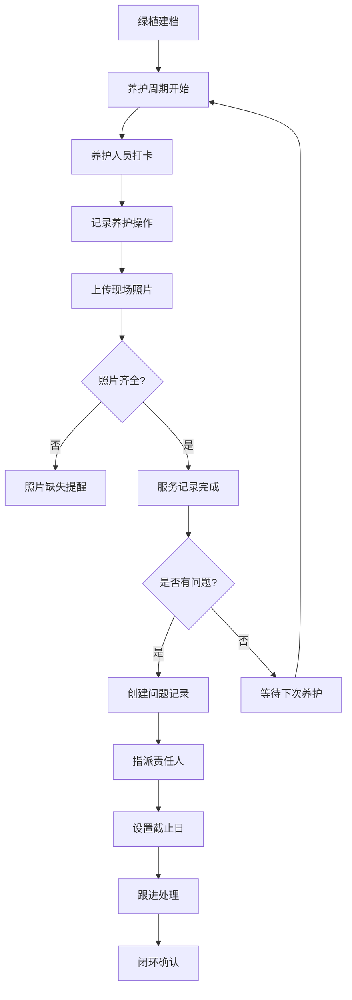

## 1. 产品概述

办公室绿植养护管理系统，用于解决行政部门验收绿植养护服务困难的问题。系统为每盆绿植建立档案，记录养护服务全过程，追踪问题绿植，并提供数据统计分析。

- 目标用户：行政管理人员、绿植养护服务人员
- 核心价值：服务过程可视化、问题责任明确化、养护数据可追溯

## 2. 核心功能

### 2.1 用户角色

| 角色 | 注册方式 | 核心权限 |
|------|----------|----------|
| 行政管理员 | 系统预设 | 绿植档案管理、查看所有记录、统计分析、问题指派 |
| 养护人员 | 系统预设 | 打卡签到、提交养护记录、上传现场照片 |

### 2.2 功能模块

1. **绿植档案页**：绿植列表展示、新增/编辑绿植档案、照片上传、查看养护历史
2. **服务记录页**：养护人员打卡、记录养护操作（浇水/修剪/施肥/换盆/病虫处理）、上传现场照片
3. **问题追踪页**：问题绿植列表、责任归属、处理截止日、闭环状态
4. **统计报表页**：月度服务次数、枯黄最多位置、供应商响应时长、未闭环问题统计

### 2.3 页面详情

| 页面名称 | 模块名称 | 功能描述 |
|----------|----------|----------|
| 绿植档案页 | 绿植列表 | 卡片式展示所有绿植，支持按位置/品种/状态筛选 |
| 绿植档案页 | 档案表单 | 录入位置、品种、盆径、供应商、养护频率、照片 |
| 绿植档案页 | 养护历史 | 时间线展示该绿植的所有养护记录 |
| 服务记录页 | 打卡签到 | 选择到场绿植，记录时间、人员信息 |
| 服务记录页 | 养护操作 | 勾选养护类型（浇水/修剪/施肥/换盆/病虫处理）、填写备注 |
| 服务记录页 | 照片上传 | 上传现场照片，每张对应养护操作 |
| 问题追踪页 | 问题列表 | 展示所有问题绿植，按紧急程度排序 |
| 问题追踪页 | 问题处理 | 指派责任人、设置截止日、记录处理过程 |
| 问题追踪页 | 提醒中心 | 漏服务提醒、照片缺失提醒、即将逾期提醒 |
| 统计报表页 | 服务统计 | 月度服务次数柱状图、按供应商统计 |
| 统计报表页 | 问题统计 | 枯黄位置排行、供应商响应时长、未闭环问题看板 |

## 3. 核心流程

### 3.1 绿植建档流程
行政管理员录入绿植基本信息 → 上传绿植照片 → 关联供应商与养护频率 → 档案生效

### 3.2 养护服务流程
养护人员到场签到 → 选择服务绿植 → 记录养护操作类型 → 上传现场照片 → 提交记录 → 系统自动检查照片完整性

### 3.3 问题处理流程
发现绿植问题 → 创建问题记录 → 指派责任归属 → 设置处理截止日 → 跟进处理进度 → 闭环确认

## 4. 用户界面设计

### 4.1 设计风格
- **主色调**：森绿色 `#2D5A27`（自然、生命感）搭配苔藓绿 `#6B8E4E`
- **辅助色**：米色 `#F5F1E8`（温暖、自然）、琥珀橙 `#D97706`（警告标识）
- **按钮风格**：圆角胶囊按钮，悬停时轻微上浮 + 阴影加深
- **字体**：标题使用 "Noto Serif SC"（典雅衬线），正文使用 "Noto Sans SC"（清晰易读）
- **布局风格**：卡片式布局，柔和阴影，大量留白
- **图标风格**：Lucide 线性图标，统一 24px 尺寸

### 4.2 页面设计概览

| 页面名称 | 模块名称 | UI 元素 |
|----------|----------|---------|
| 绿植档案页 | 绿植卡片 | 圆角卡片、绿植照片缩略图、状态标签（健康/警告/问题）、悬浮展开详情 |
| 服务记录页 | 打卡面板 | 大型签到按钮、时间显示、绿植选择列表、操作复选框组 |
| 问题追踪页 | 问题看板 | 三栏看板（待处理/处理中/已闭环）、优先级色标、倒计时显示 |
| 统计报表页 | 图表区域 | 柱状图、排行列表、数据卡片、数据筛选器 |

### 4.3 响应式
- 桌面端优先设计（1280px 起步）
- 平板端（768px）：卡片网格从 3 列调整为 2 列
- 移动端（375px）：单列布局，底部导航栏替代顶部侧边栏
