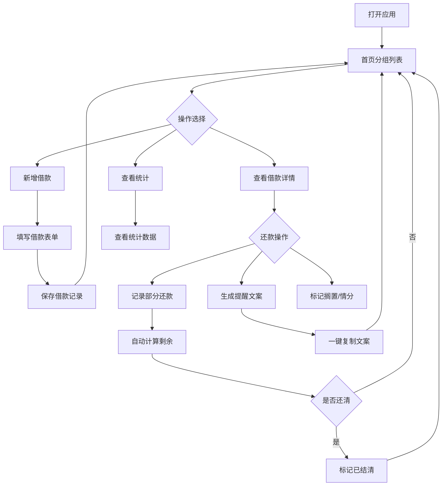

## 1. 产品概述
亲友借钱还款备忘录——专为日常亲友间借贷场景设计的小工具。借出去几百几千不用尴尬，记录清楚、提醒到位、催收不伤感情。
- 解决亲友间借款易忘、催还尴尬、账目混乱的痛点
- 目标用户：经常有亲友间资金往来的普通用户

## 2. 核心功能

### 2.1 用户角色
| 角色 | 注册方式 | 核心权限 |
|------|----------|----------|
| 普通用户 | 无需注册，本地使用 | 记录借款、还款、查看统计 |

### 2.2 功能模块
1. **首页**：借款分组列表（快到期/已逾期/分期还款/已结清）、快捷操作入口
2. **新增借款页**：填写借款详情表单
3. **借款详情页**：还款记录、提醒操作、状态管理
4. **统计页**：借出总额、逾期金额、已收回金额、最长拖欠天数

### 2.3 页面详情
| 页面名称 | 模块名称 | 功能描述 |
|----------|----------|----------|
| 首页 | 分组列表 | 按快到期（3天内）、已逾期、分期还款、已结清四组展示借款卡片，支持搁置标记 |
| 首页 | 快捷入口 | 新增借款按钮，搜索筛选 |
| 新增借款页 | 借款表单 | 填写对方姓名、金额、借出日期、约定还款日、用途、转账截图标记、备注 |
| 借款详情页 | 基本信息 | 显示借款完整信息，状态标签 |
| 借款详情页 | 还款记录 | 每次还款记录金额、时间、凭证；支持部分还款，自动计算剩余金额 |
| 借款详情页 | 温和提醒 | 生成温和提醒文案，一键复制发给对方；支持搁置（不想提醒的先放一边） |
| 借款详情页 | 情分标记 | 标记亲友情分等级（挚友/普通/疏远），影响提醒策略 |
| 统计页 | 数据总览 | 借出总额、逾期金额、已收回金额、最长拖欠天数 |
| 统计页 | 趋势图表 | 按月展示借出/收回趋势 |

## 3. 核心流程

用户打开应用 → 首页查看各分组借款情况 → 点击"新增借款"填写信息 → 保存后自动归入对应分组 → 到期前可生成温和提醒文案一键复制 → 对方部分还款后记录金额，自动算剩余 → 全部还清后自动标记为已结清 → 统计页查看整体数据

## 4. 用户界面设计

### 4.1 设计风格
- 主色调：暖杏色 (#E8A87C) + 深棕 (#4A3728)，传达温暖、亲近感
- 辅助色：柔绿 (#7BC47F) 表示正常/已结清，柔红 (#E07A6A) 表示逾期/提醒
- 按钮风格：圆角柔和，带轻微阴影，手感温暖
- 字体：标题使用"霞鹜文楷"风格衬线体，正文使用简洁无衬线体
- 布局：卡片式布局，顶部导航，底部标签栏
- 图标：线性图标风格，搭配少量手绘感装饰
- 整体氛围：手账/备忘录风格，带纸张纹理背景，圆角卡片带微妙阴影

### 4.2 页面设计概览
| 页面名称 | 模块名称 | UI元素 |
|----------|----------|--------|
| 首页 | 分组列表 | 四个可折叠分组卡片，每组有颜色标识和数量角标；借款卡片显示姓名、金额、到期日、状态标签 |
| 首页 | 快捷入口 | 底部悬浮"+"按钮，暖杏色圆形，点击展开表单 |
| 新增借款页 | 借款表单 | 分段式表单，输入框带图标前缀，日期选择器，转账截图开关，备注文本域 |
| 借款详情页 | 信息卡片 | 顶部大卡片展示借款信息和状态；下方还款时间线 |
| 借款详情页 | 提醒区域 | 气泡样式提醒文案预览，复制按钮，搁置开关 |
| 统计页 | 数据卡片 | 四宫格统计卡片，带数字动画；下方柱状图展示趋势 |

### 4.3 响应式设计
- 移动优先设计，适配手机竖屏为主
- 桌面端使用居中容器（最大宽度 480px），模拟备忘录效果
- 触控优化：按钮最小 44px 点击区域，滑动操作支持

### 4.4 温和提醒文案风格
- 挚友："嗨~上次借你的那笔钱，方便的时候还一下就行，不急~"
- 普通："你好，上次借你的那笔钱，最近如果方便的话可以转我一下吗？"
- 疏远："你好，之前借你的款项，麻烦在方便时安排一下还款，谢谢。"
- 逾期加急："嘿，那笔借款已经超期了哦，最近手头有点紧，方便的话尽快处理一下呗~"
