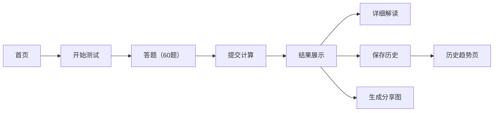

## 1. 产品概述

MBTI 十六型人格测试网页应用，提供沉浸式的性格测评体验，帮助用户探索自我性格类型。通过动画视觉效果、交互式答题、数据可视化分析，让性格测试变得有趣且有深度。

- 目标用户：对性格心理学感兴趣的年轻用户、职场人士、学生群体
- 产品价值：提供专业且有趣的 MBTI 测评，支持历史追踪和社交分享

## 2. 核心功能

### 2.1 用户角色
| 角色 | 注册方式 | 核心权限 |
|------|----------|----------|
| 普通用户 | 无需注册，本地存储 | 完成测试、查看结果、保存历史、生成分享图 |

### 2.2 功能模块
1. **首页**：动画背景、MBTI 介绍、16 种人格类型预览卡片
2. **测试页**：60 道场景题、4 选项选择、强度滑块调节、进度指示
3. **结果页**：四字人格代码、四维强度百分比、雷达图可视化
4. **解读页**：性格特点详解、适合职业推荐、名人代表、性格配对分析
5. **历史页**：多次测试记录、维度变化趋势折线图
6. **分享功能**：朋友圈风格分享卡片生成、图片下载

### 2.3 页面详情
| 页面名称 | 模块名称 | 功能描述 |
|----------|----------|----------|
| 首页 | 动态背景 | 粒子动画 + 渐变流动效果，营造科技神秘感 |
| 首页 | MBTI 介绍 | 简洁动画文字介绍 MBTI 起源和四个维度 |
| 首页 | 16 型卡片 | 网格布局展示 16 种人格类型，悬停动效 |
| 测试页 | 答题区 | 场景描述 + 4 选项按钮 + 强度滑块双模式 |
| 测试页 | 进度条 | 实时显示答题进度，支持上下题导航 |
| 结果页 | 人格展示 | 大字号四字代码 + 类型名称 + 一句话标签 |
| 结果页 | 雷达图 | 四维八面雷达图展示各维度强度 |
| 结果页 | 维度条 | 四个维度的百分比进度条动画 |
| 解读页 | 性格特点 | 分点详细描述该类型的核心特质 |
| 解读页 | 职业推荐 | 适配该性格的职业列表和原因说明 |
| 解读页 | 名人代表 | 展示同类型名人头像和简介 |
| 解读页 | 配对分析 | 最佳匹配、一般匹配、需磨合的类型展示 |
| 历史页 | 测试记录 | 时间线展示历次测试结果 |
| 历史页 | 趋势图 | 折线图展示四个维度随时间的变化 |
| 分享弹窗 | 卡片生成 | 自动生成精美分享卡片，支持下载保存 |

## 3. 核心流程

用户进入首页 → 浏览 16 型人格预览 → 点击开始测试 → 逐题作答（60 题）→ 提交答案 → 计算人格类型 → 展示结果（雷达图 + 百分比）→ 查看详细解读 → 可保存到历史记录 → 生成分享图片下载

## 4. 用户界面设计

### 4.1 设计风格
- **主色调**：深邃紫蓝渐变（#1a1a2e → #16213e → #0f3460），营造神秘心理学氛围
- **强调色**：霓虹紫 (#e94560)、电光蓝 (#00d9ff)、荧光绿 (#00ff88) 用于数据高亮
- **按钮风格**：圆角胶囊按钮，发光 hover 效果，点击缩放动效
- **字体**：标题使用有设计感的无衬线字体（Orbitron/Exo 2），正文使用现代无衬线
- **布局风格**：卡片式设计 + 毛玻璃效果 + 深色模式
- **图标/emoji**：使用 Lucide 线性图标，配合 emoji 增强趣味性

### 4.2 页面设计概览
| 页面名称 | 模块名称 | UI 元素 |
|----------|----------|---------|
| 首页 | Hero 区 | 大标题渐入动画、粒子背景、发光按钮 |
| 首页 | 16 型卡片 | 3D 翻转悬停、渐变边框、类型代码醒目展示 |
| 测试页 | 答题卡 | 场景描述高亮、选项按钮排开、滑块顺滑拖动 |
| 结果页 | 雷达图 | 动画绘制、渐变填充、发光数据点 |
| 结果页 | 维度条 | 进度条渐变填充、数字滚动动画 |
| 分享卡 | 分享图 | 圆角卡片、背景渐变、二维码占位、可下载 |

### 4.3 响应式
- 桌面端优先设计，适配平板和移动端
- 移动端卡片单列布局，触控区域优化
- 滑块和按钮在移动端增大触控面积

### 4.4 动效设计
- 页面切换：淡入淡出 + 轻微位移动画
- 答题进度：平滑进度条动画
- 结果展示：雷达图逐圈绘制、数字滚动计数
- 卡片悬停：轻微上浮 + 发光边框 + 3D 倾斜
- 背景：粒子系统缓慢流动、渐变色彩缓慢呼吸
