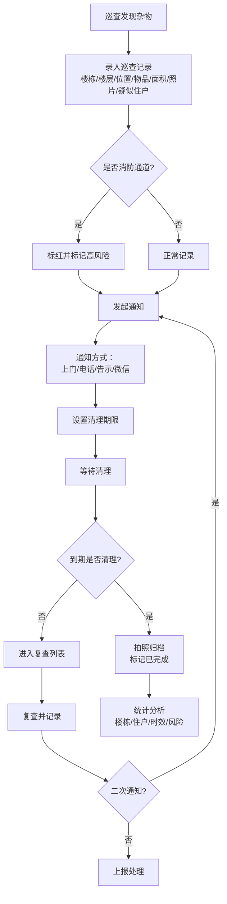

## 1. 产品概述

楼道杂物清理看板系统是一套面向物业管理人员的杂物巡查与清理跟踪工具，解决楼道纸箱、旧花盆、儿童车等杂物堆放无人管理的问题，实现从巡查发现、通知处理、复查跟踪到清理归档的全流程闭环管理。

- 核心目标：提升楼道杂物清理效率，消除消防通道安全隐患
- 目标用户：物业巡查人员、物业管理员、消防安全负责人
- 核心价值：可视化跟踪每处杂物的处理进度，量化清理成效，识别高风险点位

## 2. 核心功能

### 2.1 用户角色

| 角色 | 使用场景 | 核心权限 |
|------|----------|----------|
| 物业巡查员 | 日常楼道巡查、记录杂物、拍照留证 | 新增/编辑巡查记录、上传照片、发起通知 |
| 物业管理员 | 查看整体情况、分配任务、审核清理结果 | 全部操作权限、数据统计与导出 |
| 消防安全负责人 | 关注消防通道、高风险点位 | 查看消防通道相关记录、风险报表 |

### 2.2 功能模块

1. **总览看板**：数据概览卡片、高风险点位、待处理列表、消防通道标红提醒
2. **巡查记录**：巡查列表、新增/编辑巡查、照片上传、详细信息查看
3. **通知管理**：通知记录、通知方式跟踪、期限管理、反馈记录
4. **复查列表**：超期未清理自动进入、复查状态跟踪、二次通知
5. **统计分析**：各楼栋未处理数量、重复堆放住户排行、平均清理天数、高风险点位地图

### 2.3 页面详情

| 页面名称 | 模块名称 | 功能描述 |
|----------|----------|----------|
| 总览看板 | 数据概览卡片 | 展示总巡查数、待处理数、已清理数、超期数、消防通道遮挡数 |
| 总览看板 | 高风险点位 | 显示消防通道遮挡、重复堆放等高危记录，红色醒目标记 |
| 总览看板 | 待处理列表 | 按紧急程度排序的待处理巡查记录摘要 |
| 总览看板 | 楼栋分布图 | 各楼栋未处理数量柱状图 |
| 巡查记录 | 筛选栏 | 按楼栋、楼层、状态、物品类型筛选 |
| 巡查记录 | 列表展示 | 卡片式列表，显示照片缩略图、位置、状态、疑似住户 |
| 巡查记录 | 新增/编辑表单 | 楼栋、楼层、位置、物品类型、占用面积、照片、疑似住户、是否消防通道 |
| 巡查记录 | 详情弹窗 | 完整信息展示、处理时间线、操作按钮 |
| 通知管理 | 通知列表 | 按通知状态筛选，显示通知方式、期限、联系人、反馈 |
| 通知管理 | 发起通知 | 选择巡查记录、填写通知方式、期限、联系人信息 |
| 通知管理 | 反馈记录 | 记录住户反馈内容、时间、态度 |
| 复查列表 | 超期列表 | 自动列出超过通知期限仍未清理的记录 |
| 复查列表 | 复查操作 | 标记已复查、记录复查结果、发起二次通知 |
| 统计分析 | 楼栋统计 | 每栋楼未处理数量柱状图 |
| 统计分析 | 重复住户 | 重复堆放住户排行及次数 |
| 统计分析 | 清理时效 | 平均清理天数、各状态时长分布 |
| 统计分析 | 高风险点位 | 高频出现杂物的位置列表及风险等级 |

## 3. 核心流程

巡查人员在楼道发现杂物后，通过系统记录巡查信息（含照片），选择通知方式并设置清理期限，住户收到通知后进行清理或反馈。系统自动跟踪期限，超期未清理自动进入复查列表。清理完成后拍照归档，系统自动统计各维度数据。

## 4. 用户界面设计

### 4.1 设计风格

- **主色调**：沉稳的深蓝（#1e3a5f）作为主色，体现专业和可信
- **强调色**：消防红（#e53935）用于消防通道和高风险标记，警示作用突出
- **辅助色**：成功绿（#43a047）表示已清理，警告橙（#fb8c00）表示即将到期
- **背景**：浅灰渐变背景，卡片使用白色带微阴影
- **字体**：中文使用「思源黑体」风格，标题加粗，正文清晰易读
- **布局**：左侧导航栏 + 顶部标题栏 + 主内容区的经典管理后台布局
- **卡片风格**：圆角8px，轻微投影，悬停时阴影加深
- **图标风格**：线性图标，简洁统一，与文字搭配使用

### 4.2 页面设计概览

| 页面名称 | 模块名称 | UI 元素 |
|----------|----------|---------|
| 总览看板 | 数据概览卡片 | 5个彩色数据卡片，大数字+趋势小箭头，图标在左 |
| 总览看板 | 高风险点位 | 红色边框卡片，闪烁红点，优先展示 |
| 总览看板 | 待处理列表 | 横向时间线样式，状态标签颜色区分 |
| 总览看板 | 楼栋分布图 | 横向条形图，按数量降序排列 |
| 巡查记录 | 筛选栏 | 下拉选择器 + 搜索框，紧凑排列 |
| 巡查记录 | 列表卡片 | 左图右文布局，状态标签在右上角 |
| 巡查记录 | 表单弹窗 | 分两列布局，照片上传区显眼 |
| 通知管理 | 通知列表 | 表格布局，含进度条显示剩余期限 |
| 统计分析 | 图表区域 | 卡片式图表容器，标题+图表+数据说明 |

### 4.3 响应式

- Desktop-first 设计，适配 1440px 及以上主流分辨率
- 平板端（≥768px）侧边栏收起为图标模式，内容区自适应
- 移动端（<768px）顶部导航展开为汉堡菜单，卡片改为单列堆叠
- 触摸操作优化：按钮最小高度 44px，列表项可点击区域充足

### 4.4 交互细节

- 页面加载时数据卡片数字从0滚动到目标值，带动效
- 状态切换有平滑过渡动画
- 消防通道标记有脉冲动画效果，吸引注意
- 表格行悬停高亮，点击展开详情
- 表单提交后有成功提示动效
