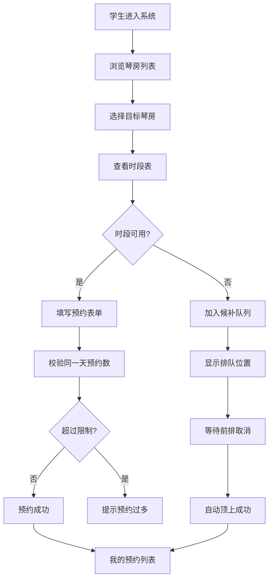

## 1. 产品概述

艺术楼琴房预约管理系统，解决学生排队预约琴房混乱的问题，实现琴房信息化管理、在线预约、自动候补和数据统计。

- 主要目的：解决琴房预约靠群里喊的混乱现状，实现规范化管理
- 目标用户：学生（预约琴房）、老师（管理琴房状态）、管理员（系统配置与数据统计）
- 核心价值：提升琴房使用效率，减少资源浪费，提供数据决策支持

## 2. 核心 Features

### 2.1 用户角色

| 角色 | 登录方式 | 核心权限 |
|------|----------|----------|
| 学生 | 选择身份登录 | 浏览琴房、预约时段、查看候补、取消预约 |
| 老师 | 选择身份登录 | 标记琴房维修、标记暂不可用、查看统计看板 |
| 管理员 | 选择身份登录 | 琴房信息录入与编辑、所有功能权限 |

### 2.2 Feature Module

1. **琴房列表页**：琴房卡片展示、筛选（楼层/钢琴类型/可用性）、琴房详情
2. **预约管理页**：时段选择、预约表单、我的预约、候补队列展示
3. **琴房管理页**：琴房信息录入、编辑、维修状态管理
4. **统计看板页**：利用率统计、爽约记录、热门时段分析

### 2.3 Page Details

| 页面名称 | 模块名称 | Feature Description |
|----------|----------|---------------------|
| 琴房列表页 | 顶部导航 | 身份切换、页面切换（琴房/预约/管理/看板） |
| 琴房列表页 | 筛选区 | 楼层筛选、钢琴类型筛选、可用性筛选 |
| 琴房列表页 | 琴房卡片 | 照片、编号、楼层、钢琴类型、谱架标识、状态标签、今日时段 |
| 琴房列表页 | 琴房详情弹窗 | 完整信息、一周时段表、预约按钮 |
| 预约管理页 | 时段选择器 | 日期切换、时段网格、已约/可约/候补状态 |
| 预约管理页 | 预约表单 | 姓名、专业、练习目的、手机号、提交校验 |
| 预约管理页 | 我的预约列表 | 预约信息、状态标签、取消按钮 |
| 预约管理页 | 候补队列 | 排队序号、学生信息、预计等待时长 |
| 琴房管理页 | 琴房表单 | 编号、钢琴类型、可用时段、楼层、谱架、照片上传 |
| 琴房管理页 | 状态管理 | 维修标记、暂不可用标记、恢复可用 |
| 统计看板页 | 利用率卡片 | 每间琴房利用率、趋势图 |
| 统计看板页 | 爽约记录 | 爽约学生列表、爽约次数 |
| 统计看板页 | 时段热度 | 最拥挤时间段柱状图、热力分布 |

## 3. Core Process

### 3.1 预约流程

学生选择琴房 → 查看可用时段 → 选择时段 → 填写预约信息 → 系统校验（同一天预约限制）→ 预约成功 / 进入候补队列 → 预约确认

### 3.2 候补流程

时段已满 → 学生选择候补 → 进入候补队列 → 前排用户取消 → 自动顺延通知 → 候补成功 / 超时取消

### 3.3 管理流程

老师选择琴房 → 标记维修/暂不可用 → 填写原因 → 状态更新 → 该时段所有预约自动取消并通知 → 维修完成后恢复可用

## 4. User Interface Design

### 4.1 设计风格

采用「简约优雅的学院风」设计，贴合艺术楼的文化氛围：
- 主色调：深胡桃木色 #5D4037（木质钢琴质感）
- 辅助色：金色 #FFD54F（琴键装饰、重点强调）
- 背景色：米白色 #FAF8F5（羊皮纸质感）
- 字体：标题用优雅衬线字体，正文用现代无衬线字体
- 卡片设计：圆角 8px，细微阴影，悬停时有优雅的上浮效果
- 按钮：简约扁平设计，主按钮采用深木色配金色文字
- 图标：线性图标为主，琴键、音符等音乐元素点缀

### 4.2 Page Design Overview

| 页面名称 | 模块名称 | UI Elements |
|----------|----------|-------------|
| 琴房列表页 | 琴房卡片 | 左侧照片圆形裁剪、右侧信息区、状态标签（可约/已满/维修）、金色预约按钮 |
| 琴房列表页 | 筛选区 | 胶囊式筛选按钮组、选中态为深木色背景 |
| 预约管理页 | 时段网格 | 7×14 网格（7天×14时段）、可约=浅绿、已约=浅红、候补=浅黄 |
| 预约管理页 | 候补队列 | 序号徽章、学生信息条、动态更新动画 |
| 琴房管理页 | 表单 | 分组卡片布局、照片预览区、开关式状态切换 |
| 统计看板页 | 数据卡片 | 大数字展示、小型趋势线、渐变背景 |
| 统计看板页 | 图表区 | 柱状图+热力图组合、优雅的配色方案 |

### 4.3 Responsiveness

- Desktop-first 设计，主内容区最大宽度 1440px
- 平板端：卡片从 4 列变为 2 列，侧边栏收起为抽屉
- 移动端：卡片单列布局，底部导航替代顶部导航，时段网格改为横向滚动
- 所有触控目标最小 44×44px，确保移动端操作流畅

### 4.4 动效设计

- 页面加载：卡片 staggered 淡入上移
- 预约成功：金色波纹扩散动画
- 候补队列更新：平滑的位置上移动画
- 状态切换：优雅的渐变过渡
- 悬停反馈：卡片轻微上浮 + 阴影加深
