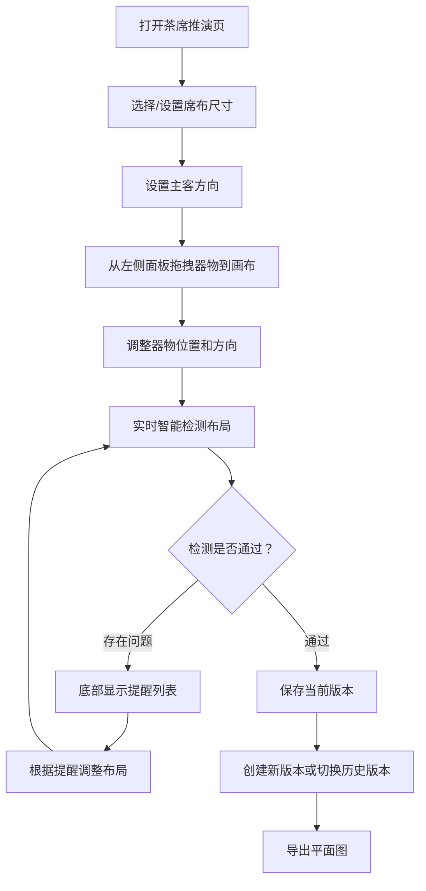

## 1. 产品概述

茶席推演工具是一款为茶艺课程设计的交互式网页应用，帮助茶艺老师在备课时快速推演不同主题的茶席布置方案。通过可视化的拖拽操作和智能检测提醒，大幅减少实物摆放试错的时间成本，提升教学设计效率。

- **目标用户**：茶艺课老师、茶道研习者
- **核心价值**：可视化推演茶席布局，智能提醒布置问题，多版本方案对比
- **使用场景**：茶艺备课、茶席设计、教学演示

## 2. 核心功能

### 2.1 用户角色

| 角色 | 注册方式 | 核心权限 |
|------|----------|----------|
| 教师用户 | 无需注册，直接使用 | 完整的茶席编辑、保存、检测功能 |

### 2.2 功能模块

1. **茶席画布**：可拖拽的器物放置区域，支持缩放和平移
2. **器物面板**：壶、公道杯、品茗杯、香插、茶荷、花器六大类器物
3. **属性面板**：席布尺寸、主客方向、取用动线设置
4. **智能检测**：遮挡检测、距离检测、左右手冲突检测、空位均衡检测
5. **版本管理**：保存多个版本平面图，支持切换和对比

### 2.3 页面详情

| 页面名称 | 模块名称 | 功能描述 |
|----------|----------|----------|
| 茶席推演页 | 顶部工具栏 | 版本切换、保存、导出、清空、撤销重做 |
| 茶席推演页 | 左侧器物面板 | 分类展示可拖拽的茶器图标 |
| 茶席推演页 | 中央画布区域 | 席布背景、器物放置与拖拽、动线显示 |
| 茶席推演页 | 右侧属性面板 | 席布尺寸设置、主客方向、取用动线记录 |
| 茶席推演页 | 底部检测面板 | 智能检测结果展示与提醒 |

## 3. 核心流程

用户打开页面后，默认展示一个空白茶席画布。从左侧面板拖拽器物到画布上，通过右侧面板设置席布尺寸和主客方向。系统实时检测布局问题并在底部给出提醒。用户可以保存当前版本，创建多个方案进行对比。

## 4. 用户界面设计

### 4.1 设计风格

- **主色调**：茶褐色系 —— 深褐 (#5D4037) 为主，米白 (#F5F0E8) 为底，赭石 (#A0522D) 点缀
- **辅助色**：竹青 (#7BA05B)、墨灰 (#3E3E3E)
- **设计风格**：东方禅意美学，简约雅致，留白充足，器物以俯视视角呈现
- **按钮风格**：圆角矩形，淡雅底色，悬停有温润的色彩过渡
- **字体**：标题用衬线字体体现传统韵味，正文用清晰易读的无衬线字体
- **图标风格**：线性图标，细腻优雅，统一线条粗细
- **视觉细节**：器物阴影柔和，席布有细微纹理，整体氛围宁静雅致

### 4.2 页面设计概述

| 页面名称 | 模块名称 | UI 元素 |
|----------|----------|---------|
| 茶席推演页 | 顶部工具栏 | 半透明磨砂背景，版本选择下拉，功能按钮横向排列 |
| 茶席推演页 | 左侧器物面板 | 卡片式器物分类，悬停有微妙浮起效果，支持拖拽 |
| 茶席推演页 | 中央画布 | 米白色席布背景，有细微经纬纹理，器物有真实阴影 |
| 茶席推演页 | 右侧属性面板 | 分组表单，输入框简洁，标签与输入两列布局 |
| 茶席推演页 | 底部检测栏 | 可展开/收起，问题项带图标和颜色区分严重程度 |

### 4.3 响应式

- 桌面端优先设计，三栏布局（左器物-中画布-右属性）
- 平板端自适应调整面板宽度
- 不做移动端适配，以桌面端体验为核心

### 4.4 交互动效

- 器物拖拽时有半透明跟随效果
- 放置时有轻微的弹性动画
- 检测提醒出现时平滑滑入
- 版本切换时画布内容淡入淡出
- 按钮悬停有温润的色彩过渡
