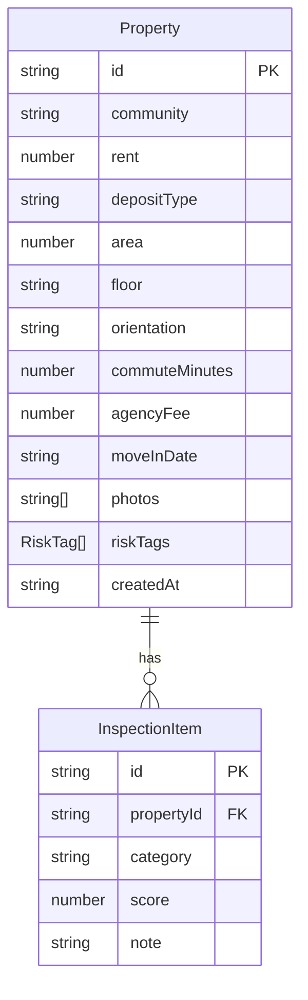

## 1. 架构设计

```mermaid
flowchart TD
    "前端 React SPA" --> "Zustand 状态管理"
    "Zustand 状态管理" --> "localStorage 持久化"
    "前端 React SPA" --> "页面路由 (React Router)"
    "页面路由" --> "首页"
    "页面路由" --> "添加/编辑房源页"
    "页面路由" --> "房源详情页"
    "页面路由" --> "对比页"
```

纯前端 SPA 应用，无后端服务。数据通过 Zustand 管理，自动持久化到 localStorage。

## 2. 技术说明

- **前端**：React@18 + TypeScript + Tailwind CSS@3 + Vite
- **初始化工具**：vite-init (react-ts 模板)
- **后端**：无
- **数据库**：localStorage（浏览器本地存储）
- **状态管理**：Zustand（含 persist 中间件实现自动持久化）
- **路由**：react-router-dom@6
- **图标**：lucide-react

## 3. 路由定义

| 路由 | 用途 |
|------|------|
| `/` | 首页 - 候选房源对比卡片列表，排序 |
| `/add` | 添加房源页 - 填写房源基础信息和上传照片 |
| `/property/:id` | 房源详情页 - 检查清单评分和备注 |
| `/property/:id/edit` | 编辑房源页 - 修改房源基础信息 |
| `/compare` | 对比页 - 选择 2-3 套房源并排对比 |

## 4. API 定义

无后端 API，所有数据操作通过 Zustand store 完成。

## 5. 服务器架构图

不适用（纯前端应用）

## 6. 数据模型

### 6.1 数据模型定义



### 6.2 数据定义

**Property（房源）**

| 字段 | 类型 | 说明 |
|------|------|------|
| id | string | UUID |
| community | string | 小区名称 |
| rent | number | 月租金（元） |
| depositType | string | 押付方式，如"押一付三" |
| area | number | 面积（㎡） |
| floor | string | 楼层，如"12/18" |
| orientation | string | 朝向 |
| commuteMinutes | number | 通勤时间（分钟） |
| agencyFee | number | 中介费（元） |
| moveInDate | string | 可入住日期 |
| photos | string[] | 照片 base64 数组 |
| riskTags | string[] | 风险标签数组 |
| createdAt | string | 创建时间 |

**InspectionItem（检查项）**

| 字段 | 类型 | 说明 |
|------|------|------|
| id | string | UUID |
| propertyId | string | 关联房源 ID |
| category | string | 检查类别：水压/采光/噪音/墙面/空调/冰箱/门锁/下水道/网络 |
| score | number | 评分 1-5 |
| note | string | 备注 |

**风险标签枚举**

| 值 | 说明 |
|----|------|
| unclear_deposit | 押金规则不清 |
| long_contract | 合同期太长 |
| old_appliances | 家电老旧 |
| downstairs_noise | 楼下噪音 |
| no_gas | 没有燃气 |

**一年总成本计算公式**

```
年总成本 = 月租金 × 12 + 押金金额 + 中介费
```

其中押金金额根据押付方式解析：如"押一付三"则押金 = 1 × 月租金
