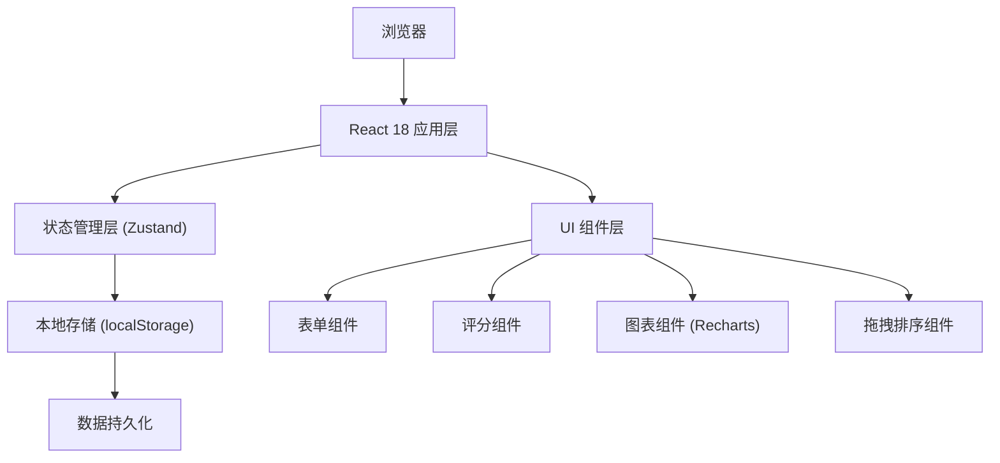
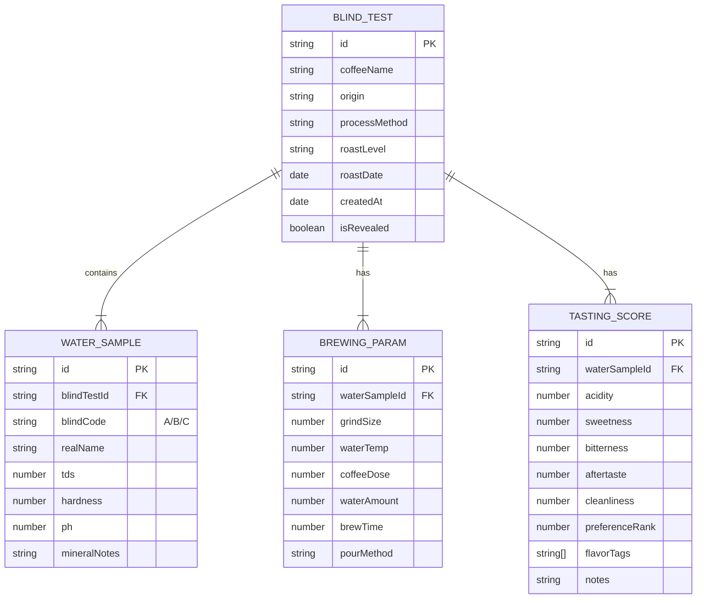

## 1. 架构设计

本项目为纯前端单页应用，数据存储在浏览器本地，无需后端服务。



## 2. 技术描述

- **前端**：React@18 + TypeScript@5 + Vite@5 + TailwindCSS@3
- **初始化工具**：vite-init (react-ts 模板)
- **状态管理**：Zustand@4
- **路由**：React Router DOM@6
- **图表库**：Recharts@2 (雷达图、柱状图)
- **图标库**：Lucide React@0.400
- **拖拽排序**：@dnd-kit/core + @dnd-kit/sortable
- **后端**：无（纯前端应用）
- **数据库**：localStorage 本地存储

## 3. 路由定义

| 路由 | 页面 | 用途 |
|------|------|------|
| `/` | 首页/历史记录 | 展示所有盲测历史记录，入口导航 |
| `/create` | 创建盲测 | 录入咖啡豆信息和水样信息 |
| `/brewing/:id` | 冲煮记录 | 记录每个水样的冲煮参数 |
| `/tasting/:id` | 杯测评分 | 盲测状态下进行评分和排序 |
| `/reveal/:id` | 揭晓对比 | 揭示真实来源，展示对比图表和建议 |

## 4. 数据模型

### 4.1 数据模型定义



### 4.2 TypeScript 类型定义

```typescript
interface BlindTest {
  id: string;
  coffeeName: string;
  origin: string;
  processMethod: string;
  roastLevel: 'light' | 'medium' | 'medium-dark' | 'dark';
  roastDate: string;
  createdAt: string;
  isRevealed: boolean;
  waterSamples: WaterSample[];
  brewingParams: BrewingParam[];
  tastingScores: TastingScore[];
}

interface WaterSample {
  id: string;
  blindCode: 'A' | 'B' | 'C';
  realName: string;
  tds: number;
  hardness: number;
  ph: number;
  mineralNotes: string;
}

interface BrewingParam {
  id: string;
  waterSampleId: string;
  grindSize: number;
  waterTemp: number;
  coffeeDose: number;
  waterAmount: number;
  brewTime: number;
  pourMethod: string;
}

interface TastingScore {
  id: string;
  waterSampleId: string;
  acidity: number;
  sweetness: number;
  bitterness: number;
  aftertaste: number;
  cleanliness: number;
  preferenceRank: number;
  flavorTags: string[];
  notes: string;
}

interface Suggestion {
  title: string;
  description: string;
  icon: string;
  priority: 'high' | 'medium' | 'low';
}
```

## 5. 状态管理设计

### 5.1 Zustand Store 结构

```typescript
interface BlindTestStore {
  blindTests: BlindTest[];
  currentBlindTest: BlindTest | null;
  
  // CRUD 操作
  createBlindTest: (data: Omit<BlindTest, 'id' | 'createdAt' | 'isRevealed'>) => string;
  updateBlindTest: (id: string, data: Partial<BlindTest>) => void;
  deleteBlindTest: (id: string) => void;
  getBlindTestById: (id: string) => BlindTest | undefined;
  
  // 水样操作
  addWaterSample: (blindTestId: string, sample: Omit<WaterSample, 'id' | 'blindCode'>) => void;
  updateWaterSample: (blindTestId: string, sampleId: string, data: Partial<WaterSample>) => void;
  removeWaterSample: (blindTestId: string, sampleId: string) => void;
  
  // 冲煮参数操作
  setBrewingParam: (blindTestId: string, param: BrewingParam) => void;
  
  // 评分操作
  setTastingScore: (blindTestId: string, score: TastingScore) => void;
  
  // 揭晓操作
  revealBlindTest: (id: string) => void;
  
  // 持久化
  saveToLocalStorage: () => void;
  loadFromLocalStorage: () => void;
  
  // 建议生成
  generateSuggestions: (blindTestId: string) => Suggestion[];
}
```

## 6. 核心算法

### 6.1 盲编号分配算法

```typescript
function assignBlindCodes(sampleCount: number): ('A' | 'B' | 'C')[] {
  const codes: ('A' | 'B' | 'C')[] = ['A', 'B', 'C'];
  const shuffled = [...codes].sort(() => Math.random() - 0.5);
  return shuffled.slice(0, sampleCount);
}
```

### 6.2 冲煮建议生成算法

基于评分数据和矿物质参数，生成个性化建议：

```typescript
function generateSuggestions(blindTest: BlindTest): Suggestion[] {
  const suggestions: Suggestion[] = [];
  
  // 1. 找出评分最高的水样
  const topSample = findTopRatedSample(blindTest);
  
  // 2. 分析TDS与风味的相关性
  const tdsCorrelation = analyzeTDSCorrelation(blindTest);
  
  // 3. 分析pH与酸质的相关性
  const phCorrelation = analyzePHCorrelation(blindTest);
  
  // 4. 基于数据分析生成建议
  suggestions.push({
    title: '推荐水质',
    description: `建议优先使用 ${topSample.realName}，TDS ${topSample.tds}，综合评分最高`,
    icon: 'droplet',
    priority: 'high'
  });
  
  // ... 更多建议逻辑
  
  return suggestions;
}
```

## 7. 组件结构

```
src/
├── components/
│   ├── layout/
│   │   ├── Header.tsx
│   │   ├── StepIndicator.tsx
│   │   └── PageTransition.tsx
│   ├── form/
│   │   ├── CoffeeInfoForm.tsx
│   │   ├── WaterSampleForm.tsx
│   │   └── BrewingParamForm.tsx
│   ├── scoring/
│   │   ├── RatingSlider.tsx
│   │   ├── FlavorTags.tsx
│   │   └── PreferenceRanker.tsx
│   ├── charts/
│   │   ├── RadarChart.tsx
│   │   └── BarChart.tsx
│   ├── reveal/
│   │   ├── RevealCard.tsx
│   │   ├── ComparisonTable.tsx
│   │   └── SuggestionCard.tsx
│   └── common/
│       ├── Button.tsx
│       ├── Input.tsx
│       └── Card.tsx
├── pages/
│   ├── HomePage.tsx
│   ├── CreatePage.tsx
│   ├── BrewingPage.tsx
│   ├── TastingPage.tsx
│   └── RevealPage.tsx
├── store/
│   └── useBlindTestStore.ts
├── types/
│   └── index.ts
├── utils/
│   ├── suggestions.ts
│   ├── storage.ts
│   └── helpers.ts
├── App.tsx
├── main.tsx
└── index.css
```

## 8. 本地存储键名

- `blind-coffee-tests`：存储所有盲测记录数组
- `blind-coffee-current`：存储当前正在进行的盲测ID
