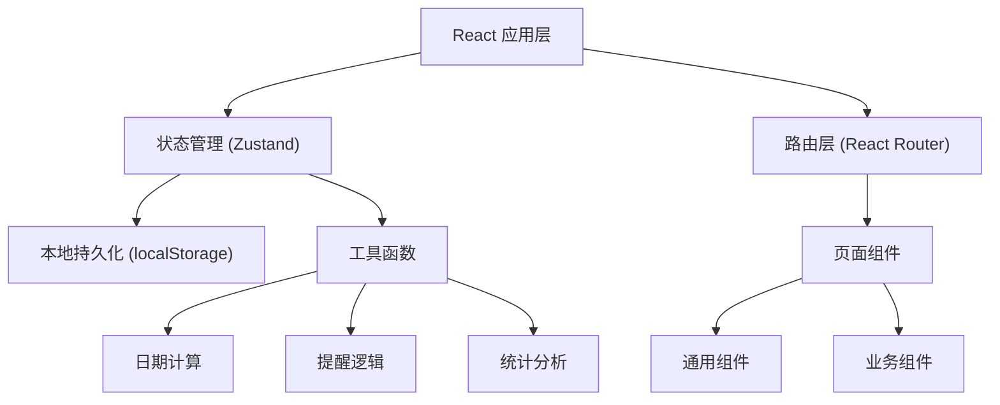
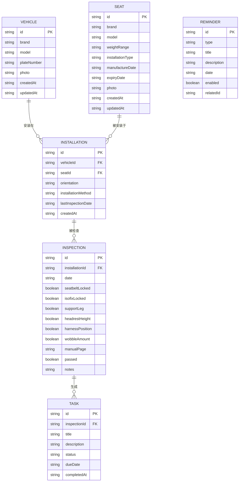

## 1. 架构设计

纯前端单页应用，数据本地持久化存储，无需后端服务。



## 2. 技术描述
- 前端：React@18 + TypeScript@5 + Vite@5
- 样式：TailwindCSS@3
- 状态管理：Zustand@4
- 路由：React Router DOM@6
- 图标：Lucide React
- 数据持久化：localStorage
- 包管理：npm

## 3. 路由定义
| 路径 | 页面 | 用途 |
|------|------|------|
| / | Dashboard | 首页仪表盘，提醒概览、快速操作 |
| /vehicles | VehicleList | 车辆档案列表 |
| /vehicles/new | VehicleForm | 新增车辆档案 |
| /vehicles/:id/edit | VehicleForm | 编辑车辆档案 |
| /seats | SeatList | 座椅档案列表 |
| /seats/new | SeatForm | 新增座椅档案 |
| /seats/:id/edit | SeatForm | 编辑座椅档案 |
| /inspection | InspectionPage | 安装检查页面 |
| /inspection/quick | QuickCheckCard | 快速检查卡生成 |
| /tasks | TaskList | 重新安装任务列表 |
| /statistics | StatisticsPage | 统计分析页面 |
| /reminders | ReminderCenter | 提醒中心 |

## 4. 数据模型

### 4.1 数据模型定义



### 4.2 TypeScript 类型定义

```typescript
// 车辆
interface Vehicle {
  id: string;
  brand: string;
  model: string;
  plateNumber: string;
  photo?: string;
  createdAt: string;
  updatedAt: string;
}

// 座椅
interface Seat {
  id: string;
  brand: string;
  model: string;
  weightRange: string;
  installationType: 'seatbelt' | 'isofix' | 'both';
  manufactureDate: string;
  expiryDate: string;
  photo?: string;
  createdAt: string;
  updatedAt: string;
}

// 安装记录
interface Installation {
  id: string;
  vehicleId: string;
  seatId: string;
  orientation: 'forward' | 'backward';
  installationMethod: 'seatbelt' | 'isofix';
  lastInspectionDate?: string;
  createdAt: string;
}

// 检查项目
interface InspectionItem {
  name: string;
  checked: boolean;
  notes?: string;
}

// 检查记录
interface Inspection {
  id: string;
  installationId: string;
  date: string;
  seatbeltLocked: InspectionItem;
  isofixLocked: InspectionItem;
  supportLeg: InspectionItem;
  headrestHeight: InspectionItem;
  harnessPosition: InspectionItem;
  wobbleAmount: InspectionItem;
  manualPage?: string;
  passed: boolean;
  notes?: string;
}

// 任务
interface Task {
  id: string;
  inspectionId: string;
  title: string;
  description: string;
  status: 'pending' | 'in_progress' | 'completed';
  dueDate: string;
  completedAt?: string;
}

// 提醒类型
type ReminderType = 'child_growth' | 'winter_clothing' | 'seat_expiry' | 'recheck';

// 提醒
interface Reminder {
  id: string;
  type: ReminderType;
  title: string;
  description: string;
  date: string;
  enabled: boolean;
  relatedId?: string;
}
```

## 5. 目录结构

```
src/
├── components/           # 通用组件
│   ├── layout/           # 布局组件
│   │   ├── Header.tsx
│   │   ├── Sidebar.tsx
│   │   └── MobileNav.tsx
│   ├── ui/               # UI 基元组件
│   │   ├── Button.tsx
│   │   ├── Card.tsx
│   │   ├── Input.tsx
│   │   ├── Checkbox.tsx
│   │   ├── Select.tsx
│   │   └── Modal.tsx
│   └── common/           # 业务通用组件
│       ├── VehicleCard.tsx
│       ├── SeatCard.tsx
│       ├── InspectionItem.tsx
│       └── ReminderBadge.tsx
├── pages/                # 页面组件
│   ├── Dashboard.tsx
│   ├── VehicleList.tsx
│   ├── VehicleForm.tsx
│   ├── SeatList.tsx
│   ├── SeatForm.tsx
│   ├── InspectionPage.tsx
│   ├── QuickCheckCard.tsx
│   ├── TaskList.tsx
│   ├── StatisticsPage.tsx
│   └── ReminderCenter.tsx
├── store/                # 状态管理
│   ├── useVehicleStore.ts
│   ├── useSeatStore.ts
│   ├── useInspectionStore.ts
│   ├── useTaskStore.ts
│   └── useReminderStore.ts
├── types/                # 类型定义
│   └── index.ts
├── utils/                # 工具函数
│   ├── date.ts
│   ├── reminder.ts
│   ├── statistics.ts
│   └── storage.ts
├── mock/                 # 模拟数据
│   └── index.ts
├── App.tsx
├── main.tsx
└── index.css
```

## 6. 状态管理设计

使用 Zustand 管理应用状态，每个数据实体对应一个 store，通过 localStorage 中间件实现持久化。

```typescript
// 示例：车辆 Store
interface VehicleState {
  vehicles: Vehicle[];
  addVehicle: (vehicle: Omit<Vehicle, 'id' | 'createdAt' | 'updatedAt'>) => void;
  updateVehicle: (id: string, data: Partial<Vehicle>) => void;
  deleteVehicle: (id: string) => void;
  getVehicleById: (id: string) => Vehicle | undefined;
}
```

## 7. 核心业务逻辑

### 7.1 提醒逻辑
- **孩子长高提醒**：基于孩子出生日期，每6个月自动生成检查身高体重提醒
- **冬季厚衣提醒**：每年11月至次年2月，每月初生成检查肩带松紧度提醒
- **座椅到期提醒**：根据座椅过期日期，提前90天、30天、7天生成提醒
- **复查提醒**：每次检查后30天自动生成下次复查提醒

### 7.2 统计逻辑
- **最久未复查**：按车辆分组，计算距上次检查天数，超过30天标记为异常
- **报废预警**：计算座椅剩余使用天数，少于180天显示警告，少于90天显示危险
- **检查通过率**：统计近30天检查通过率

### 7.3 任务生成逻辑
- 检查未通过时，针对每个未通过项生成对应重装任务
- 任务包含具体操作指引和说明书页码参考
- 任务完成后自动触发重新检查流程
