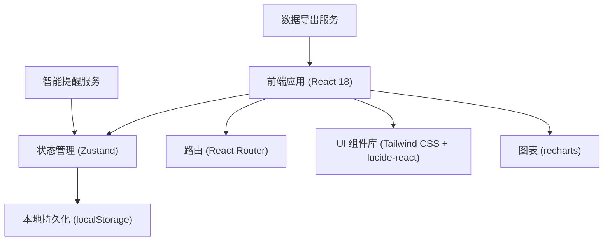
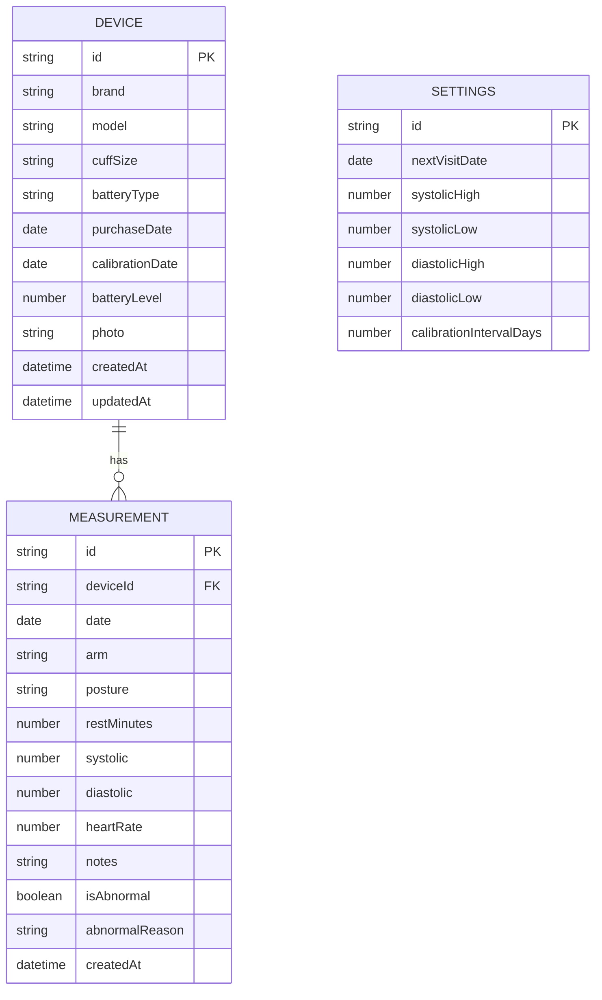

## 1. 架构设计


## 2. 技术描述
- **前端**: React@18 + TypeScript@5 + Vite@5
- **样式**: Tailwind CSS@3
- **状态管理**: Zustand@4
- **路由**: React Router DOM@6
- **图表库**: recharts@2
- **图标**: lucide-react@0
- **数据存储**: localStorage（纯前端，无需后端）
- **初始化工具**: vite-init

## 3. 路由定义
| Route | 页面 | Purpose |
|-------|------|---------|
| / | 首页仪表盘 | 展示今日状态、异常、维护、复诊提醒 |
| /device | 设备档案 | 管理血压计和袖带信息 |
| /records | 测量记录 | 查看和新增血压测量记录 |
| /trends | 趋势分析 | 查看血压趋势图和复诊报告 |
| /export | 数据导出 | 导出血压记录为 CSV |

## 4. 数据模型

### 4.1 数据模型定义


### 4.2 核心类型定义
```typescript
interface Device {
  id: string;
  brand: string;
  model: string;
  cuffSize: 'small' | 'medium' | 'large' | 'extra-large';
  batteryType: string;
  purchaseDate: string;
  calibrationDate: string;
  batteryLevel: number;
  photo?: string;
  createdAt: string;
  updatedAt: string;
}

interface Measurement {
  id: string;
  deviceId: string;
  date: string;
  arm: 'left' | 'right';
  posture: 'sitting' | 'standing' | 'lying';
  restMinutes: number;
  systolic: number;
  diastolic: number;
  heartRate: number;
  notes?: string;
  isAbnormal: boolean;
  abnormalReason?: string;
  createdAt: string;
}

interface Settings {
  id: string;
  nextVisitDate?: string;
  systolicHigh: number;
  systolicLow: number;
  diastolicHigh: number;
  diastolicLow: number;
  calibrationIntervalDays: number;
}

interface Alert {
  id: string;
  type: 'cuff' | 'calibration' | 'battery' | 'abnormal-reading';
  severity: 'info' | 'warning' | 'error';
  message: string;
  measurementId?: string;
  createdAt: string;
}
```

## 5. 核心服务

### 5.1 智能提醒服务
- **袖带尺寸检测**: 根据用户上臂周长建议合适的袖带尺寸
- **校准超期检测**: 比较当前日期与校准日期 + 校准间隔
- **电量低检测**: 电量低于 20% 时提醒更换电池
- **异常读数检测**: 
  - 收缩压 > 140 或 < 90
  - 舒张压 > 90 或 < 60
  - 连续 3 次读数差异 > 20
  - 脉压差 > 60 或 < 20

### 5.2 数据导出服务
- 导出 CSV 格式，包含所有测量字段
- 支持自定义时间范围，默认近一个月
- 包含设备信息表头，便于医生参考

### 5.3 趋势分析服务
- 按复诊日期范围筛选数据
- 计算平均收缩压、舒张压、心率
- 识别异常读数比例
- 生成医生友好的报告摘要
