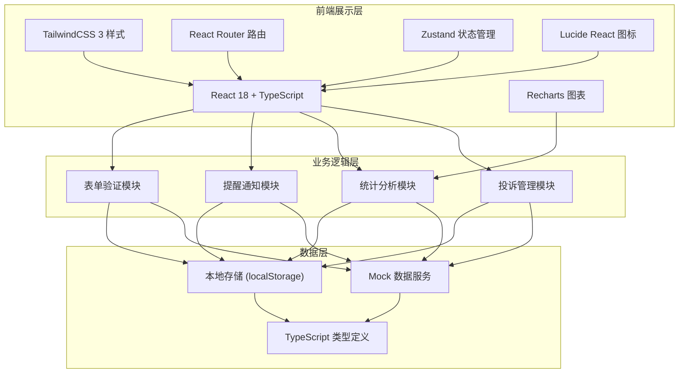
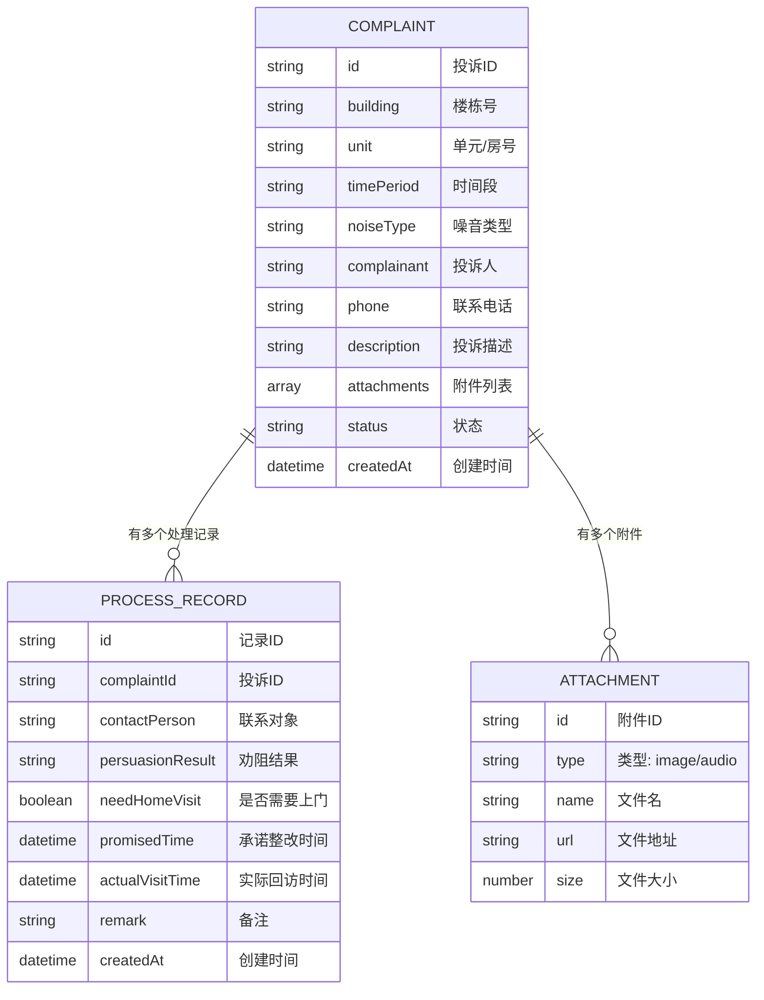

## 1. 架构设计



## 2. 技术描述

- **前端框架**：React@18 + TypeScript@5 + Vite@5
- **样式方案**：TailwindCSS@3 + CSS 变量主题系统
- **路由管理**：react-router-dom@6
- **状态管理**：zustand@4
- **图标库**：lucide-react@0.344.0
- **图表库**：recharts@2.12.0
- **初始化工具**：vite-init
- **后端**：无（纯前端应用，使用 Mock 数据 + localStorage 持久化）
- **数据库**：localStorage 浏览器本地存储

## 3. 路由定义

| 路由路径 | 页面名称 | 用途 |
|---------|---------|------|
| `/` | 首页 | 数据概览、待办提醒、快捷操作 |
| `/complaints` | 投诉列表 | 投诉记录列表、筛选搜索 |
| `/complaints/new` | 新建投诉 | 投诉信息登记、附件上传 |
| `/complaints/:id` | 投诉详情 | 查看详情、处理记录填写 |
| `/heatmap` | 楼栋热力图 | 高频投诉点可视化、统计图表 |

## 4. 数据模型

### 4.1 数据模型定义



### 4.2 TypeScript 类型定义

```typescript
interface Attachment {
  id: string;
  type: 'image' | 'audio';
  name: string;
  url: string;
  size: number;
  createdAt: string;
}

interface ProcessRecord {
  id: string;
  complaintId: string;
  contactPerson: string;
  persuasionResult: string;
  needHomeVisit: boolean;
  promisedTime: string;
  actualVisitTime?: string;
  remark: string;
  createdAt: string;
}

interface Complaint {
  id: string;
  building: string;
  unit: string;
  timePeriod: string;
  noiseType: 'decoration' | 'square_dance' | 'furniture' | 'pet' | 'other';
  complainant: string;
  phone: string;
  description: string;
  attachments: Attachment[];
  processRecords: ProcessRecord[];
  status: 'pending' | 'processing' | 'completed' | 'overdue';
  createdAt: string;
  updatedAt: string;
}

interface Statistics {
  weeklyCount: number;
  repeatComplainants: number;
  avgProcessingTime: number;
  pendingCount: number;
  overdueCount: number;
  buildingStats: { building: string; count: number }[];
  noiseTypeStats: { type: string; count: number }[];
}
```

## 5. 项目结构

```
src/
├── components/          # 可复用组件
│   ├── Layout/         # 布局组件
│   ├── ComplaintCard/  # 投诉卡片
│   ├── StatusBadge/    # 状态标签
│   ├── StatCard/       # 统计卡片
│   ├── Timeline/       # 时间线
│   └── Modal/          # 模态框
├── pages/              # 页面组件
│   ├── Dashboard/      # 首页
│   ├── ComplaintList/  # 投诉列表
│   ├── ComplaintNew/   # 新建投诉
│   ├── ComplaintDetail/# 投诉详情
│   └── Heatmap/        # 楼栋热力图
├── store/              # Zustand 状态管理
│   └── useComplaintStore.ts
├── types/              # TypeScript 类型定义
│   └── index.ts
├── utils/              # 工具函数
│   ├── mockData.ts     # Mock 数据
│   ├── dateUtils.ts    # 日期工具
│   └── statistics.ts   # 统计计算
├── hooks/              # 自定义 Hooks
│   ├── useStatistics.ts
│   └── useOverdueCheck.ts
├── App.tsx
├── main.tsx
└── index.css
```

## 6. 核心功能实现方案

### 6.1 超期提醒机制
- 自定义 Hook `useOverdueCheck` 每分钟检查一次
- 比较当前时间与 `promisedTime`，超过则标记为 `overdue`
- 首页待办列表中使用脉冲动画高亮超期项

### 6.2 楼栋热力图
- 使用 CSS Grid 布局展示楼栋网格
- 根据投诉数量计算颜色深度（0-5次: 浅绿, 6-10次: 黄色, 11-15次: 橙色, 15+次: 红色）
- 点击楼栋显示详细投诉列表

### 6.3 统计数据计算
- `calculateStatistics` 工具函数统一处理
- 本周投诉量：筛选 `createdAt` 在最近7天内
- 重复投诉住户：按 `complainant + phone` 分组统计
- 平均处理时长：计算 `createdAt` 到最新 `processRecord.createdAt` 的平均差值

### 6.4 附件上传
- 使用 `FileReader` API 实现本地文件预览
- 图片转 Base64 存储在 localStorage
- 音频文件支持播放控制
