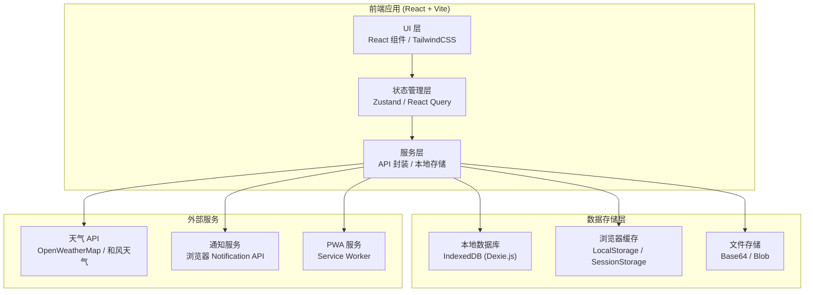
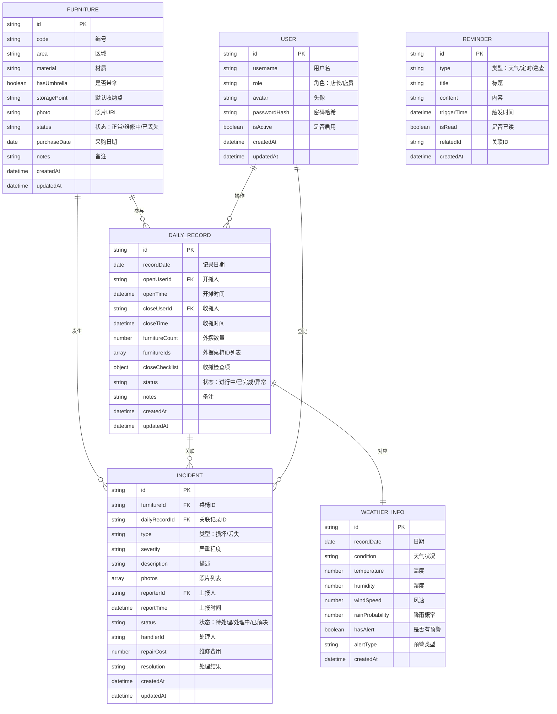

## 1. 架构设计



## 2. 技术选型说明

### 2.1 前端技术栈

| 技术 | 版本 | 用途说明 |
|------|------|----------|
| React | 18.x | UI 框架，组件化开发 |
| TypeScript | 5.x | 类型安全，提升代码可维护性 |
| Vite | 5.x | 构建工具，热更新，快速开发 |
| TailwindCSS | 3.x | CSS 框架，原子化样式 |
| Zustand | 4.x | 轻量级状态管理，替代 Redux |
| React Router | 6.x | 路由管理 |
| React Query | 5.x | 服务端状态管理，数据缓存 |
| Dexie.js | 4.x | IndexedDB 封装，本地数据库 |
| ECharts | 5.x | 图表库，数据可视化 |
| React Hook Form | 7.x | 表单管理 |
| Zod | 3.x | 数据校验 |
| Lucide React | 0.x | 图标库 |
| date-fns | 3.x | 日期处理 |

### 2.2 PWA 能力

- Service Worker：离线缓存、后台同步
- Web App Manifest：添加到主屏幕
- Notification API：浏览器桌面通知
- Geolocation API：获取位置用于天气查询
- Camera API：拍照上传损坏照片

## 3. 路由定义

| 路由路径 | 页面名称 | 权限要求 |
|----------|----------|----------|
| `/` | 首页仪表盘 | 所有用户 |
| `/furniture` | 桌椅档案列表 | 所有用户 |
| `/furniture/new` | 新增桌椅档案 | 店长 |
| `/furniture/:id` | 桌椅档案详情 | 所有用户 |
| `/furniture/:id/edit` | 编辑桌椅档案 | 店长 |
| `/open` | 开摊操作 | 所有用户 |
| `/close` | 收摊操作 | 所有用户 |
| `/reminders` | 提醒中心 | 所有用户 |
| `/reminders/settings` | 提醒设置 | 店长 |
| `/incidents` | 事件列表 | 所有用户 |
| `/incidents/new` | 新增事件登记 | 所有用户 |
| `/incidents/:id` | 事件详情 | 所有用户 |
| `/statistics` | 统计报表 | 店长 |
| `/settings` | 系统设置 | 店长 |

## 4. 数据模型

### 4.1 ER 图



### 4.2 TypeScript 类型定义

```typescript
// 桌椅档案
interface Furniture {
  id: string;
  code: string;
  name?: string;
  area: 'outdoor-east' | 'outdoor-west' | 'outdoor-south' | 'outdoor-north';
  type: 'chair' | 'table' | 'umbrella';
  material: 'wood' | 'metal' | 'plastic' | 'rattan';
  hasUmbrella: boolean;
  storagePoint: string;
  photo?: string;
  status: 'normal' | 'repairing' | 'lost';
  purchaseDate?: string;
  notes?: string;
  createdAt: string;
  updatedAt: string;
}

// 每日记录
interface DailyRecord {
  id: string;
  recordDate: string;
  openUserId: string;
  openTime: string;
  closeUserId?: string;
  closeTime?: string;
  furnitureCount: number;
  furnitureIds: string[];
  closeChecklist: {
    wiped: boolean;
    folded: boolean;
    locked: boolean;
    covered: boolean;
    returned: boolean;
  };
  status: 'in-progress' | 'completed' | 'abnormal';
  weatherInfo?: WeatherInfo;
  notes?: string;
  createdAt: string;
  updatedAt: string;
}

// 事件记录
interface Incident {
  id: string;
  furnitureId: string;
  dailyRecordId?: string;
  type: 'damage' | 'loss';
  severity: 'minor' | 'moderate' | 'severe';
  description: string;
  photos: string[];
  reporterId: string;
  reportTime: string;
  status: 'pending' | 'processing' | 'resolved';
  handlerId?: string;
  repairCost?: number;
  resolution?: string;
  resolutionTime?: string;
  createdAt: string;
  updatedAt: string;
}

// 天气信息
interface WeatherInfo {
  id: string;
  recordDate: string;
  condition: string;
  temperature: number;
  humidity: number;
  windSpeed: number;
  rainProbability: number;
  hasAlert: boolean;
  alertType?: 'rain' | 'wind' | 'typhoon';
  alertLevel?: 'blue' | 'yellow' | 'orange' | 'red';
  createdAt: string;
}

// 用户
interface User {
  id: string;
  username: string;
  role: 'manager' | 'staff';
  avatar?: string;
  isActive: boolean;
  createdAt: string;
  updatedAt: string;
}

// 提醒
interface Reminder {
  id: string;
  type: 'weather' | 'timer' | 'patrol' | 'custom';
  title: string;
  content: string;
  triggerTime: string;
  isRead: boolean;
  relatedId?: string;
  createdAt: string;
}

// 提醒设置
interface ReminderSettings {
  rainAlertThreshold: number;
  windAlertThreshold: number;
  patrolReminderTimes: string[];
  autoCloseReminderTime: string;
  weatherCheckInterval: number;
  enableDesktopNotification: boolean;
  enableSound: boolean;
}

// 统计数据
interface StatisticsData {
  dailyUsageRate: { date: string; rate: number }[];
  frequentlyMissing: { furnitureId: string; code: string; count: number }[];
  weatherImpact: { condition: string; incidentCount: number }[];
  repairList: Incident[];
}
```

## 5. 核心模块设计

### 5.1 状态管理 (Zustand Stores)

```
stores/
├── useFurnitureStore.ts      # 桌椅档案状态
├── useDailyRecordStore.ts    # 每日记录状态
├── useIncidentStore.ts       # 事件记录状态
├── useWeatherStore.ts        # 天气信息状态
├── useReminderStore.ts       # 提醒状态
├── useUserStore.ts           # 用户状态
└── useStatisticsStore.ts     # 统计数据状态
```

### 5.2 组件目录结构

```
components/
├── layout/
│   ├── Header.tsx
│   ├── Sidebar.tsx
│   ├── BottomNav.tsx
│   └── ProtectedRoute.tsx
├── furniture/
│   ├── FurnitureCard.tsx
│   ├── FurnitureForm.tsx
│   ├── FurnitureGrid.tsx
│   └── FurnitureFilter.tsx
├── daily/
│   ├── OpenChecklist.tsx
│   ├── CloseChecklist.tsx
│   ├── ChecklistItem.tsx
│   └── FurnitureSelector.tsx
├── incidents/
│   ├── IncidentForm.tsx
│   ├── PhotoUploader.tsx
│   └── IncidentTimeline.tsx
├── reminders/
│   ├── ReminderCard.tsx
│   ├── WeatherAlert.tsx
│   └── ReminderSettingsForm.tsx
├── statistics/
│   ├── UsageChart.tsx
│   ├── MissingChart.tsx
│   ├── WeatherImpactChart.tsx
│   └── StatCard.tsx
└── ui/
    ├── Button.tsx
    ├── Input.tsx
    ├── Modal.tsx
    ├── Card.tsx
    ├── Badge.tsx
    ├── Toast.tsx
    └── Loading.tsx
```

### 5.3 工具函数

```
utils/
├── storage.ts           # 本地存储封装
├── database.ts          # Dexie.js 数据库操作
├── weather.ts           # 天气 API 封装
├── notification.ts      # 通知封装
├── image.ts             # 图片压缩、水印
├── date.ts              # 日期处理
├── export.ts            # 数据导出
└── validation.ts        # 表单校验
```

## 6. 数据同步策略

### 6.1 本地优先

- 所有数据首先写入 IndexedDB
- 关键操作记录操作日志
- 支持离线完整功能

### 6.2 云端同步（可选扩展）

- 网络恢复时自动同步到后端 API
- 冲突解决策略：最后写入优先 + 人工确认
- 增量同步，减少数据传输

## 7. 安全设计

- 密码使用 bcrypt 哈希存储
- 本地数据加密存储（AES-GCM）
- 照片添加时间+地点水印
- 操作日志不可篡改
- 支持数据导出为 Excel/PDF 备份
