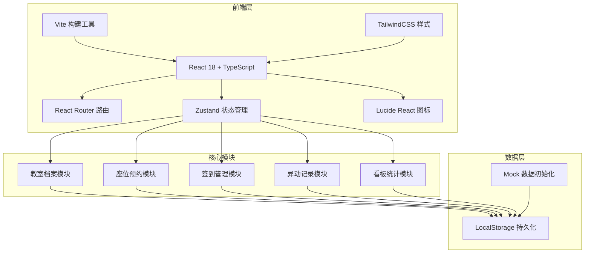
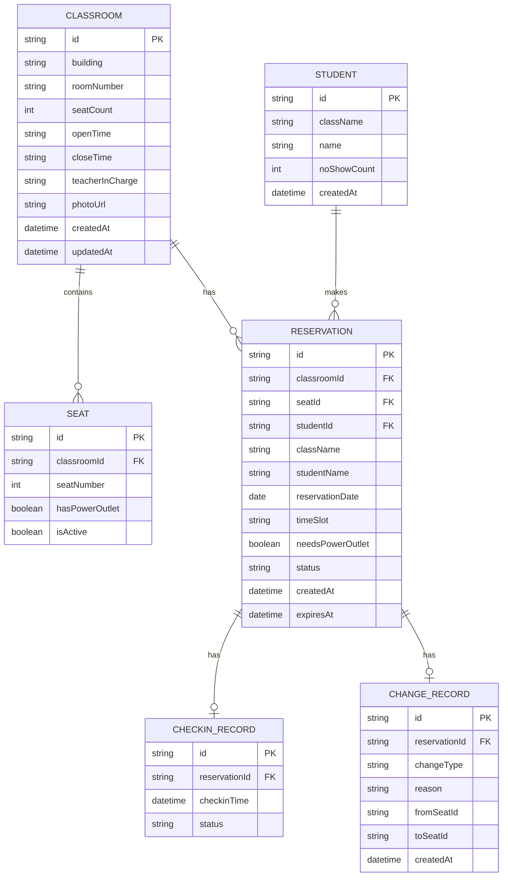

## 1. 架构设计



## 2. 技术描述

- **前端框架**：React@18 + TypeScript
- **构建工具**：Vite@5
- **样式方案**：TailwindCSS@3
- **路由管理**：React Router DOM@6
- **状态管理**：Zustand@4
- **图标库**：Lucide React@0.344
- **数据持久化**：LocalStorage（前端存储）
- **初始化工具**：vite-init
- **后端**：无（纯前端应用，使用本地存储）
- **数据库**：LocalStorage + Mock 数据

## 3. 路由定义

| 路由路径 | 页面用途 |
|----------|----------|
| `/` | 看板首页 - 空位概览、未签到名单、爽约记录、班级使用率 |
| `/classrooms` | 教室管理 - 教室档案列表、新增/编辑教室 |
| `/reservation` | 座位预约 - 座位图、预约表单 |
| `/checkin` | 签到管理 - 签到列表、签到操作 |
| `/records` | 异动记录 - 请假、换座、提前离开记录 |

## 4. 数据模型

### 4.1 实体关系图



### 4.2 数据类型定义

```typescript
// 教室
interface Classroom {
  id: string;
  building: string;
  roomNumber: string;
  seatCount: number;
  openTime: string;
  closeTime: string;
  teacherInCharge: string;
  photoUrl: string;
  createdAt: string;
  updatedAt: string;
}

// 座位
interface Seat {
  id: string;
  classroomId: string;
  seatNumber: number;
  hasPowerOutlet: boolean;
  isActive: boolean;
}

// 学生
interface Student {
  id: string;
  className: string;
  name: string;
  noShowCount: number;
  createdAt: string;
}

// 预约状态
type ReservationStatus = 'pending' | 'checked_in' | 'no_show' | 'cancelled' | 'left_early';

// 预约
interface Reservation {
  id: string;
  classroomId: string;
  seatId: string;
  studentId: string;
  className: string;
  studentName: string;
  reservationDate: string;
  timeSlot: string;
  needsPowerOutlet: boolean;
  status: ReservationStatus;
  createdAt: string;
  expiresAt: string;
}

// 签到记录
interface CheckinRecord {
  id: string;
  reservationId: string;
  checkinTime: string;
  status: 'success' | 'late';
}

// 异动类型
type ChangeType = 'leave' | 'seat_change' | 'early_leave';

// 异动记录
interface ChangeRecord {
  id: string;
  reservationId: string;
  changeType: ChangeType;
  reason: string;
  fromSeatId?: string;
  toSeatId?: string;
  createdAt: string;
}

// 看板统计
interface DashboardStats {
  totalSeats: number;
  availableSeats: number;
  checkedInCount: number;
  pendingCount: number;
  noShowCount: number;
  classUsage: { className: string; usageRate: number; total: number; used: number }[];
  frequentNoShows: { studentId: string; name: string; className: string; count: number }[];
}
```

### 4.3 初始 Mock 数据

```typescript
// 初始教室数据
const initialClassrooms: Classroom[] = [
  {
    id: 'class-001',
    building: '教学楼A',
    roomNumber: '301',
    seatCount: 40,
    openTime: '18:00',
    closeTime: '22:00',
    teacherInCharge: '张老师',
    photoUrl: 'https://trae-api-cn.mchost.guru/api/ide/v1/text_to_image?prompt=modern%20classroom%20interior%20with%20desks%20and%20chairs%20bright%20lighting&image_size=landscape_16_9',
    createdAt: '2026-01-01T00:00:00Z',
    updatedAt: '2026-01-01T00:00:00Z',
  },
  {
    id: 'class-002',
    building: '教学楼A',
    roomNumber: '302',
    seatCount: 35,
    openTime: '18:00',
    closeTime: '22:00',
    teacherInCharge: '李老师',
    photoUrl: 'https://trae-api-cn.mchost.guru/api/ide/v1/text_to_image?prompt=study%20room%20with%20rows%20of%20desks%20whiteboard%20clean%20modern&image_size=landscape_16_9',
    createdAt: '2026-01-01T00:00:00Z',
    updatedAt: '2026-01-01T00:00:00Z',
  },
  {
    id: 'class-003',
    building: '教学楼B',
    roomNumber: '205',
    seatCount: 50,
    openTime: '18:30',
    closeTime: '22:30',
    teacherInCharge: '王老师',
    photoUrl: 'https://trae-api-cn.mchost.guru/api/ide/v1/text_to_image?prompt=quiet%20study%20hall%20with%20individual%20seats%20warm%20lighting&image_size=landscape_16_9',
    createdAt: '2026-01-01T00:00:00Z',
    updatedAt: '2026-01-01T00:00:00Z',
  },
];

// 初始班级列表
const classList = ['高一(1)班', '高一(2)班', '高一(3)班', '高二(1)班', '高二(2)班', '高三(1)班', '高三(2)班'];

// 时段列表
const timeSlots = ['18:00-19:30', '19:40-21:10', '21:20-22:30'];
```

## 5. 项目结构

```
trae0601-3/
├── src/
│   ├── components/          # 公共组件
│   │   ├── Layout.tsx       # 页面布局
│   │   ├── Navbar.tsx       # 导航栏
│   │   ├── StatsCard.tsx    # 统计卡片
│   │   ├── StatusBadge.tsx  # 状态标签
│   │   ├── SeatGrid.tsx     # 座位图
│   │   ├── DataTable.tsx    # 数据表格
│   │   └── Modal.tsx        # 弹窗组件
│   ├── pages/               # 页面组件
│   │   ├── Dashboard.tsx    # 看板首页
│   │   ├── ClassroomList.tsx # 教室管理
│   │   ├── ClassroomForm.tsx # 教室表单
│   │   ├── Reservation.tsx  # 座位预约
│   │   ├── Checkin.tsx      # 签到管理
│   │   └── Records.tsx      # 异动记录
│   ├── store/               # 状态管理
│   │   └── useStore.ts      # Zustand store
│   ├── types/               # 类型定义
│   │   └── index.ts         # 所有类型定义
│   ├── utils/               # 工具函数
│   │   ├── mockData.ts      # Mock 数据
│   │   ├── storage.ts       # 本地存储
│   │   └── helpers.ts       # 通用工具
│   ├── App.tsx              # 根组件
│   ├── main.tsx             # 入口文件
│   └── index.css            # 全局样式
├── shared/                  # 前后端共享类型
│   └── types.ts
├── .trae/
│   └── documents/
│       ├── prd.md
│       └── tech-arch.md
├── index.html
├── package.json
├── vite.config.ts
├── tsconfig.json
├── tailwind.config.js
└── postcss.config.js
```

## 6. 核心功能实现要点

### 6.1 状态管理（Zustand）

```typescript
// store/useStore.ts
interface AppState {
  classrooms: Classroom[];
  seats: Seat[];
  reservations: Reservation[];
  students: Student[];
  checkinRecords: CheckinRecord[];
  changeRecords: ChangeRecord[];
  currentRole: 'student' | 'teacher';
  currentClassroomId: string | null;
  selectedDate: string;
  selectedTimeSlot: string;
  
  // Actions
  setCurrentRole: (role: 'student' | 'teacher') => void;
  addClassroom: (classroom: Omit<Classroom, 'id' | 'createdAt' | 'updatedAt'>) => void;
  updateClassroom: (id: string, data: Partial<Classroom>) => void;
  deleteClassroom: (id: string) => void;
  createReservation: (data: Omit<Reservation, 'id' | 'status' | 'createdAt' | 'expiresAt'>) => void;
  cancelReservation: (id: string) => void;
  checkin: (reservationId: string) => void;
  handleNoShow: (reservationId: string) => void;
  recordChange: (data: Omit<ChangeRecord, 'id' | 'createdAt'>) => void;
  getDashboardStats: () => DashboardStats;
  getAvailableSeats: (classroomId: string, date: string, timeSlot: string) => Seat[];
}
```

### 6.2 超时自动释放逻辑

```typescript
// utils/helpers.ts
const AUTO_RELEASE_MINUTES = 15; // 时段开始后15分钟未签到自动释放

export function checkAndReleaseNoShows(reservations: Reservation[]): { 
  updated: Reservation[]; 
  released: string[] 
} {
  const now = new Date();
  const released: string[] = [];
  
  const updated = reservations.map(r => {
    if (r.status === 'pending') {
      const [startTime] = r.timeSlot.split('-');
      const [hours, minutes] = startTime.split(':').map(Number);
      const slotStart = new Date(r.reservationDate);
      slotStart.setHours(hours, minutes + AUTO_RELEASE_MINUTES, 0, 0);
      
      if (now > slotStart) {
        released.push(r.id);
        return { ...r, status: 'no_show' as const };
      }
    }
    return r;
  });
  
  return { updated, released };
}
```

### 6.3 看板统计计算

```typescript
// utils/helpers.ts
export function calculateDashboardStats(
  classrooms: Classroom[],
  reservations: Reservation[],
  students: Student[]
): DashboardStats {
  const today = new Date().toISOString().split('T')[0];
  const todayReservations = reservations.filter(r => r.reservationDate === today);
  
  const totalSeats = classrooms.reduce((sum, c) => sum + c.seatCount, 0);
  const checkedInCount = todayReservations.filter(r => r.status === 'checked_in').length;
  const pendingCount = todayReservations.filter(r => r.status === 'pending').length;
  const noShowCount = todayReservations.filter(r => r.status === 'no_show').length;
  const usedSeats = checkedInCount + pendingCount;
  const availableSeats = totalSeats - usedSeats;
  
  // 班级使用率统计
  const classMap = new Map<string, { total: number; used: number }>();
  todayReservations.forEach(r => {
    const current = classMap.get(r.className) || { total: 0, used: 0 };
    current.total++;
    if (r.status === 'checked_in') current.used++;
    classMap.set(r.className, current);
  });
  
  const classUsage = Array.from(classMap.entries())
    .map(([className, { total, used }]) => ({
      className,
      total,
      used,
      usageRate: total > 0 ? Math.round((used / total) * 100) : 0,
    }))
    .sort((a, b) => b.usageRate - a.usageRate);
  
  // 连续爽约学生
  const frequentNoShows = students
    .filter(s => s.noShowCount >= 2)
    .map(s => ({
      studentId: s.id,
      name: s.name,
      className: s.className,
      count: s.noShowCount,
    }))
    .sort((a, b) => b.count - a.count);
  
  return {
    totalSeats,
    availableSeats,
    checkedInCount,
    pendingCount,
    noShowCount,
    classUsage,
    frequentNoShows,
  };
}
```
