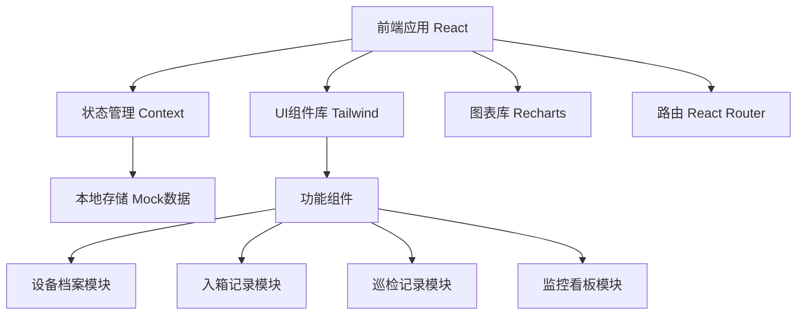
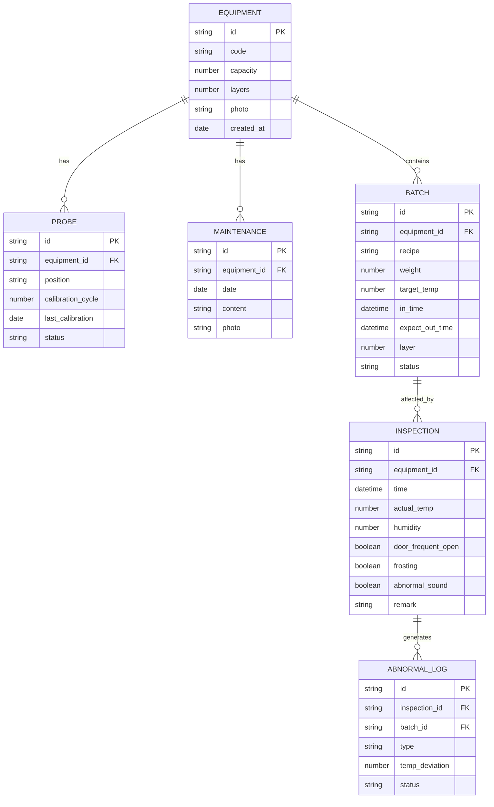

## 1. 架构设计



## 2. 技术选型

- **前端框架**：React 18 + TypeScript
- **构建工具**：Vite 5
- **样式方案**：TailwindCSS 3
- **路由管理**：React Router 6
- **图表组件**：Recharts
- **图标库**：Phosphor React
- **状态管理**：React Context + useReducer
- **数据持久化**：localStorage（开发阶段使用Mock数据）
- **日期处理**：date-fns
- **表单验证**：React Hook Form

## 3. 路由定义

| 路由路径 | 页面名称 | 说明 |
|----------|----------|------|
| / | 监控看板 | 首页，展示所有实时监控信息 |
| /equipment | 设备档案列表 | 发酵箱设备管理 |
| /equipment/:id | 设备档案详情 | 单个设备详细信息、探头配置、保养记录 |
| /batches | 入箱记录列表 | 所有面团批次记录 |
| /batches/new | 新增入箱记录 | 面团入箱登记表单 |
| /inspections | 巡检记录列表 | 所有巡检记录 |
| /inspections/new | 新增巡检记录 | 巡检登记表单 |

## 4. 数据模型

### 4.1 ER图



### 4.2 TypeScript 类型定义

```typescript
// 设备档案
interface Equipment {
  id: string;
  code: string;
  capacity: number;
  layers: number;
  probePositions: string[];
  photo?: string;
  createdAt: string;
}

// 温度探头
interface Probe {
  id: string;
  equipmentId: string;
  position: string;
  calibrationCycle: number;
  lastCalibration: string;
  status: 'normal' | 'need_calibration' | 'fault';
}

// 保养记录
interface Maintenance {
  id: string;
  equipmentId: string;
  date: string;
  content: string;
  photo?: string;
}

// 面团批次
interface Batch {
  id: string;
  equipmentId: string;
  recipe: string;
  weight: number;
  targetTemp: number;
  inTime: string;
  expectOutTime: string;
  layer: number;
  status: 'fermenting' | 'completed' | 'abnormal';
}

// 巡检记录
interface Inspection {
  id: string;
  equipmentId: string;
  time: string;
  actualTemp: number;
  humidity: number;
  doorFrequentOpen: boolean;
  frosting: boolean;
  abnormalSound: boolean;
  remark?: string;
}

// 温度记录（用于曲线图）
interface TemperatureRecord {
  time: string;
  temperature: number;
  isAbnormal: boolean;
}

// 异常记录
interface AbnormalLog {
  id: string;
  inspectionId: string;
  batchIds: string[];
  type: 'temp_high' | 'temp_low' | 'other';
  tempDeviation: number;
  status: 'pending' | 'resolved';
}
```

## 5. 核心组件结构

```
src/
├── components/
│   ├── layout/
│   │   ├── Header.tsx
│   │   ├── Sidebar.tsx
│   │   └── Layout.tsx
│   ├── dashboard/
│   │   ├── BatchCard.tsx
│   │   ├── TemperatureChart.tsx
│   │   ├── AbnormalAlert.tsx
│   │   ├── ProbeStatus.tsx
│   │   └── UpcomingBatches.tsx
│   ├── equipment/
│   │   ├── EquipmentCard.tsx
│   │   ├── ProbeList.tsx
│   │   └── MaintenanceForm.tsx
│   ├── batch/
│   │   ├── BatchForm.tsx
│   │   └── BatchTable.tsx
│   ├── inspection/
│   │   ├── InspectionForm.tsx
│   │   └── InspectionTable.tsx
│   └── common/
│       ├── StatusBadge.tsx
│       ├── NumberAnimation.tsx
│       └── LayerSelector.tsx
├── context/
│   ├── EquipmentContext.tsx
│   ├── BatchContext.tsx
│   └── InspectionContext.tsx
├── types/
│   └── index.ts
├── data/
│   └── mockData.ts
├── utils/
│   ├── dateUtils.ts
│   └── tempUtils.ts
├── pages/
│   ├── Dashboard.tsx
│   ├── EquipmentList.tsx
│   ├── EquipmentDetail.tsx
│   ├── BatchList.tsx
│   ├── NewBatch.tsx
│   ├── InspectionList.tsx
│   └── NewInspection.tsx
└── App.tsx
```

## 6. Mock数据初始化

应用启动时自动生成以下模拟数据：
- 3台发酵箱设备，每台4层
- 6个温度探头，其中1个需要校准
- 8条当前发酵中的批次记录
- 48条24小时温度记录（含3个异常时段）
- 10条历史巡检记录
- 5条保养记录

温度正常范围：2°C ~ 6°C，超出范围标记为异常并关联当前批次。
