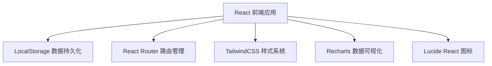
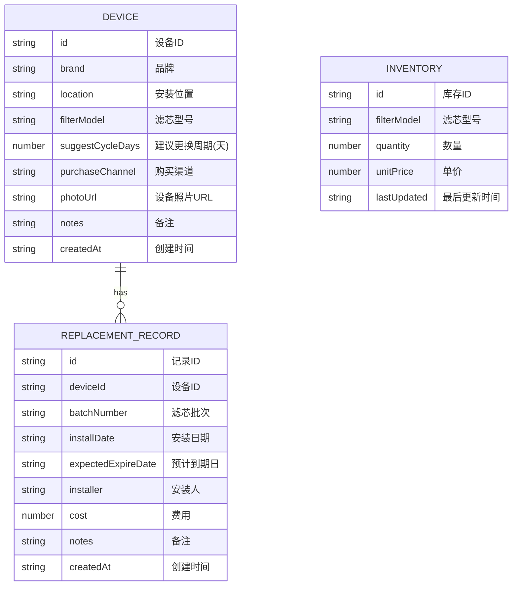

## 1. 架构设计



## 2. 技术描述

- 前端：React@18 + TypeScript + TailwindCSS@3 + Vite
- 初始化工具：npm create vite@latest
- 后端：无（纯前端应用，使用 LocalStorage 存储）
- 数据库：LocalStorage（浏览器本地存储）
- 数据可视化：Recharts
- 路由：React Router DOM
- 图标：Lucide React
- 日期处理：date-fns

## 3. 路由定义

| 路由 | 用途 |
|------|------|
| / | 仪表盘 - 临期提醒、快速统计 |
| /devices | 设备档案列表 |
| /devices/new | 新增设备 |
| /devices/:id | 设备详情 |
| /devices/:id/edit | 编辑设备 |
| /records | 更换记录列表 |
| /records/new | 新增更换记录 |
| /inventory | 库存管理 |
| /statistics | 统计分析 |

## 4. 数据模型

### 4.1 数据模型定义



### 4.2 数据存储结构

```typescript
// 设备档案
interface Device {
  id: string;
  brand: string;
  location: string;
  filterModel: string;
  suggestCycleDays: number;
  purchaseChannel: string;
  photoUrl: string;
  notes?: string;
  createdAt: string;
}

// 更换记录
interface ReplacementRecord {
  id: string;
  deviceId: string;
  batchNumber: string;
  installDate: string;
  expectedExpireDate: string;
  installer: string;
  cost: number;
  notes?: string;
  createdAt: string;
}

// 库存
interface Inventory {
  id: string;
  filterModel: string;
  quantity: number;
  unitPrice: number;
  lastUpdated: string;
}

// 临期提醒
interface Reminder {
  deviceId: string;
  filterModel: string;
  location: string;
  remainingDays: number;
  expectedExpireDate: string;
  urgency: 'normal' | 'warning' | 'urgent';
}
```

### 4.3 业务规则

1. 库存为 0 时，无法创建更换记录
2. 创建更换记录时，自动扣减对应型号库存 1 件
3. 临期提醒规则：
   - 剩余天数 > 30 天：正常（绿色）
   - 剩余天数 15-30 天：警告（黄色）
   - 剩余天数 < 15 天：紧急（红色）
4. 预计到期日 = 安装日期 + 建议周期
5. 年度花费统计：按月份统计当年所有更换记录的费用总和

