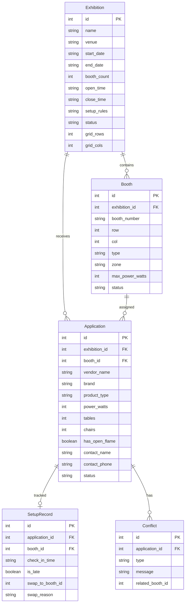

## 1. 架构设计

```mermaid
graph TB
    subgraph "前端层"
        "React + TypeScript + Tailwind CSS"
        "Zustand 状态管理"
        "React Router 路由"
    end
    subgraph "后端层"
        "Express + TypeScript"
        "RESTful API"
    end
    subgraph "数据层"
        "SQLite 数据库"
        "better-sqlite3 驱动"
    end
    "React + TypeScript + Tailwind CSS" --> "RESTful API"
    "RESTful API" --> "SQLite 数据库"
```

## 2. 技术说明

- 前端：React@18 + TypeScript + Tailwind CSS@3 + Vite
- 初始化工具：vite-init
- 后端：Express@4 + TypeScript
- 数据库：SQLite（better-sqlite3），无需外部数据库服务
- 状态管理：Zustand
- 路由：React Router DOM
- 图表：Recharts
- 图标：lucide-react

## 3. 路由定义

| 路由 | 用途 |
|------|------|
| / | 场地平面图首页（默认展会） |
| /exhibitions | 展会列表与管理 |
| /exhibitions/create | 创建展会 |
| /exhibitions/:id | 展会详情与布局编辑 |
| /exhibitions/:id/applications | 申请审核列表 |
| /apply | 摊主申请摊位 |
| /apply/my | 我的申请 |
| /setup/:id | 布展管理（签到/换位） |
| /stats | 统计面板 |

## 4. API 定义

### 4.1 展会相关

```typescript
interface Exhibition {
  id: number
  name: string
  venue: string
  start_date: string
  end_date: string
  booth_count: number
  open_time: string
  close_time: string
  setup_rules: string
  status: "draft" | "published" | "ongoing" | "ended"
  grid_rows: number
  grid_cols: number
  created_at: string
}

// GET /api/exhibitions - 获取展会列表
// GET /api/exhibitions/:id - 获取展会详情
// POST /api/exhibitions - 创建展会
// PUT /api/exhibitions/:id - 更新展会
// DELETE /api/exhibitions/:id - 删除展会
```

### 4.2 摊位相关

```typescript
interface Booth {
  id: number
  exhibition_id: number
  booth_number: string
  row: number
  col: number
  type: "booth" | "aisle" | "empty"
  zone: string
  max_power_watts: number
  status: "available" | "applied" | "confirmed" | "conflict"
}

// GET /api/exhibitions/:id/booths - 获取展会摊位列表
// PUT /api/booths/:id - 更新摊位信息
// PUT /api/exhibitions/:id/layout - 批量更新布局
```

### 4.3 申请相关

```typescript
interface Application {
  id: number
  exhibition_id: number
  booth_id: number
  vendor_name: string
  brand: string
  product_type: string
  power_watts: number
  tables: number
  chairs: number
  has_open_flame: boolean
  contact_name: string
  contact_phone: string
  status: "pending" | "approved" | "rejected"
  conflicts: Conflict[]
  created_at: string
}

interface Conflict {
  type: "adjacent_type" | "power_overload" | "aisle_blocked"
  message: string
  related_booth_id?: number
}

// GET /api/exhibitions/:id/applications - 获取申请列表
// POST /api/applications - 提交申请
// PUT /api/applications/:id/status - 审核申请（批准/拒绝）
// GET /api/applications/my - 我的申请
```

### 4.4 布展相关

```typescript
interface SetupRecord {
  id: number
  application_id: number
  booth_id: number
  check_in_time: string | null
  is_late: boolean
  swap_to_booth_id: number | null
  swap_reason: string | null
}

// POST /api/setup/checkin - 签到
// POST /api/setup/swap - 临时换位
// GET /api/exhibitions/:id/setup - 获取布展状态
```

### 4.5 统计相关

```typescript
interface Stats {
  utilization: { date: string; rate: number }[]
  type_distribution: { type: string; count: number }[]
  late_ranking: { vendor_name: string; late_count: number; total_count: number }[]
}

// GET /api/exhibitions/:id/stats - 获取统计数据
```

## 5. 服务器架构图

```mermaid
graph LR
    "Router 路由层" --> "Controller 控制层"
    "Controller 控制层" --> "Service 业务层"
    "Service 业务层" --> "Repository 数据层"
    "Repository 数据层" --> "SQLite 数据库"
```

## 6. 数据模型

### 6.1 数据模型定义



### 6.2 数据定义语言

```sql
CREATE TABLE exhibitions (
  id INTEGER PRIMARY KEY AUTOINCREMENT,
  name TEXT NOT NULL,
  venue TEXT NOT NULL,
  start_date TEXT NOT NULL,
  end_date TEXT NOT NULL,
  booth_count INTEGER NOT NULL,
  open_time TEXT NOT NULL,
  close_time TEXT NOT NULL,
  setup_rules TEXT DEFAULT '',
  status TEXT NOT NULL DEFAULT 'draft',
  grid_rows INTEGER NOT NULL DEFAULT 5,
  grid_cols INTEGER NOT NULL DEFAULT 8,
  created_at TEXT DEFAULT (datetime('now'))
);

CREATE TABLE booths (
  id INTEGER PRIMARY KEY AUTOINCREMENT,
  exhibition_id INTEGER NOT NULL REFERENCES exhibitions(id),
  booth_number TEXT NOT NULL,
  row INTEGER NOT NULL,
  col INTEGER NOT NULL,
  type TEXT NOT NULL DEFAULT 'booth',
  zone TEXT DEFAULT 'A',
  max_power_watts INTEGER DEFAULT 2000,
  status TEXT NOT NULL DEFAULT 'available',
  UNIQUE(exhibition_id, booth_number)
);

CREATE TABLE applications (
  id INTEGER PRIMARY KEY AUTOINCREMENT,
  exhibition_id INTEGER NOT NULL REFERENCES exhibitions(id),
  booth_id INTEGER NOT NULL REFERENCES booths(id),
  vendor_name TEXT NOT NULL,
  brand TEXT NOT NULL,
  product_type TEXT NOT NULL,
  power_watts INTEGER DEFAULT 0,
  tables INTEGER DEFAULT 0,
  chairs INTEGER DEFAULT 0,
  has_open_flame INTEGER DEFAULT 0,
  contact_name TEXT NOT NULL,
  contact_phone TEXT NOT NULL,
  status TEXT NOT NULL DEFAULT 'pending',
  created_at TEXT DEFAULT (datetime('now'))
);

CREATE TABLE setup_records (
  id INTEGER PRIMARY KEY AUTOINCREMENT,
  application_id INTEGER NOT NULL REFERENCES applications(id),
  booth_id INTEGER NOT NULL REFERENCES booths(id),
  check_in_time TEXT,
  is_late INTEGER DEFAULT 0,
  swap_to_booth_id INTEGER,
  swap_reason TEXT,
  created_at TEXT DEFAULT (datetime('now'))
);

CREATE TABLE conflicts (
  id INTEGER PRIMARY KEY AUTOINCREMENT,
  application_id INTEGER NOT NULL REFERENCES applications(id),
  type TEXT NOT NULL,
  message TEXT NOT NULL,
  related_booth_id INTEGER,
  created_at TEXT DEFAULT (datetime('now'))
);

CREATE INDEX idx_booths_exhibition ON booths(exhibition_id);
CREATE INDEX idx_applications_exhibition ON applications(exhibition_id);
CREATE INDEX idx_applications_booth ON applications(booth_id);
CREATE INDEX idx_applications_status ON applications(status);
CREATE INDEX idx_setup_records_application ON setup_records(application_id);
CREATE INDEX idx_conflicts_application ON conflicts(application_id);
```
