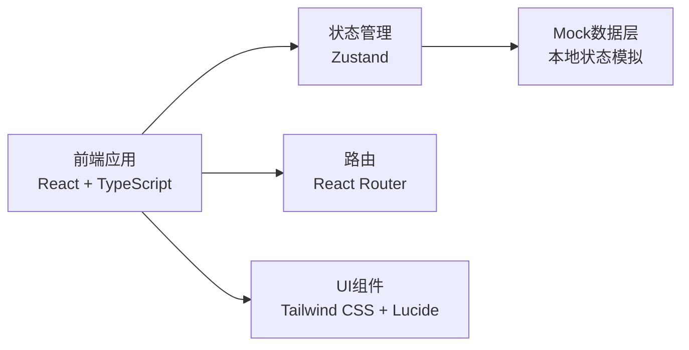
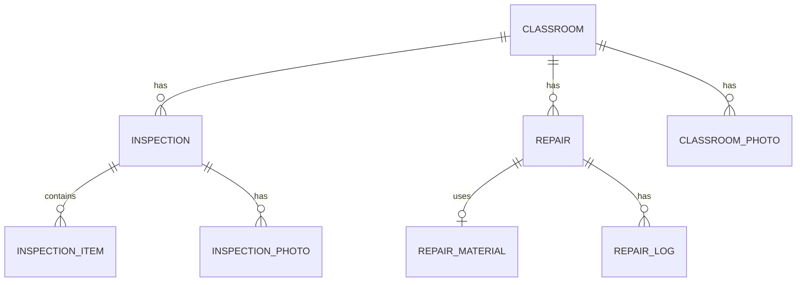

## 1. 架构设计



## 2. 技术描述

- 前端框架：React@18 + TypeScript
- 构建工具：Vite@5
- 样式方案：Tailwind CSS@3
- 状态管理：Zustand
- 路由管理：React Router DOM@6
- 图标库：Lucide React
- 后端：无后端，使用 Mock 数据模拟
- 数据持久化：localStorage（可选）

## 3. 路由定义

| 路由 | 页面 | 说明 |
|------|------|------|
| /dashboard | 数据看板 | 首页，展示统计数据和概览 |
| /classrooms | 教室列表 | 教室档案列表页 |
| /classrooms/:id | 教室详情 | 单个教室的详细信息 |
| /classrooms/new | 新增教室 | 新建教室档案 |
| /inspections | 巡检列表 | 所有巡检记录 |
| /inspections/new | 新建巡检 | 提交巡检表单 |
| /repairs | 维修列表 | 维修工单列表 |
| /repairs/:id | 维修详情 | 维修工单详情 |

## 4. 数据模型

### 4.1 实体关系图



### 4.2 数据类型定义

```typescript
// 教室档案
interface Classroom {
  id: string;
  name: string;
  floor: number;
  area: number;        // 面积（平方米）
  floorBrand: string;  // 地胶品牌
  installDate: string; // 安装日期
  clubs: string[];     // 使用社团
  photos: string[];    // 照片URL
  status: 'normal' | 'suspended' | 'maintenance';
  lastInspectionDate?: string;
  createdAt: string;
  updatedAt: string;
}

// 巡检项类型
type InspectionItemType = 
  | 'edge_lifting'    // 翘边
  | 'bubbling'        // 起泡
  | 'cracking'        // 裂纹
  | 'water_accumulation' // 积水
  | 'glue_stain'      // 胶痕
  | 'mirror_surface'  // 镜面（太滑）
  | 'handrail'        // 把杆
  | 'hvac';           // 空调温湿度

// 巡检项状态
type InspectionStatus = 'normal' | 'warning' | 'critical';

// 巡检项
interface InspectionItem {
  type: InspectionItemType;
  status: InspectionStatus;
  description?: string;
  severity?: number; // 1-5 严重程度
}

// 巡检记录
interface Inspection {
  id: string;
  classroomId: string;
  inspectorName: string;
  inspectorRole: 'teacher' | 'club_leader' | 'admin';
  date: string;
  items: InspectionItem[];
  overallStatus: InspectionStatus;
  photos: string[];
  notes?: string;
  autoSuspended: boolean; // 是否触发自动暂停
  createdAt: string;
}

// 维修工单状态
type RepairStatus = 'pending' | 'in_progress' | 'completed' | 'recheck_failed';

// 维修工单
interface Repair {
  id: string;
  classroomId: string;
  inspectionId?: string;
  status: RepairStatus;
  workerName: string;       // 施工人
  materials: RepairMaterial[]; // 材料清单
  closeStartTime?: string;  // 封闭开始时间
  closeEndTime?: string;    // 封闭结束时间
  recheckResult?: 'passed' | 'failed';
  recheckDate?: string;
  recheckNotes?: string;
  createdAt: string;
  updatedAt: string;
}

// 维修材料
interface RepairMaterial {
  name: string;
  quantity: number;
  unit: string;
}

// 看板统计数据
interface DashboardStats {
  pendingInspections: number;
  suspendedClassrooms: number;
  repeatedHazards: number;
  affectedCourses: number;
  floorLifeWarnings: number;
}
```

## 5. 目录结构

```
src/
├── components/          # 公共组件
│   ├── Layout.tsx       # 布局组件（侧边栏+顶栏）
│   ├── StatsCard.tsx    # 统计卡片
│   ├── StatusBadge.tsx  # 状态标签
│   ├── PhotoUpload.tsx  # 照片上传组件
│   └── Timeline.tsx     # 时间线组件
├── pages/               # 页面组件
│   ├── Dashboard.tsx    # 数据看板
│   ├── ClassroomList.tsx # 教室列表
│   ├── ClassroomDetail.tsx # 教室详情
│   ├── ClassroomForm.tsx # 教室表单
│   ├── InspectionList.tsx # 巡检列表
│   ├── InspectionForm.tsx # 巡检表单
│   ├── RepairList.tsx   # 维修列表
│   └── RepairDetail.tsx # 维修详情
├── store/               # 状态管理
│   └── useStore.ts      # Zustand store
├── types/               # TypeScript 类型
│   └── index.ts
├── data/                # Mock 数据
│   └── mockData.ts
├── utils/               # 工具函数
│   ├── dateUtils.ts
│   └── statusUtils.ts
├── App.tsx
├── main.tsx
└── index.css
```

## 6. 核心业务规则

### 6.1 严重隐患判断规则

满足以下任一条件即为严重隐患，自动暂停教室预约：
- 翘边严重（severity >= 4）
- 起泡数量多且面积大（severity >= 4）
- 有积水（water_accumulation 为 warning 或 critical）
- 裂纹深度较深（severity >= 4）
- 任意两项同时为 warning 及以上

### 6.2 地胶寿命提醒

- 地胶设计寿命：5年
- 提前6个月提醒更换
- 计算公式：安装日期 + 5年 - 当前日期 < 180天 则提醒

### 6.3 重复隐患判断

- 同一教室同一巡检项连续3次巡检均为异常状态
- 记为重复隐患，需重点关注
