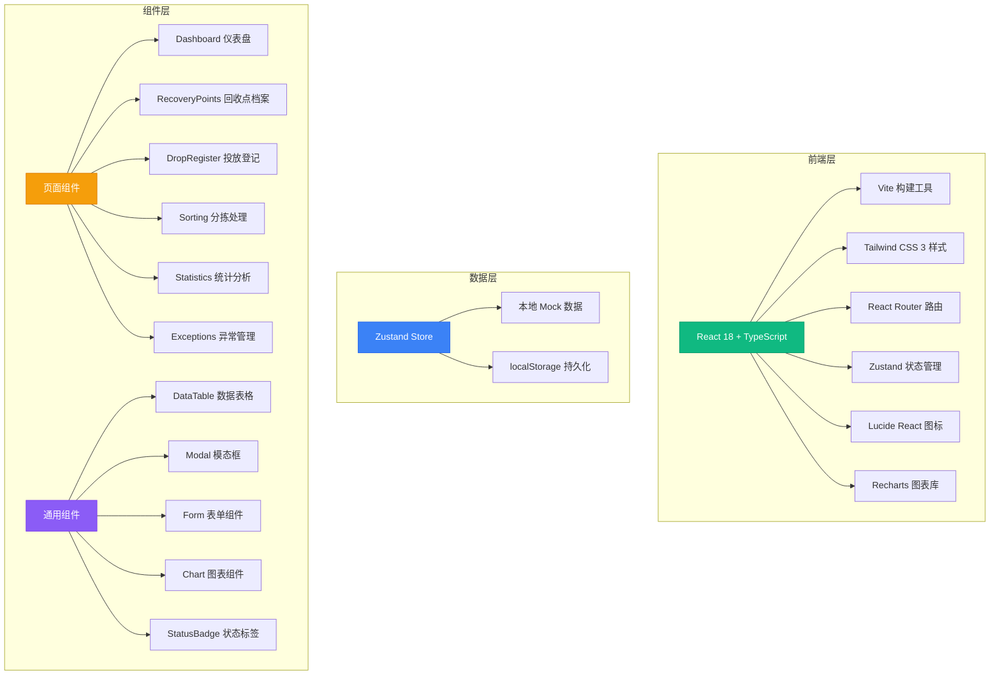
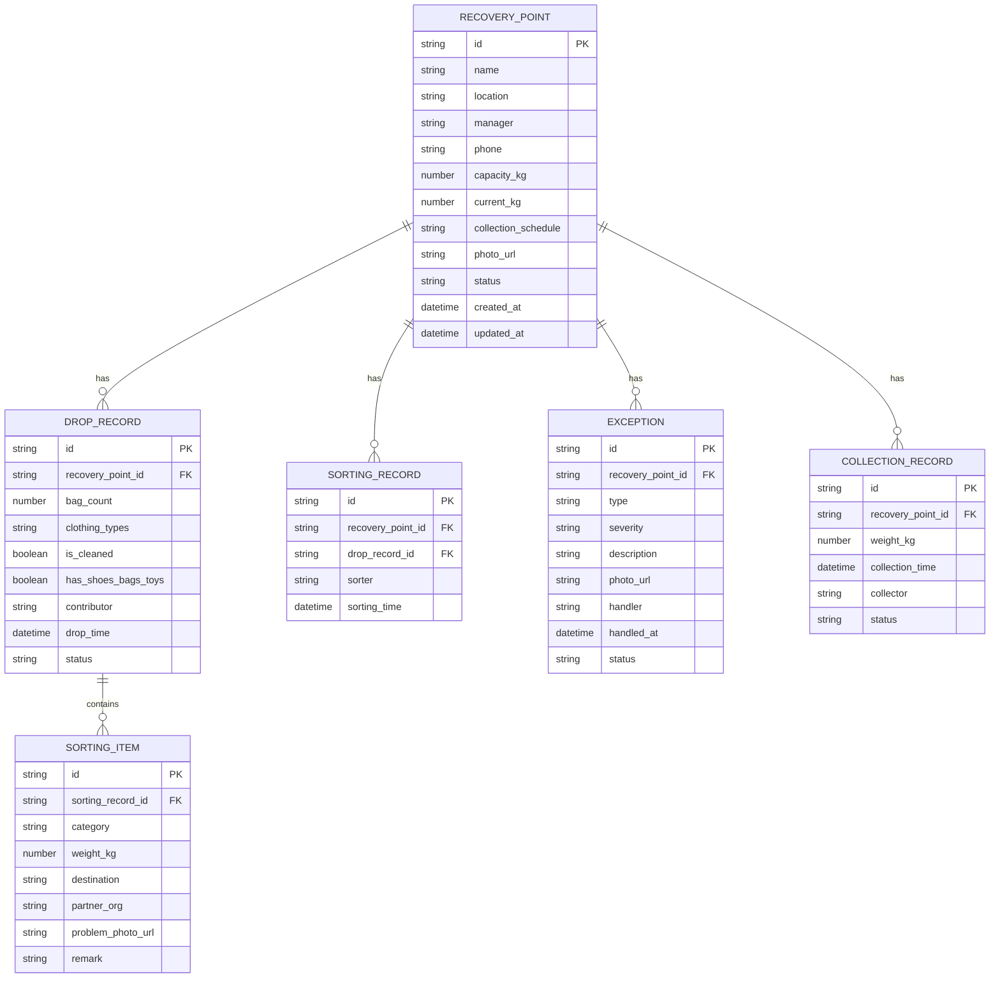

## 1. 架构设计



## 2. 技术描述

- **前端框架**: React 18 + TypeScript 5
- **构建工具**: Vite 5
- **样式方案**: Tailwind CSS 3.4
- **路由管理**: React Router DOM 6
- **状态管理**: Zustand 4
- **图标库**: Lucide React
- **图表库**: Recharts 2
- **数据持久化**: localStorage
- **后端**: 无后端，使用 Mock 数据 + localStorage 实现完整 CRUD

## 3. 路由定义

| 路由路径 | 页面名称 | 说明 |
|-------|---------|------|
| `/` | Dashboard 仪表盘 | 系统首页，展示KPI、满箱提醒、异常预警 |
| `/recovery-points` | 回收点档案 | 回收点列表、新增、编辑、删除、详情 |
| `/drop-register` | 投放登记 | 投放记录列表、新增投放登记 |
| `/sorting` | 分拣处理 | 待分拣列表、分拣操作、分拣记录 |
| `/statistics` | 统计分析 | 投放量、分拣比例、清运效率、公益去向图表 |
| `/exceptions` | 异常管理 | 满箱提醒、异常列表、异常处理 |

## 4. 数据模型

### 4.1 实体关系图



### 4.2 TypeScript 类型定义

```typescript
// 回收点状态
type RecoveryPointStatus = 'normal' | 'warning' | 'full' | 'exception';

// 分拣类别
type SortingCategory = 'donatable' | 'recyclable' | 'damaged' | 'needs_cleaning';

// 异常类型
type ExceptionType = 'full' | 'moisture' | 'odor' | 'damage';

// 异常严重程度
type ExceptionSeverity = 'low' | 'medium' | 'high' | 'critical';

// 异常状态
type ExceptionStatus = 'pending' | 'handling' | 'resolved';

// 回收点
interface RecoveryPoint {
  id: string;
  name: string;
  location: string;
  manager: string;
  phone: string;
  capacityKg: number;
  currentKg: number;
  collectionSchedule: string;
  photoUrl: string;
  status: RecoveryPointStatus;
  createdAt: string;
  updatedAt: string;
}

// 投放记录
interface DropRecord {
  id: string;
  recoveryPointId: string;
  bagCount: number;
  clothingTypes: string[];
  isCleaned: boolean;
  hasShoesBagsToys: boolean;
  contributor: string;
  dropTime: string;
  status: 'pending' | 'sorting' | 'completed';
}

// 分拣记录
interface SortingRecord {
  id: string;
  recoveryPointId: string;
  dropRecordId: string;
  sorter: string;
  sortingTime: string;
  items: SortingItem[];
}

// 分拣明细
interface SortingItem {
  id: string;
  category: SortingCategory;
  weightKg: number;
  destination: string;
  partnerOrg: string;
  problemPhotoUrl?: string;
  remark?: string;
}

// 异常记录
interface Exception {
  id: string;
  recoveryPointId: string;
  type: ExceptionType;
  severity: ExceptionSeverity;
  description: string;
  photoUrl?: string;
  handler?: string;
  handledAt?: string;
  status: ExceptionStatus;
  createdAt: string;
}

// 清运记录
interface CollectionRecord {
  id: string;
  recoveryPointId: string;
  weightKg: number;
  collectionTime: string;
  collector: string;
  status: 'scheduled' | 'completed';
}
```

## 5. 项目结构

```
src/
├── components/           # 通用组件
│   ├── Layout/          # 布局组件
│   │   ├── Sidebar.tsx
│   │   ├── Header.tsx
│   │   └── index.tsx
│   ├── DataTable.tsx    # 数据表格
│   ├── Modal.tsx        # 模态框
│   ├── StatusBadge.tsx  # 状态标签
│   ├── FormFields.tsx   # 表单字段组件
│   └── charts/          # 图表组件
│       ├── BarChart.tsx
│       ├── PieChart.tsx
│       ├── LineChart.tsx
│       └── SankeyChart.tsx
├── pages/               # 页面组件
│   ├── Dashboard.tsx
│   ├── RecoveryPoints/
│   │   ├── List.tsx
│   │   ├── Form.tsx
│   │   └── Detail.tsx
│   ├── DropRegister/
│   │   ├── List.tsx
│   │   └── Form.tsx
│   ├── Sorting/
│   │   ├── PendingList.tsx
│   │   ├── SortingForm.tsx
│   │   └── Records.tsx
│   ├── Statistics/
│   │   ├── index.tsx
│   │   ├── DropVolume.tsx
│   │   ├── SortingRatio.tsx
│   │   ├── CollectionEfficiency.tsx
│   │   └── DonationDestination.tsx
│   └── Exceptions/
│       ├── FullBoxAlerts.tsx
│       └── ExceptionList.tsx
├── store/               # Zustand 状态管理
│   ├── index.ts
│   ├── recoveryPoints.ts
│   ├── dropRecords.ts
│   ├── sortingRecords.ts
│   ├── exceptions.ts
│   └── statistics.ts
├── data/                # Mock 数据
│   ├── recoveryPoints.ts
│   ├── dropRecords.ts
│   ├── sortingRecords.ts
│   └── exceptions.ts
├── types/               # 类型定义
│   └── index.ts
├── utils/               # 工具函数
│   ├── formatters.ts
│   ├── calculations.ts
│   └── mock.ts
├── App.tsx
├── main.tsx
└── index.css
```

## 6. 核心业务逻辑

### 6.1 容量计算
```
当前容量占比 = currentKg / capacityKg * 100%
- 正常: 占比 < 70%
- 预警: 70% ≤ 占比 < 90%
- 满箱: 占比 ≥ 90%
```

### 6.2 分拣比例计算
```
可捐赠比例 = 可捐赠重量 / 总分拣重量 * 100%
可再生比例 = 可再生重量 / 总分拣重量 * 100%
破损报废比例 = 破损报废重量 / 总分拣重量 * 100%
需清洗比例 = 需清洗重量 / 总分拣重量 * 100%
```

### 6.3 清运效率计算
```
平均响应时间 = Σ(清运时间 - 满箱提醒时间) / 清运次数
及时率 = 24小时内完成清运次数 / 总清运次数 * 100%
```
