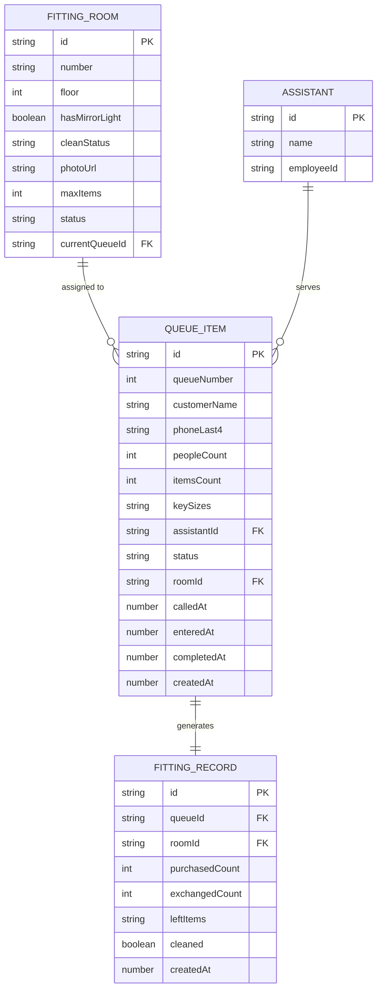

## 1. 架构设计


## 2. 技术描述

- **前端**: React@18 + TypeScript + tailwindcss@3 + Vite
- **状态管理**: zustand
- **路由**: react-router-dom
- **图标**: lucide-react
- **后端**: Express@4 + TypeScript
- **数据存储**: 内存存储（开发阶段），后续可扩展为 SQLite
- **初始化工具**: vite-init react-express-ts 模板

## 3. 路由定义

| 路由 | 页面 | 功能 |
|------|------|------|
| / | 看板首页 | 实时排队状态、试衣间状态墙、数据概览 |
| /queue | 排队管理 | 顾客登记、叫号、超时处理 |
| /rooms | 试衣间管理 | 试衣间档案CRUD |
| /records | 试衣记录 | 结束登记、购买记录、遗落物 |
| /stats | 数据统计 | 转化率趋势、时段分析 |

## 4. API 定义

```typescript
// 试衣间
interface FittingRoom {
  id: string;
  number: string;
  floor: number;
  hasMirrorLight: boolean;
  cleanStatus: 'clean' | 'dirty' | 'cleaning';
  photoUrl?: string;
  maxItems: number;
  status: 'available' | 'occupied' | 'maintenance';
  currentQueueId?: string;
}

// 排队顾客
interface QueueItem {
  id: string;
  queueNumber: number;
  customerName?: string;
  phoneLast4?: string;
  peopleCount: number;
  itemsCount: number;
  keySizes: string[];
  assistantId: string;
  assistantName: string;
  status: 'waiting' | 'called' | 'fitting' | 'completed' | 'timeout';
  roomId?: string;
  calledAt?: number;
  enteredAt?: number;
  completedAt?: number;
  createdAt: number;
}

// 试衣记录
interface FittingRecord {
  id: string;
  queueId: string;
  roomId: string;
  purchasedCount: number;
  exchangedCount: number;
  leftItems: string[];
  cleaned: boolean;
  createdAt: number;
}

// 导购
interface Assistant {
  id: string;
  name: string;
  employeeId: string;
}
```

### API 端点

| 方法 | 路径 | 描述 |
|------|------|------|
| GET | /api/rooms | 获取试衣间列表 |
| POST | /api/rooms | 创建试衣间 |
| PUT | /api/rooms/:id | 更新试衣间 |
| DELETE | /api/rooms/:id | 删除试衣间 |
| GET | /api/queue | 获取排队列表 |
| POST | /api/queue | 新增排队顾客 |
| PUT | /api/queue/:id/call | 叫号 |
| PUT | /api/queue/:id/enter | 确认进入 |
| PUT | /api/queue/:id/complete | 试衣完成 |
| PUT | /api/queue/:id/timeout | 标记超时 |
| GET | /api/records | 获取试衣记录 |
| POST | /api/records | 创建试衣记录 |
| GET | /api/stats/conversion | 获取转化率统计 |
| GET | /api/assistants | 获取导购列表 |

## 5. 数据模型



## 6. 前端状态管理

```typescript
interface AppState {
  rooms: FittingRoom[];
  queue: QueueItem[];
  records: FittingRecord[];
  assistants: Assistant[];
  currentCalledNumber: number | null;
  timeoutThreshold: number; // 超时时间（秒）
  
  // Actions
  fetchRooms: () => Promise<void>;
  addRoom: (room: Omit<FittingRoom, 'id'>) => Promise<void>;
  updateRoom: (id: string, data: Partial<FittingRoom>) => Promise<void>;
  deleteRoom: (id: string) => Promise<void>;
  
  fetchQueue: () => Promise<void>;
  addQueueItem: (data: Omit<QueueItem, 'id' | 'queueNumber' | 'status' | 'createdAt'>) => Promise<void>;
  callNext: () => Promise<void>;
  confirmEnter: (queueId: string) => Promise<void>;
  completeFitting: (queueId: string, record: Partial<FittingRecord>) => Promise<void>;
  markTimeout: (queueId: string) => Promise<void>;
  
  fetchStats: (period: 'today' | 'week' | 'month') => Promise<ConversionStats>;
  checkTimeouts: () => void; // 定时检查超时
}
```

## 7. 核心业务逻辑

### 7.1 叫号逻辑
1. 查找状态为 `waiting` 的最早排队项
2. 查找状态为 `available` 且 `cleanStatus` 为 `clean` 的试衣间
3. 分配试衣间，更新排队项状态为 `called`，记录 `calledAt`
4. 触发叫号提醒（动画+可选音效）

### 7.2 超时检测
- 定时任务每秒检查状态为 `called` 的排队项
- 若 `Date.now() - calledAt > timeoutThreshold`，自动标记为 `timeout`
- 释放试衣间，自动叫下一位

### 7.3 件数超限提醒
- 顾客拿入件数 > 试衣间 `maxItems` 时，提交前弹出警告
- 试衣间卡片显示当前件数和上限

### 7.4 转化率计算
```
试衣转化率 = 进入试衣间人数 / 排队人数
购买转化率 = 购买人数 / 进入试衣间人数
整体转化率 = 购买人数 / 排队人数
```
按小时时段分组统计
