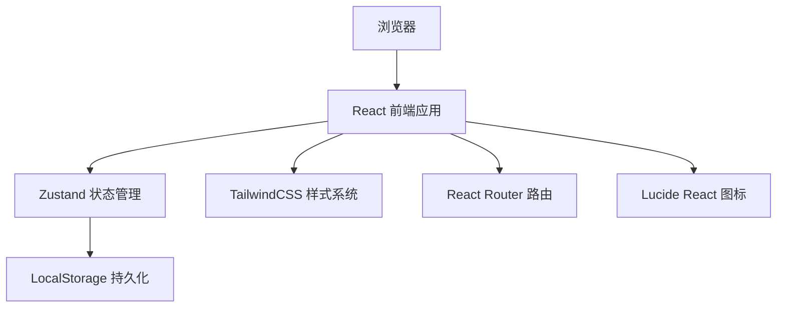
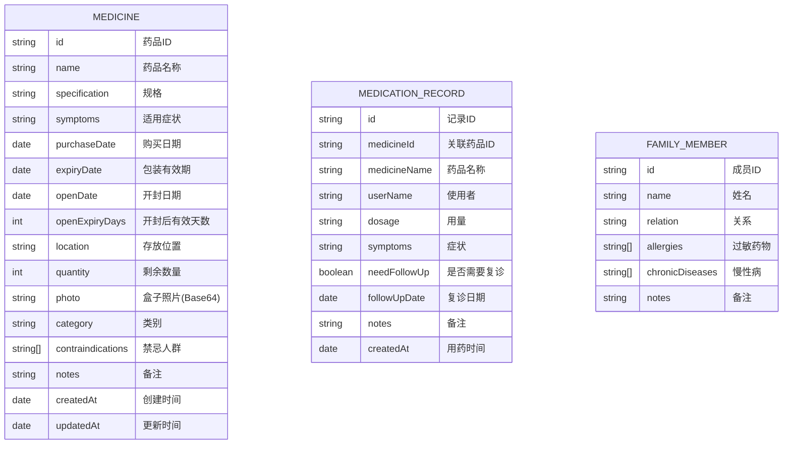

## 1. 架构设计



## 2. 技术描述

- **前端**：React@18 + TypeScript + Vite
- **初始化工具**：vite-init
- **状态管理**：Zustand
- **路由**：react-router-dom
- **样式**：tailwindcss@3
- **图标**：lucide-react
- **数据存储**：LocalStorage（纯前端，无需后端）
- **图片处理**：FileReader API 转 Base64 存储

## 3. 路由定义

| 路由 | 页面 | 用途 |
|-------|---------|---------|
| / | 首页 | 概览临期、过期、库存不足、禁忌药 |
| /medicines | 药品列表 | 按类别分组展示所有药品 |
| /medicines/add | 药品登记 | 新增药品表单 |
| /medicines/:id/edit | 药品编辑 | 编辑已有药品信息 |
| /medicines/:id | 药品详情 | 查看药品详细信息 |
| /records | 用药记录 | 展示和添加用药记录 |
| /records/add | 新增用药记录 | 快速添加用药记录表单 |

## 4. 数据模型

### 4.1 数据模型定义



### 4.2 药品类别枚举

```typescript
enum MedicineCategory {
  COLD_FEVER = 'cold_fever',      // 感冒发烧
  GASTROINTESTINAL = 'gastro',   // 肠胃
  TRAUMA = 'trauma',             // 外伤
  ALLERGY = 'allergy',           // 过敏
  CHRONIC = 'chronic',           // 慢病备用
  OTHER = 'other'                // 其他
}
```

### 4.3 药品状态计算

```typescript
// 状态优先级：已过期 > 临期 > 开封临期 > 正常
function getMedicineStatus(medicine: Medicine): MedicineStatus {
  const now = new Date();
  const oneMonthLater = new Date(now.getTime() + 30 * 24 * 60 * 60 * 1000);
  
  // 检查是否已过期（包装有效期）
  if (new Date(medicine.expiryDate) < now) {
    return { status: 'expired', label: '已过期', color: 'red' };
  }
  
  // 检查是否临期（包装有效期1个月内）
  if (new Date(medicine.expiryDate) < oneMonthLater) {
    return { status: 'expiring', label: '临期', color: 'orange' };
  }
  
  // 检查开封后有效期
  if (medicine.openDate && medicine.openExpiryDays) {
    const openExpiryDate = new Date(
      new Date(medicine.openDate).getTime() + 
      medicine.openExpiryDays * 24 * 60 * 60 * 1000
    );
    
    if (openExpiryDate < now) {
      return { status: 'open_expired', label: '开封已过期', color: 'red' };
    }
    
    if (openExpiryDate < oneMonthLater) {
      return { status: 'open_expiring', label: '开封临期', color: 'orange' };
    }
    
    return { status: 'opened', label: '已开封', color: 'blue' };
  }
  
  return { status: 'normal', label: '正常', color: 'green' };
}
```

## 5. 核心工具函数

### 5.1 日期计算

```typescript
// 计算两个日期之间的天数差
function daysBetween(date1: Date, date2: Date): number

// 检查药品是否临期（1个月内）
function isExpiringSoon(expiryDate: string): boolean

// 计算开封后有效期截止日期
function getOpenExpiryDate(openDate: string, days: number): Date
```

### 5.2 类别检查

```typescript
// 检查是否有关键类别缺少药品
function getMissingCategories(medicines: Medicine[]): MedicineCategory[]

// 关键类别定义：感冒发烧、肠胃、外伤、过敏
const ESSENTIAL_CATEGORIES = [
  MedicineCategory.COLD_FEVER,
  MedicineCategory.GASTROINTESTINAL,
  MedicineCategory.TRAUMA,
  MedicineCategory.ALLERGY
]
```

### 5.3 图片处理

```typescript
// 压缩图片并转换为Base64
function compressImage(file: File, maxSize: number = 800): Promise<string>
```

## 6. 状态管理 (Zustand Store)

```typescript
interface MedicineStore {
  medicines: Medicine[]
  records: MedicationRecord[]
  familyMembers: FamilyMember[]
  
  // 药品操作
  addMedicine: (medicine: Omit<Medicine, 'id' | 'createdAt' | 'updatedAt'>) => void
  updateMedicine: (id: string, data: Partial<Medicine>) => void
  deleteMedicine: (id: string) => void
  
  // 用药记录操作
  addRecord: (record: Omit<MedicationRecord, 'id' | 'createdAt'>) => void
  deleteRecord: (id: string) => void
  
  // 家庭成员操作
  addFamilyMember: (member: Omit<FamilyMember, 'id'>) => void
  updateFamilyMember: (id: string, data: Partial<FamilyMember>) => void
  deleteFamilyMember: (id: string) => void
  
  // 计算属性
  getExpiredMedicines: () => Medicine[]
  getExpiringMedicines: () => Medicine[]
  getLowStockMedicines: () => Medicine[]
  getContraindicatedMedicines: (memberId: string) => Medicine[]
  
  // 持久化
  loadFromStorage: () => void
  saveToStorage: () => void
}
```
