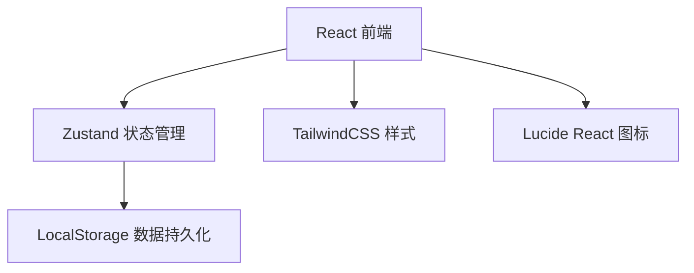
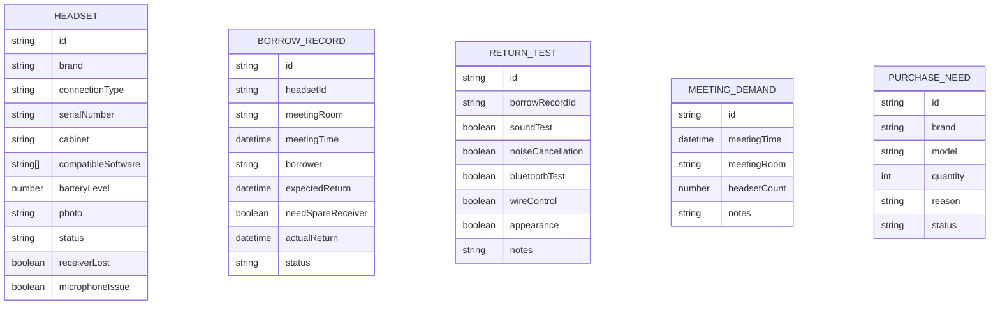

## 1. 架构设计



## 2. 技术描述

- 前端：React@18 + TypeScript + Vite
- 状态管理：Zustand
- 样式：TailwindCSS@3
- 图标：lucide-react
- 数据存储：LocalStorage + Mock数据
- 路由：react-router-dom

## 3. 路由定义

| 路由 | 用途 |
|------|------|
| / | 看板页 |
| /headsets | 耳麦档案列表 |
| /headsets/new | 新增耳麦档案 |
| /headsets/:id/edit | 编辑耳麦档案 |
| /borrow | 借用登记 |
| /return/:id | 归还测试 |

## 4. 数据模型

### 4.1 数据模型定义



### 4.2 类型定义

```typescript
type ConnectionType = 'bluetooth' | 'usb' | 'wireless_24g' | 'wired';
type HeadsetStatus = 'available' | 'borrowed' | 'faulty' | 'maintenance';
type BorrowStatus = 'borrowed' | 'returned' | 'overdue';
type PurchaseStatus = 'pending' | 'ordered' | 'received';

interface Headset {
  id: string;
  brand: string;
  connectionType: ConnectionType;
  serialNumber: string;
  cabinet: string;
  compatibleSoftware: string[];
  batteryLevel: number;
  photo: string;
  status: HeadsetStatus;
  receiverLost: boolean;
  microphoneIssue: boolean;
  createdAt: string;
}

interface BorrowRecord {
  id: string;
  headsetId: string;
  meetingRoom: string;
  meetingTime: string;
  borrower: string;
  expectedReturn: string;
  needSpareReceiver: boolean;
  actualReturn?: string;
  status: BorrowStatus;
  createdAt: string;
}

interface ReturnTest {
  id: string;
  borrowRecordId: string;
  soundTest: boolean;
  noiseCancellation: boolean;
  bluetoothTest: boolean;
  wireControl: boolean;
  appearance: boolean;
  notes?: string;
  createdAt: string;
}

interface MeetingDemand {
  id: string;
  meetingTime: string;
  meetingRoom: string;
  headsetCount: number;
  notes?: string;
  createdAt: string;
}

interface PurchaseNeed {
  id: string;
  brand: string;
  model: string;
  quantity: number;
  reason: string;
  status: PurchaseStatus;
  createdAt: string;
}
```
