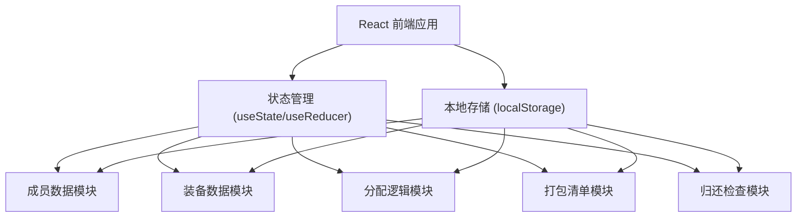
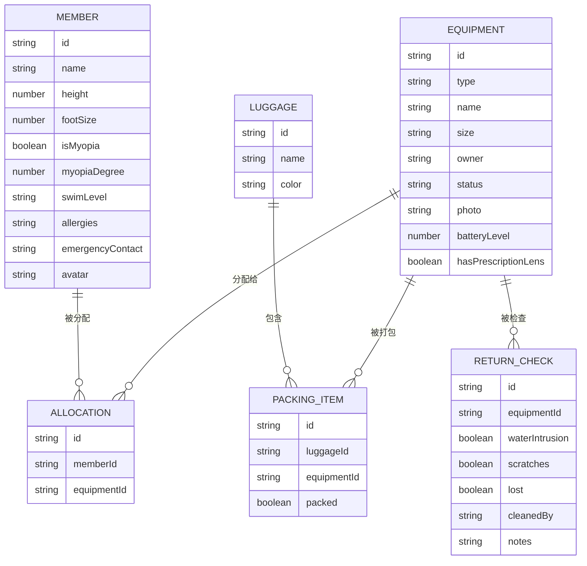

## 1. 架构设计



纯前端单页应用，数据持久化到 localStorage，无需后端服务。

## 2. 技术描述

- **前端框架**：React 18 + TypeScript
- **构建工具**：Vite
- **样式方案**：TailwindCSS 3
- **图标库**：Lucide React
- **状态管理**：React Hooks (useState, useReducer, useContext)
- **数据持久化**：localStorage
- **拖拽交互**：@dnd-kit/core + @dnd-kit/sortable

## 3. 路由定义

| 路由 | 页面 | 功能 |
|-----|------|------|
| / | 仪表盘 | 数据总览和快捷入口 |
| /members | 成员管理 | 成员信息增删改查 |
| /equipment | 装备档案 | 装备分类管理 |
| /allocation | 智能分配 | 装备分配与告警提示 |
| /packing | 打包清单 | 按行李箱打包确认 |
| /return | 归还检查 | 装备归还与清洗责任 |

## 4. 数据模型

### 4.1 实体关系图



### 4.2 装备类型枚举

```typescript
type EquipmentType = 
  | 'mask'        // 面镜
  | 'snorkel'     // 呼吸管
  | 'fins'        // 脚蹼
  | 'rashGuard'   // 防晒衣
  | 'lifeJacket'  // 救生衣
  | 'dryBag'      // 防水袋
  | 'actionCam';  // 运动相机
```

### 4.3 游泳水平枚举

```typescript
type SwimLevel = 'beginner' | 'intermediate' | 'advanced' | 'professional';
```

### 4.4 装备状态枚举

```typescript
type EquipmentStatus = 'good' | 'damaged' | 'maintenance' | 'lost';
```

## 5. 核心算法

### 5.1 智能分配检查

- **近视检查**：成员近视且面镜无度数镜片 → 告警
- **脚蹼尺码检查**：脚蹼尺码与成员脚码不匹配 → 告警
- **救生衣缺口**：救生衣数量 < 成员数量（尤其游泳初学者）→ 告警
- **相机电池检查**：运动相机电量 < 30% → 告警

### 5.2 尺码匹配规则

- 脚蹼：脚码 ±1 码为合适
- 防晒衣：根据身高匹配 S/M/L/XL
- 救生衣：根据身高体重范围匹配

## 6. 项目结构

```
src/
├── components/       # 通用组件
│   ├── Layout/
│   ├── Card/
│   └── Modal/
├── pages/           # 页面组件
│   ├── Dashboard/
│   ├── Members/
│   ├── Equipment/
│   ├── Allocation/
│   ├── Packing/
│   └── Return/
├── hooks/           # 自定义 Hooks
│   ├── useMembers.ts
│   ├── useEquipment.ts
│   └── useAllocation.ts
├── types/           # TypeScript 类型定义
├── utils/           # 工具函数
├── store/           # 状态管理 Context
└── App.tsx
```
