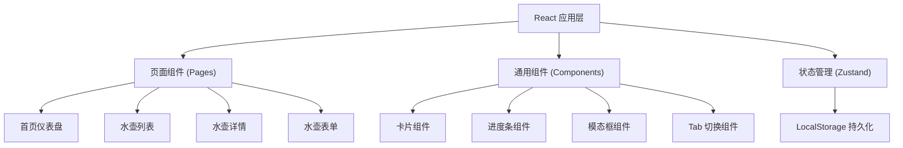
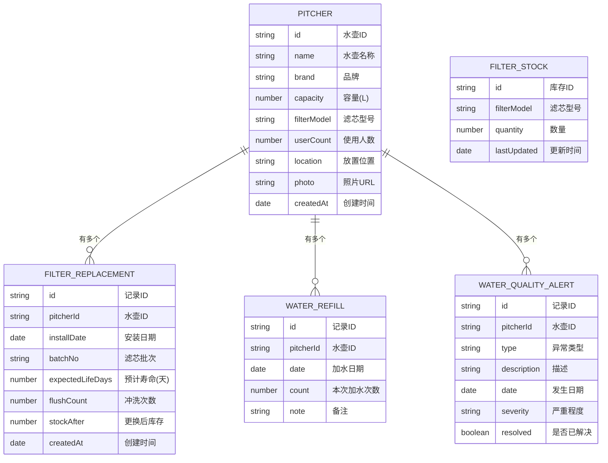

## 1. 架构设计



## 2. 技术说明

- 前端框架：React@18 + TypeScript
- 构建工具：Vite
- 样式方案：Tailwind CSS@3
- 状态管理：Zustand
- 路由管理：React Router DOM@6
- 图标库：Lucide React
- 数据持久化：LocalStorage
- 图表实现：纯 CSS + 自定义组件（轻量级）

## 3. 路由定义

| 路由路径 | 页面名称 | 功能说明 |
|----------|----------|----------|
| `/` | 首页仪表盘 | 滤芯寿命总览、购买建议、异常提醒、使用频率 |
| `/pitchers` | 水壶列表 | 所有水壶卡片展示，支持新增入口 |
| `/pitchers/:id` | 水壶详情 | 水壶档案、换芯历史、加水记录、异常记录 |
| `/pitchers/new` | 新增水壶 | 新建水壶档案表单 |
| `/pitchers/:id/edit` | 编辑水壶 | 编辑水壶档案表单 |

## 4. 数据模型

### 4.1 数据模型定义



### 4.2 TypeScript 类型定义

```typescript
interface Pitcher {
  id: string;
  name: string;
  brand: string;
  capacity: number;
  filterModel: string;
  userCount: number;
  location: string;
  photo: string;
  createdAt: string;
}

interface FilterReplacement {
  id: string;
  pitcherId: string;
  installDate: string;
  batchNo: string;
  expectedLifeDays: number;
  flushCount: number;
  stockAfter: number;
  createdAt: string;
}

interface WaterRefill {
  id: string;
  pitcherId: string;
  date: string;
  count: number;
  note?: string;
}

type AlertType = 'slow_flow' | 'odor' | 'chlorine_test';
type AlertSeverity = 'low' | 'medium' | 'high';

interface WaterQualityAlert {
  id: string;
  pitcherId: string;
  type: AlertType;
  description: string;
  date: string;
  severity: AlertSeverity;
  resolved: boolean;
}

interface FilterStock {
  id: string;
  filterModel: string;
  quantity: number;
  lastUpdated: string;
}
```

## 5. 状态管理设计

### 5.1 Store 结构

```typescript
interface AppState {
  pitchers: Pitcher[];
  filterReplacements: FilterReplacement[];
  waterRefills: WaterRefill[];
  alerts: WaterQualityAlert[];
  stocks: FilterStock[];
  
  // Pitcher actions
  addPitcher: (pitcher: Omit<Pitcher, 'id' | 'createdAt'>) => void;
  updatePitcher: (id: string, data: Partial<Pitcher>) => void;
  deletePitcher: (id: string) => void;
  
  // Filter actions
  replaceFilter: (pitcherId: string, data: ReplaceFilterData) => void;
  getCurrentFilter: (pitcherId: string) => FilterReplacement | null;
  getFilterLifePercent: (pitcherId: string) => number;
  
  // Refill actions
  addRefill: (pitcherId: string, count?: number) => void;
  getRefillCount: (pitcherId: string, days?: number) => number;
  
  // Alert actions
  addAlert: (alert: Omit<WaterQualityAlert, 'id'>) => void;
  resolveAlert: (id: string) => void;
  
  // Stock actions
  updateStock: (filterModel: string, quantity: number) => void;
  getStock: (filterModel: string) => number;
  
  // Dashboard calculations
  getDashboardStats: () => DashboardStats;
}
```

### 5.2 持久化方案

使用 Zustand 的 persist 中间件，将所有状态存储到 localStorage 中，键名为 `water-filter-app-state`。

## 6. 项目目录结构

```
src/
├── components/          # 通用组件
│   ├── Card.tsx         # 卡片容器
│   ├── ProgressBar.tsx  # 进度条
│   ├── Modal.tsx        # 模态框
│   ├── Tabs.tsx         # Tab 切换
│   ├── StatCard.tsx     # 统计卡片
│   ├── PitcherCard.tsx  # 水壶卡片
│   └── AlertItem.tsx    # 异常提醒项
├── pages/               # 页面组件
│   ├── Dashboard.tsx    # 首页仪表盘
│   ├── PitcherList.tsx  # 水壶列表
│   ├── PitcherDetail.tsx # 水壶详情
│   └── PitcherForm.tsx  # 水壶表单
├── store/               # 状态管理
│   └── useStore.ts      # Zustand store
├── types/               # 类型定义
│   └── index.ts         # 所有类型
├── utils/               # 工具函数
│   ├── date.ts          # 日期工具
│   └── calculations.ts  # 计算工具
├── data/                # 初始数据
│   └── mockData.ts      # Mock 数据
├── App.tsx              # 应用入口
├── main.tsx             # 渲染入口
└── index.css            # 全局样式
```

## 7. 核心业务逻辑

### 7.1 滤芯寿命计算

- 基于安装日期和预计寿命天数计算剩余寿命百分比
- 剩余天数 = 预计寿命 - (当前日期 - 安装日期)
- 寿命百分比 = 剩余天数 / 预计寿命 × 100%
- 状态判定：>70% 健康、30%-70% 正常、<30% 警告、≤0% 过期

### 7.2 库存预警

- 滤芯过期且库存为 0 → 红色紧急警示
- 库存 ≤ 1 且滤芯寿命 < 30% → 橙色购买提醒
- 正常库存 → 绿色正常状态

### 7.3 购买建议计算

- 根据历史换芯频率计算平均消耗速度
- 下次需要更换的时间 = 当前滤芯到期时间
- 建议购买数量 = 预计未来3个月消耗量 - 当前库存

### 7.4 使用频率统计

- 统计每个水壶最近30天的加水次数
- 用柱状图可视化展示各水壶使用频率对比
