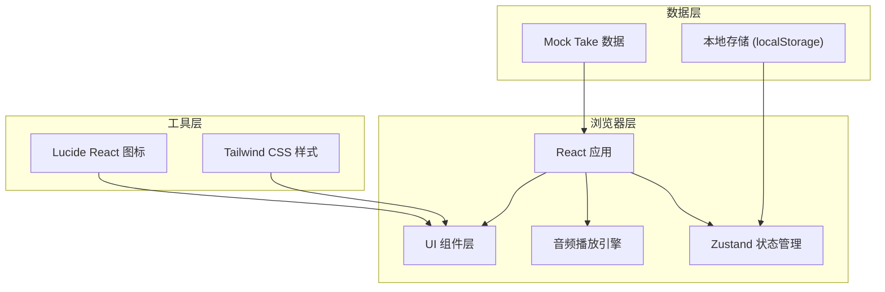

## 1. 架构设计

纯前端单页应用，本地状态管理，无需后端服务。音频数据使用 Mock 数据模拟真实试音场景。



## 2. 技术描述

- **前端框架**：React 18 + TypeScript
- **构建工具**：Vite 5
- **状态管理**：Zustand
- **样式方案**：Tailwind CSS 3 + 自定义 CSS 变量
- **图标库**：lucide-react
- **包管理器**：pnpm（如果可用，否则 npm）

## 3. 路由定义

| Route | 用途 |
|-------|------|
| / | 试音对比主页（单页应用唯一入口） |

## 4. 数据模型

### 4.1 核心数据结构

```typescript
interface AudioTake {
  id: string;
  name: string;
  microphone: string;
  preamp: string;
  distance: number; // cm
  gain: number; // dB
  roomPosition: string;
  popFilter: boolean;
  audioUrl: string;
  duration: number; // seconds
  starred: boolean;
  annotations: Annotations;
  notes: string;
  createdAt: string;
}

interface Annotations {
  sibilance: number; // 0-10 齿音
  nasality: number; // 0-10 鼻音
  plosives: number; // 0-10 爆破音
  noiseFloor: number; // 0-10 底噪（越小越好）
  emotion: number; // 0-10 情绪表现
}

interface ComparisonSlot {
  a: AudioTake | null;
  b: AudioTake | null;
  active: 'a' | 'b';
}

interface FilterState {
  microphones: string[];
  preamps: string[];
  distances: [number, number];
  gains: [number, number];
  roomPositions: string[];
  popFilter: boolean | null;
  starredOnly: boolean;
  sortBy: 'name' | 'distance' | 'gain' | 'createdAt';
  sortOrder: 'asc' | 'desc';
}
```

### 4.2 Mock 数据结构

生成 8-12 条模拟试音数据，覆盖以下设备组合：

- **麦克风**：Neumann U87, Shure SM7B, AKG C414, Sony C800G, Telefunken ELA M 251
- **前级**：Neve 1073, API 512c, Universal Audio 6176, Focusrite ISA One
- **距离**：10cm, 15cm, 20cm, 30cm
- **增益**：-12dB, -6dB, 0dB, +6dB, +12dB
- **房间位置**：Center, Off-axis 15°, Corner, Vocal Booth
- **防喷罩**：开启/关闭

## 5. 组件划分

```
src/
├── components/
│   ├── FilterBar.tsx          # 顶部筛选排序栏
│   ├── TakeCard.tsx           # 试音卡片
│   ├── AudioPlayer.tsx        # 音频播放器
│   ├── VUMeter.tsx            # VU 表动画组件
│   ├── ComparisonBar.tsx      # 底部 A/B 对比栏
│   ├── AnnotationPanel.tsx    # 音质标注侧边栏
│   ├── StarButton.tsx         # 星标按钮
│   ├── FavoritesList.tsx      # 收藏列表
│   └── ExportModal.tsx        # 导出报告弹窗
├── hooks/
│   ├── useAudioPlayer.ts      # 音频播放逻辑
│   └── useKeyboardShortcuts.ts # 键盘快捷键
├── store/
│   └── useStore.ts            # Zustand 全局状态
├── types/
│   └── index.ts               # TypeScript 类型定义
├── data/
│   └── mockTakes.ts           # Mock 数据
├── utils/
│   └── audio.ts               # 音频工具函数
├── App.tsx
├── main.tsx
└── index.css
```

## 6. 核心功能实现要点

### 6.1 A/B 切换对比
- 使用两个 `Audio` 实例，分别加载 A/B 轨道音频
- 切换时实现 150ms 交叉淡入淡出，避免爆音
- 支持空格键快捷键切换，同步播放进度

### 6.2 音频播放引擎
- 封装 `useAudioPlayer` hook 管理播放状态
- 音量归一化处理，确保不同 Take 音量一致
- VU 表动画使用 Web Audio API 分析实时音量

### 6.3 拖拽交互
- 原生 HTML5 Drag & Drop API 实现 Take 卡片拖入 A/B 槽
- 拖拽时卡片半透明，目标槽位高亮提示

### 6.4 本地持久化
- 收藏状态和标注数据存储在 `localStorage`
- 页面刷新后自动恢复状态

### 6.5 导出功能
- 生成 Markdown 格式的设备链路报告
- 支持复制到剪贴板或下载为 `.md` 文件
