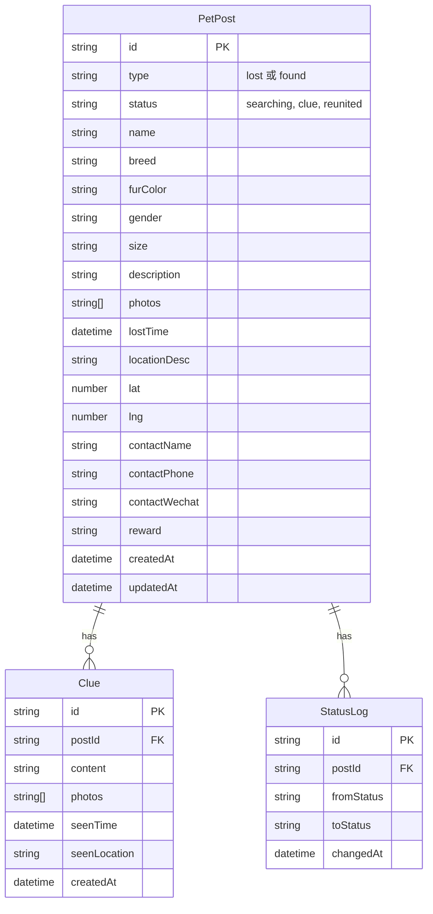

## 1. 架构设计

```mermaid
flowchart TB
    subgraph "前端层"
        "React App" --> "React Router"
        "React App" --> "Zustand Store"
        "React App" --> "Leaflet 地图"
        "React App" --> "HTML2Canvas 打印"
    end
    subgraph "数据层"
        "Zustand Store" --> "localStorage"
        "Zustand Store" --> "导入导出 JSON"
    end
    subgraph "外部服务"
        "Leaflet 地图" --> "OpenStreetMap 瓦片"
        "QRCode 生成" --> "详情页 URL"
    end
```

纯前端应用，无需后端服务。数据存储在浏览器 localStorage 中，支持 JSON 格式导入导出。

## 2. 技术说明

- **前端框架**：React 18 + TypeScript + Vite
- **样式方案**：Tailwind CSS 3
- **状态管理**：Zustand
- **路由**：React Router DOM v6
- **地图**：Leaflet + react-leaflet（OpenStreetMap 免费瓦片）
- **二维码**：qrcode.react
- **海报生成**：html2canvas（截图生成打印海报）
- **图标**：lucide-react
- **数据存储**：localStorage + JSON 导入导出
- **后端**：无（纯前端）

## 3. 路由定义

| 路由 | 用途 |
|------|------|
| `/` | 首页：地图+卡片列表视图 |
| `/post/:id` | 宠物详情页：信息展示+线索留言+打印启事 |
| `/create` | 发布页：新增走失/捡到宠物信息 |
| `/create/:id` | 编辑页：修改已有宠物信息 |

## 4. API 定义

无后端 API，所有数据操作通过 Zustand Store 在本地完成。

## 5. 数据模型

### 5.1 数据模型定义



### 5.2 数据定义

```typescript
interface PetPost {
  id: string
  type: 'lost' | 'found'
  status: 'searching' | 'clue' | 'reunited'
  name: string
  breed: string
  furColor: string
  gender: 'male' | 'female' | 'unknown'
  size: string
  description: string
  photos: string[]
  lostTime: string
  locationDesc: string
  lat: number
  lng: number
  contactName: string
  contactPhone: string
  contactWechat: string
  reward: string
  createdAt: string
  updatedAt: string
}

interface Clue {
  id: string
  postId: string
  content: string
  photos: string[]
  seenTime: string
  seenLocation: string
  createdAt: string
}

interface StatusLog {
  id: string
  postId: string
  fromStatus: string
  toStatus: string
  changedAt: string
}

interface AppData {
  posts: PetPost[]
  clues: Clue[]
  statusLogs: StatusLog[]
}
```

照片以 Base64 DataURL 形式存储在 localStorage 中。导入导出时整个 AppData 序列化为 JSON 文件下载/上传。
