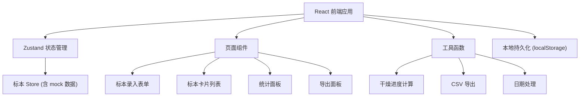
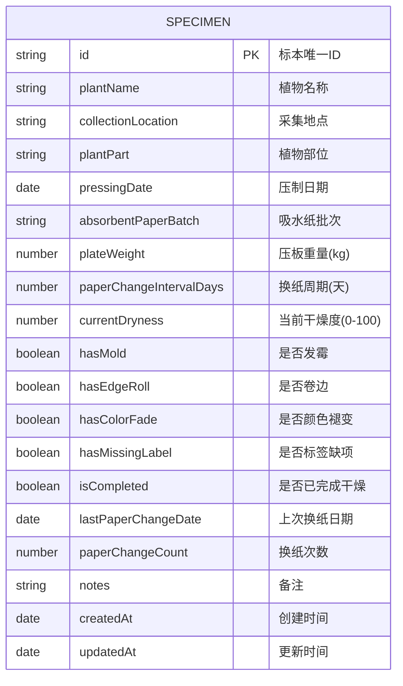

## 1. 架构设计



## 2. 技术描述

- **前端**：React@18 + TypeScript + tailwindcss@3 + Vite
- **初始化工具**：vite-init（react-ts 模板）
- **状态管理**：zustand
- **路由**：react-router-dom（单页应用，可选 HashRouter）
- **图标**：lucide-react
- **后端**：无，使用 localStorage 本地持久化 + 内置 mock 数据
- **数据存储**：浏览器 localStorage

## 3. 路由定义

| 路由 | 用途 |
|-----|-----|
| / | 标本压制管理主页（单页应用所有功能集成于此） |

## 4. 数据模型

### 4.1 数据模型定义



### 4.2 TypeScript 类型定义

```typescript
export interface Specimen {
  id: string;
  plantName: string;
  collectionLocation: string;
  plantPart: string;
  pressingDate: string;
  absorbentPaperBatch: string;
  plateWeight: number;
  paperChangeIntervalDays: number;
  currentDryness: number;
  hasMold: boolean;
  hasEdgeRoll: boolean;
  hasColorFade: boolean;
  hasMissingLabel: boolean;
  isCompleted: boolean;
  lastPaperChangeDate: string;
  paperChangeCount: number;
  notes: string;
  createdAt: string;
  updatedAt: string;
}

export type SpecimenFormData = Omit<
  Specimen,
  'id' | 'currentDryness' | 'hasMold' | 'hasEdgeRoll' | 'hasColorFade' |
  'hasMissingLabel' | 'isCompleted' | 'lastPaperChangeDate' | 'paperChangeCount' |
  'createdAt' | 'updatedAt'
>;
```

## 5. 组件结构

```
src/
├── components/
│   ├── SpecimenForm/          # 标本录入表单
│   ├── SpecimenCard/          # 标本展示卡片
│   ├── SpecimenList/          # 标本列表容器
│   ├── StatsPanel/            # 顶部统计面板
│   ├── DrynessProgress/       # 干燥进度条组件
│   ├── StatusBadge/           # 状态标签（异常/完成等）
│   ├── ActionPanel/           # 操作面板（换纸、标记状态）
│   └── ExportPanel/           # 导出面板
├── store/
│   └── useSpecimenStore.ts    # zustand 状态管理
├── utils/
│   ├── dryness.ts             # 干燥进度计算工具
│   ├── export.ts              # CSV 导出工具
│   └── date.ts                # 日期处理工具
├── types/
│   └── specimen.ts            # 类型定义
├── data/
│   └── mockData.ts            # Mock 初始数据
├── pages/
│   └── App.tsx                # 主页面
└── main.tsx                   # 入口文件
```
