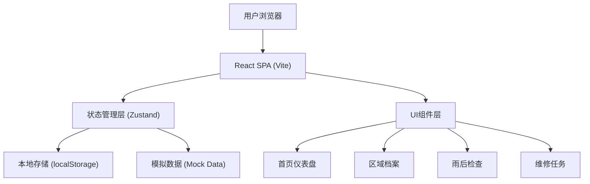
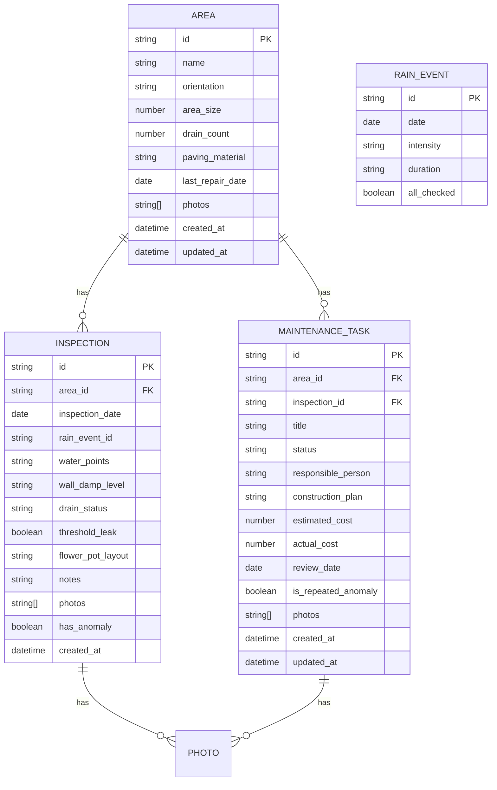

# 露台防水排查管理系统 技术架构文档

## 1. 架构设计



## 2. 技术说明
- **前端框架**：React@18 + TypeScript + Vite@6
- **样式方案**：TailwindCSS@3 + CSS变量主题系统
- **状态管理**：Zustand（轻量级状态管理，适合中小型应用）
- **路由**：React Router@6
- **图标库**：Lucide React（线性风格图标，配合防水主题）
- **数据持久化**：localStorage + Zustand persist 中间件
- **后端**：无，纯前端应用，使用Mock数据和本地存储

## 3. 路由定义
| 路由 | 用途 |
|------|------|
| / | 首页仪表盘（待检查区域、暴雨记录、渗水点、维修进度） |
| /areas | 区域档案列表 |
| /areas/:id | 区域详情/编辑 |
| /areas/new | 新增区域 |
| /inspections/:areaId | 雨后检查记录（指定区域） |
| /inspections | 所有检查记录 |
| /tasks | 维修任务看板 |
| /tasks/:id | 任务详情/编辑 |
| /tasks/new | 新增维修任务 |

## 4. 数据模型

### 4.1 实体关系图



### 4.2 TypeScript 类型定义

```typescript
// 区域档案
interface Area {
  id: string;
  name: string;
  orientation: '东' | '南' | '西' | '北' | '东南' | '东北' | '西南' | '西北';
  areaSize: number; // 平方米
  drainCount: number;
  pavingMaterial: string;
  lastRepairDate?: string;
  photos: string[];
  createdAt: string;
  updatedAt: string;
}

// 潮痕程度
type DampLevel = 'none' | 'light' | 'medium' | 'severe';
// 地漏状态
type DrainStatus = 'normal' | 'slow' | 'blocked';
// 任务状态
type TaskStatus = 'pending' | 'in_progress' | 'completed' | 'review';

// 雨后检查记录
interface Inspection {
  id: string;
  areaId: string;
  inspectionDate: string;
  rainEventId: string;
  waterPoints: string[]; // 积水点位置描述
  wallDampLevel: DampLevel;
  drainStatus: DrainStatus;
  thresholdLeak: boolean;
  flowerPotLayout: string;
  notes: string;
  photos: string[];
  hasAnomaly: boolean;
  createdAt: string;
}

// 维修任务
interface MaintenanceTask {
  id: string;
  areaId: string;
  inspectionId?: string;
  title: string;
  status: TaskStatus;
  responsiblePerson: string;
  constructionPlan: string;
  estimatedCost?: number;
  actualCost?: number;
  reviewDate?: string;
  isRepeatedAnomaly: boolean;
  photos: string[];
  createdAt: string;
  updatedAt: string;
}

// 暴雨事件
interface RainEvent {
  id: string;
  date: string;
  intensity: 'light' | 'moderate' | 'heavy' | 'storm';
  duration: string;
  allChecked: boolean;
}
```

## 5. 项目目录结构

```
src/
├── assets/              # 静态资源（图片、SVG等）
├── components/          # 通用组件
│   ├── Layout/          # 布局组件
│   ├── Card/            # 卡片组件
│   ├── Timeline/        # 时间线组件
│   ├── StatusBadge/     # 状态标签
│   ├── PhotoUpload/     # 照片上传
│   └── AnomalyCard/     # 异常标红卡片
├── pages/               # 页面组件
│   ├── Dashboard/       # 首页仪表盘
│   ├── Areas/           # 区域档案
│   ├── Inspections/     # 雨后检查
│   └── Tasks/           # 维修任务
├── store/               # Zustand状态管理
│   ├── useAreaStore.ts
│   ├── useInspectionStore.ts
│   ├── useTaskStore.ts
│   └── useRainEventStore.ts
├── types/               # TypeScript类型定义
│   └── index.ts
├── data/                # Mock数据
│   └── mockData.ts
├── utils/               # 工具函数
│   ├── date.ts
│   ├── anomaly.ts       # 异常检测逻辑
│   └── storage.ts
├── App.tsx
├── main.tsx
└── index.css
```

## 6. 异常检测逻辑

连续两次异常标红规则：
1. 查询指定区域的所有检查记录，按时间倒序排列
2. 取最近两条记录，检查 `hasAnomaly` 字段
3. 若两条均为 `true`，则该区域的相关卡片和任务需标红显示
4. 在生成维修任务时自动设置 `isRepeatedAnomaly` 字段

```typescript
function checkRepeatedAnomaly(areaId: string, inspections: Inspection[]): boolean {
  const areaInspections = inspections
    .filter(i => i.areaId === areaId)
    .sort((a, b) => new Date(b.createdAt).getTime() - new Date(a.createdAt).getTime())
    .slice(0, 2);
  
  if (areaInspections.length < 2) return false;
  return areaInspections.every(i => i.hasAnomaly);
}
```
