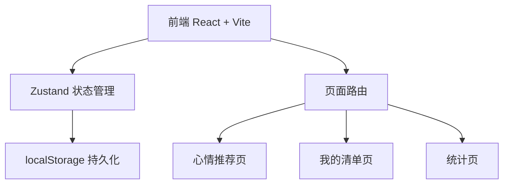
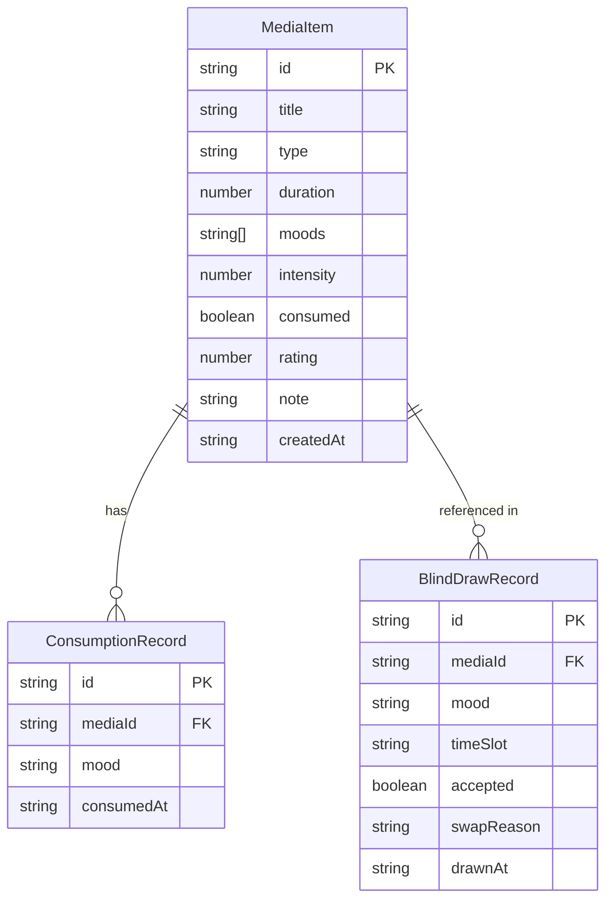

## 1. 架构设计



纯前端应用，所有数据存储在 localStorage，无需后端服务。

## 2. 技术说明

- 前端：React@18 + TypeScript + Tailwind CSS@3 + Vite
- 初始化工具：vite-init
- 后端：无
- 数据库：localStorage（浏览器本地持久化）
- 状态管理：Zustand + persist 中间件
- 路由：react-router-dom v6
- 图表：recharts（轻量级图表库）
- 动画：framer-motion

## 3. 路由定义

| 路由 | 用途 |
|------|------|
| / | 心情推荐页（首页），心情选择盘 + 时间选择 + 推荐结果 + 盲抽 |
| /library | 我的清单页，书影音条目管理 |
| /stats | 统计页，心情消费画像和盲抽历史 |

## 4. API 定义
无后端 API，所有数据通过 Zustand store + localStorage 管理。

## 5. 服务器架构图
不适用。

## 6. 数据模型

### 6.1 数据模型定义



### 6.2 数据定义

**MediaItem（媒体条目）**
```typescript
interface MediaItem {
  id: string
  title: string
  type: 'book' | 'movie' | 'series' | 'music'
  duration: number // 分钟
  moods: Mood[]
  intensity: number // 1-5
  consumed: boolean
  rating: number // 1-5
  note: string
  createdAt: string
}
```

**Mood（心情枚举）**
```typescript
type Mood = 'tired' | 'annoyed' | 'happy' | 'insomnia' | 'want-cry' | 'want-learn' | 'want-empty'
```

**TimeSlot（时间档位）**
```typescript
type TimeSlot = '20min' | '1hr' | 'evening'
```

**ConsumptionRecord（消费记录）**
```typescript
interface ConsumptionRecord {
  id: string
  mediaId: string
  mood: Mood
  consumedAt: string
}
```

**BlindDrawRecord（盲抽记录）**
```typescript
interface BlindDrawRecord {
  id: string
  mediaId: string
  mood: Mood
  timeSlot: TimeSlot
  accepted: boolean
  swapReason?: string
  drawnAt: string
}
```
