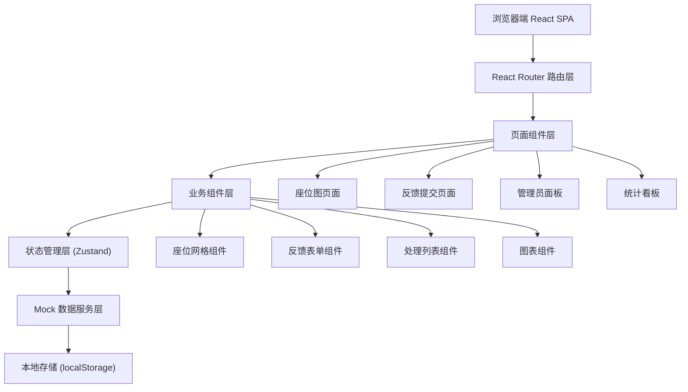

## 1. 架构设计



## 2. 技术描述

- **前端框架**：React@18 + TypeScript@5
- **构建工具**：Vite@5
- **样式方案**：TailwindCSS@3 + CSS Variables
- **路由管理**：React Router@6
- **状态管理**：Zustand（轻量、API 简洁，适合中小型项目）
- **图表库**：Recharts（React 原生，支持柱状图、折线图、热力图）
- **图标库**：Lucide React
- **后端**：无后端，使用 Mock 数据 + localStorage 持久化
- **数据存储**：localStorage 存储反馈记录和处理状态

## 3. 路由定义

| 路由 | 页面 | 权限 |
|------|------|------|
| `/` | 座位图主页 | 公开 |
| `/feedback` | 反馈提交页 | 公开（带座位参数） |
| `/admin` | 管理员处理面板 | 管理员 |
| `/dashboard` | 统计看板 | 管理员 |
| `/history` | 反馈历史页 | 管理员 |

## 4. 数据模型

### 4.1 核心类型定义

```typescript
// 座位状态
type SeatStatus = 'quiet' | 'warning' | 'serious';

// 噪音类型
type NoiseType = 'call' | 'keyboard' | 'eating' | 'occupied' | 'talking' | 'equipment';

// 处理结果
type HandleResult = 'reminded' | 'moved' | 'cleared' | 'false_alarm' | 'pending';

// 楼层
type Floor = 1 | 2 | 3;

// 区域
type Zone = 'A' | 'B' | 'C';

interface Seat {
  id: string;
  floor: Floor;
  zone: Zone;
  deskNumber: number;
  seatNumber: number;
  status: SeatStatus;
  feedbackCount24h: number;
  isOccupied: boolean;
}

interface Feedback {
  id: string;
  seatId: string;
  floor: Floor;
  zone: Zone;
  deskNumber: number;
  seatNumber: number;
  noiseType: NoiseType;
  occurTime: string;
  submitTime: string;
  photos: string[];
  reporterId: string;
  reporterName: string;
  status: HandleResult;
  handleTime?: string;
  handlerId?: string;
  handlerName?: string;
}

interface Statistics {
  topZones: { zone: string; count: number }[];
  avgHandleTime: number; // 分钟
  repeatReporters: { id: string; name: string; count: number }[];
  freeSeatsByFloor: { floor: number; count: number }[];
  quietestPeriods: { day: number; hour: number; score: number }[][];
}
```

### 4.2 Mock 数据结构

```typescript
// 初始座位数据：3 层楼 × 3 区域 × 8 桌 × 2 座 = 144 个座位
const mockSeats: Seat[] = generateSeats();

// 初始反馈数据：20 条历史反馈
const mockFeedbacks: Feedback[] = generateMockFeedbacks();
```

## 5. 目录结构

```
src/
├── components/          # 业务组件
│   ├── SeatGrid.tsx     # 座位网格
│   ├── SeatCard.tsx     # 座位卡片
│   ├── FloorTabs.tsx    # 楼层切换
│   ├── ZoneFilter.tsx   # 区域筛选
│   ├── FeedbackForm.tsx # 反馈表单
│   ├── NoiseTypeSelector.tsx
│   ├── PhotoUploader.tsx
│   ├── AdminList.tsx    # 管理员列表
│   ├── StatusBadge.tsx  # 状态标签
│   └── charts/          # 图表组件
│       ├── ZoneBarChart.tsx
│       ├── HandleTimeChart.tsx
│       └── QuietHeatmap.tsx
├── pages/               # 页面
│   ├── SeatMap.tsx
│   ├── FeedbackSubmit.tsx
│   ├── AdminPanel.tsx
│   └── Dashboard.tsx
├── store/               # 状态管理
│   └── useFeedbackStore.ts
├── types/               # 类型定义
│   └── index.ts
├── data/                # Mock 数据
│   └── mockData.ts
├── utils/               # 工具函数
│   ├── seatStatus.ts
│   └── statistics.ts
├── App.tsx
├── main.tsx
└── index.css
```

## 6. 关键实现要点

### 6.1 座位状态计算逻辑

```typescript
function calculateSeatStatus(feedbackCount24h: number): SeatStatus {
  if (feedbackCount24h >= 3) return 'serious';
  if (feedbackCount24h >= 1) return 'warning';
  return 'quiet';
}
```

### 6.2 高频检测（24小时内 ≥3 次）

```typescript
function isHighFrequency(seatId: string, feedbacks: Feedback[]): boolean {
  const oneDayAgo = Date.now() - 24 * 60 * 60 * 1000;
  const recentFeedbacks = feedbacks.filter(
    f => f.seatId === seatId && new Date(f.submitTime).getTime() > oneDayAgo
  );
  return recentFeedbacks.length >= 3;
}
```

### 6.3 最安静时段计算

```typescript
function calculateQuietPeriods(feedbacks: Feedback[]): number[][] {
  // 7天 × 24小时 的矩阵，统计各时段反馈数量，越少越安静
  const matrix = Array(7).fill(null).map(() => Array(24).fill(0));
  feedbacks.forEach(f => {
    const date = new Date(f.occurTime);
    const day = date.getDay();
    const hour = date.getHours();
    matrix[day][hour]++;
  });
  return matrix;
}
```

### 6.4 本地存储持久化

```typescript
const STORAGE_KEY = 'library_noise_feedbacks';

function saveFeedbacks(feedbacks: Feedback[]): void {
  localStorage.setItem(STORAGE_KEY, JSON.stringify(feedbacks));
}

function loadFeedbacks(): Feedback[] {
  const data = localStorage.getItem(STORAGE_KEY);
  return data ? JSON.parse(data) : mockFeedbacks;
}
```
