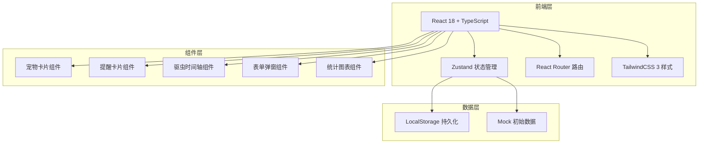
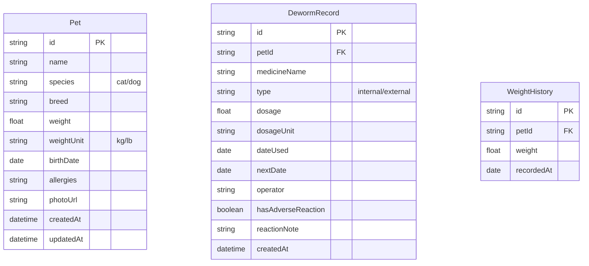

## 1. 架构设计



## 2. 技术描述
- **前端**：React@18 + TypeScript + TailwindCSS@3 + Vite
- **路由**：react-router-dom@6
- **状态管理**：zustand
- **图标**：lucide-react
- **数据持久化**：localStorage（无需后端）
- **初始化工具**：vite-init（react-ts 模板）

## 3. 路由定义
| 路由 | 用途 |
|------|------|
| / | 首页看板，展示提醒概览与宠物列表 |
| /pet/:id | 宠物详情页，档案信息与驱虫时间轴 |
| /pet/new | 新增宠物档案 |
| /pet/:id/edit | 编辑宠物档案 |
| /pet/:id/deworm/new | 为指定宠物新增驱虫记录 |
| /statistics | 数据统计页面 |

## 4. 数据模型

### 4.1 数据模型定义



### 4.2 TypeScript 类型定义

```typescript
type Species = 'cat' | 'dog';
type DewormType = 'internal' | 'external';

interface Pet {
  id: string;
  name: string;
  species: Species;
  breed: string;
  weight: number;
  weightUnit: 'kg' | 'lb';
  birthDate: string;
  allergies: string;
  photoUrl: string;
  createdAt: string;
  updatedAt: string;
}

interface DewormRecord {
  id: string;
  petId: string;
  medicineName: string;
  type: DewormType;
  dosage: number;
  dosageUnit: string;
  dateUsed: string;
  nextDate: string;
  operator: string;
  hasAdverseReaction: boolean;
  reactionNote: string;
  createdAt: string;
}

interface WeightHistory {
  id: string;
  petId: string;
  weight: number;
  recordedAt: string;
}
```

## 5. 核心业务逻辑

### 5.1 提醒状态计算
```typescript
function getReminderStatus(nextDate: string): 'overdue' | 'urgent' | 'upcoming' | 'normal' {
  const today = new Date();
  const next = new Date(nextDate);
  const diffDays = Math.ceil((next.getTime() - today.getTime()) / (1000 * 60 * 60 * 24));
  if (diffDays < 0) return 'overdue';
  if (diffDays <= 3) return 'urgent';
  if (diffDays <= 7) return 'upcoming';
  return 'normal';
}
```

### 5.2 体重变化检测
```typescript
const WEIGHT_CHANGE_THRESHOLD = 0.1; // 10%

function checkWeightChange(oldWeight: number, newWeight: number): boolean {
  if (oldWeight === 0) return false;
  const changeRate = Math.abs(newWeight - oldWeight) / oldWeight;
  return changeRate >= WEIGHT_CHANGE_THRESHOLD;
}
```

### 5.3 下次驱虫日期推算
- 体内驱虫：默认 90 天（3个月）
- 体外驱虫：默认 30 天（1个月）

### 5.4 初始 Mock 数据
- 2 只宠物（1猫1狗）
- 每只宠物 3-5 条历史驱虫记录
- 含 1 条逾期、1 条临近到期的提醒
- 1 条带不良反应的记录
