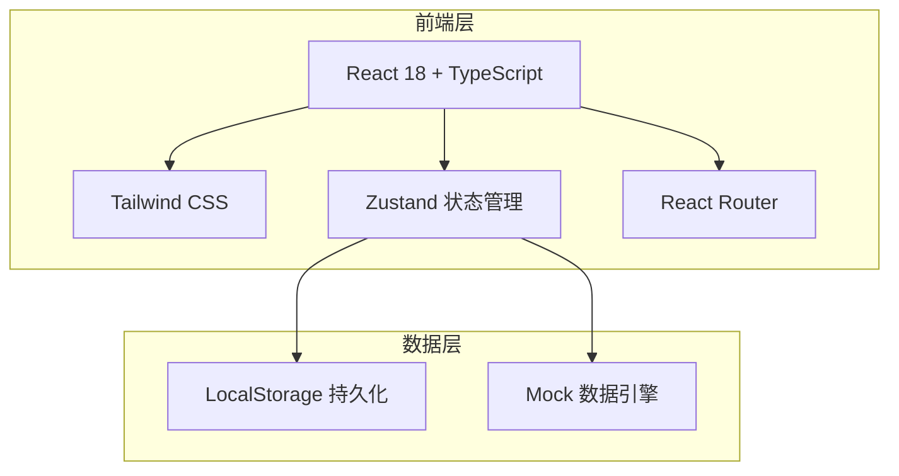
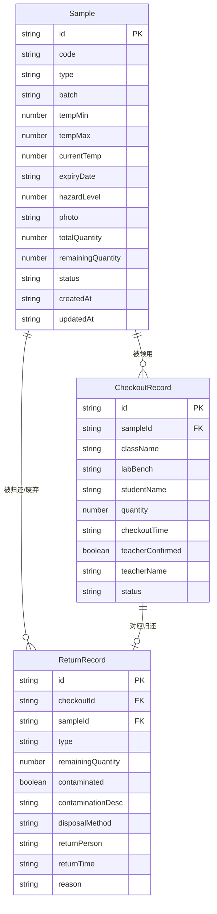

## 1. 架构设计

本项目采用纯前端架构，使用 LocalStorage 进行数据持久化，模拟完整的数据流转。

## 2. 技术说明

- **前端**：React@18 + TailwindCSS@3 + Vite + TypeScript
- **初始化工具**：vite-init
- **后端**：无（纯前端，LocalStorage 持久化）
- **数据库**：无（LocalStorage + 内存状态管理）
- **图表库**：recharts（统计图表）
- **图标**：lucide-react
- **状态管理**：zustand
- **路由**：react-router-dom

## 3. 路由定义

| 路由 | 用途 |
|------|------|
| / | 重定向到 /samples |
| /samples | 样本档案列表页 |
| /samples/new | 新增样本页 |
| /samples/:id | 样本详情页 |
| /checkout | 领用管理页 |
| /checkout/record | 领用登记页 |
| /checkout/history | 领用记录页 |
| /return | 归还废弃管理页 |
| /dashboard | 统计仪表盘页 |

## 4. API 定义

无后端 API，所有数据操作通过 Zustand store + LocalStorage 完成。

## 5. 服务端架构图

不适用（纯前端项目）

## 6. 数据模型

### 6.1 数据模型定义

### 6.2 数据定义语言

**Sample（样本档案）**：

| 字段 | 类型 | 说明 |
|------|------|------|
| id | string | UUID 主键 |
| code | string | 样本编号，唯一 |
| type | string | 样本类型（血液/组织/细胞/微生物/化学试剂/其他） |
| batch | string | 批次号 |
| tempMin | number | 保存温度下限（℃） |
| tempMax | number | 保存温度上限（℃） |
| currentTemp | number | 当前温度（℃） |
| expiryDate | string | 有效期（ISO日期） |
| hazardLevel | number | 危险等级 1-5 |
| photo | string | 照片（Base64 或 URL） |
| totalQuantity | number | 入库总量 |
| remainingQuantity | number | 剩余库存量 |
| status | string | 状态：normal/expiring/expired/temp_abnormal |
| createdAt | string | 创建时间 |
| updatedAt | string | 更新时间 |

**CheckoutRecord（领用记录）**：

| 字段 | 类型 | 说明 |
|------|------|------|
| id | string | UUID 主键 |
| sampleId | string | 关联样本ID |
| className | string | 班级 |
| labBench | string | 实验台号 |
| studentName | string | 领用学生 |
| quantity | number | 领用数量 |
| checkoutTime | string | 领取时间 |
| teacherConfirmed | boolean | 教师是否确认 |
| teacherName | string | 确认教师姓名 |
| status | string | 状态：pending/confirmed/rejected/returned/disposed |

**ReturnRecord（归还/废弃记录）**：

| 字段 | 类型 | 说明 |
|------|------|------|
| id | string | UUID 主键 |
| checkoutId | string | 关联领用记录ID |
| sampleId | string | 关联样本ID |
| type | string | 类型：return/dispose |
| remainingQuantity | number | 剩余量 |
| contaminated | boolean | 是否污染 |
| contaminationDesc | string | 污染情况描述 |
| disposalMethod | string | 处理方式：incineration/chemical/autoclave/other |
| returnPerson | string | 回收人 |
| returnTime | string | 归还/废弃时间 |
| reason | string | 废弃原因 |
