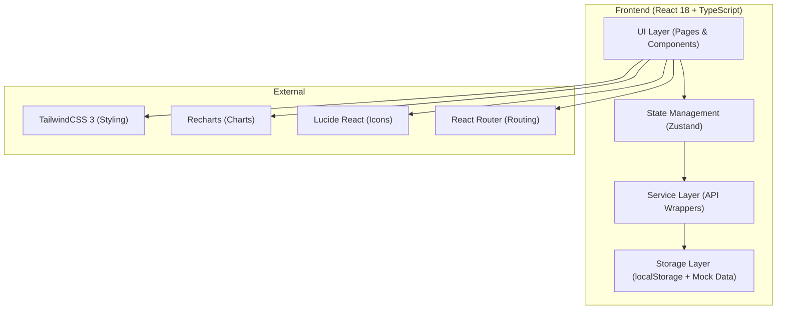
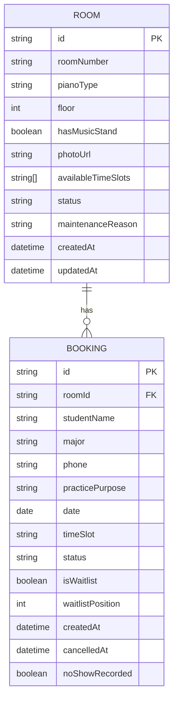

## 1. Architecture Design



## 2. Technology Description

- **Frontend Framework**: React 18 + TypeScript
- **Build Tool**: Vite 5
- **Styling**: TailwindCSS 3
- **State Management**: Zustand 4（轻量级状态管理，适合中小规模应用）
- **Routing**: React Router v6
- **Charts**: Recharts 2（柱状图、折线图、热力图）
- **Icons**: Lucide React
- **Data Storage**: localStorage + Mock Data（模拟后端，无需真实后端）
- **Date Handling**: date-fns

## 3. Route Definitions

| Route | Purpose |
|-------|---------|
| `/` | 琴房列表页（首页） |
| `/booking` | 预约管理页 |
| `/admin` | 琴房管理页（老师/管理员） |
| `/dashboard` | 统计看板页 |

## 4. Type Definitions

### 4.1 核心数据类型

```typescript
// 钢琴类型
type PianoType = 'grand' | 'upright' | 'digital' | 'hybrid';

// 琴房状态
type RoomStatus = 'available' | 'maintenance' | 'temporarily_closed';

// 预约状态
type BookingStatus = 'confirmed' | 'cancelled' | 'no_show' | 'waitlist' | 'completed';

// 时段状态
type SlotStatus = 'available' | 'booked' | 'waitlist_only' | 'blocked';

// 用户角色
type UserRole = 'student' | 'teacher' | 'admin';

// 琴房信息
interface Room {
  id: string;
  roomNumber: string;
  pianoType: PianoType;
  floor: number;
  hasMusicStand: boolean;
  photoUrl: string;
  availableTimeSlots: string[]; // e.g., ["08:00-09:00", "09:00-10:00"]
  status: RoomStatus;
  maintenanceReason?: string;
  createdAt: string;
  updatedAt: string;
}

// 学生信息
interface Student {
  id: string;
  name: string;
  major: string;
  phone: string;
}

// 预约记录
interface Booking {
  id: string;
  roomId: string;
  studentId: string;
  studentName: string;
  major: string;
  phone: string;
  practicePurpose: string;
  date: string; // YYYY-MM-DD
  timeSlot: string; // "08:00-09:00"
  status: BookingStatus;
  isWaitlist: boolean;
  waitlistPosition?: number;
  createdAt: string;
  cancelledAt?: string;
  noShowRecorded?: boolean;
}

// 时段可用性
interface TimeSlotAvailability {
  roomId: string;
  date: string;
  timeSlot: string;
  status: SlotStatus;
  currentBookings: number;
  maxCapacity: number;
  waitlistCount: number;
}

// 统计数据
interface Statistics {
  roomUtilization: {
    roomId: string;
    roomNumber: string;
    utilizationRate: number; // 0-100
    weeklyData: number[];
  }[];
  noShowStudents: {
    studentId: string;
    studentName: string;
    noShowCount: number;
  }[];
  peakTimeSlots: {
    timeSlot: string;
    bookingCount: number;
    dayOfWeek: number; // 0-6
  }[];
}

// 应用状态
interface AppState {
  currentRole: UserRole;
  rooms: Room[];
  bookings: Booking[];
  selectedDate: string;
  selectedRoomId: string | null;
}
```

## 5. Data Model (ER Diagram)



## 6. Mock Data 初始化

### 6.1 琴房数据（8间）

```typescript
const mockRooms: Room[] = [
  {
    id: 'room-1',
    roomNumber: 'A101',
    pianoType: 'grand',
    floor: 1,
    hasMusicStand: true,
    photoUrl: 'https://trae-api-cn.mchost.guru/api/ide/v1/text_to_image?prompt=elegant%20grand%20piano%20in%20bright%20music%20practice%20room%20with%20wooden%20floor&image_size=square',
    availableTimeSlots: generateTimeSlots(),
    status: 'available',
    createdAt: new Date().toISOString(),
    updatedAt: new Date().toISOString()
  },
  // ... 共8间琴房，不同类型和楼层
];
```

### 6.2 预约数据（30+条历史预约）

```typescript
const mockBookings: Booking[] = [
  {
    id: 'booking-1',
    roomId: 'room-1',
    studentName: '李同学',
    major: '钢琴表演',
    phone: '13800138001',
    practicePurpose: '日常练习',
    date: formatDate(new Date()),
    timeSlot: '09:00-10:00',
    status: 'confirmed',
    isWaitlist: false,
    createdAt: new Date().toISOString()
  },
  // ... 更多预约记录
];
```

### 6.3 辅助函数

- `generateTimeSlots()`: 生成 08:00-22:00 共14个时段
- `formatDate(date)`: 格式化日期为 YYYY-MM-DD
- `getDaysOfWeek()`: 获取本周7天日期
- `validateDailyBookingLimit(studentName, date)`: 检查同一天预约数（限制3次）
- `processWaitlist(roomId, date, timeSlot)`: 处理候补队列自动顶上逻辑

## 7. 核心业务规则

1. **预约限制**：同一学生同一天最多预约3个时段，且不能连续预约超过2个时段
2. **候补规则**：每个时段最多5人候补，前排取消后自动顺延，候补成功后15分钟内确认
3. **爽约规则**：预约后15分钟未到标记为爽约，累计3次爽约暂停预约权限7天
4. **维修规则**：标记维修后，该时段所有预约自动取消并进入候补队列（或取消）
5. **利用率计算**：实际使用时段数 / 总可预约时段数 × 100%
