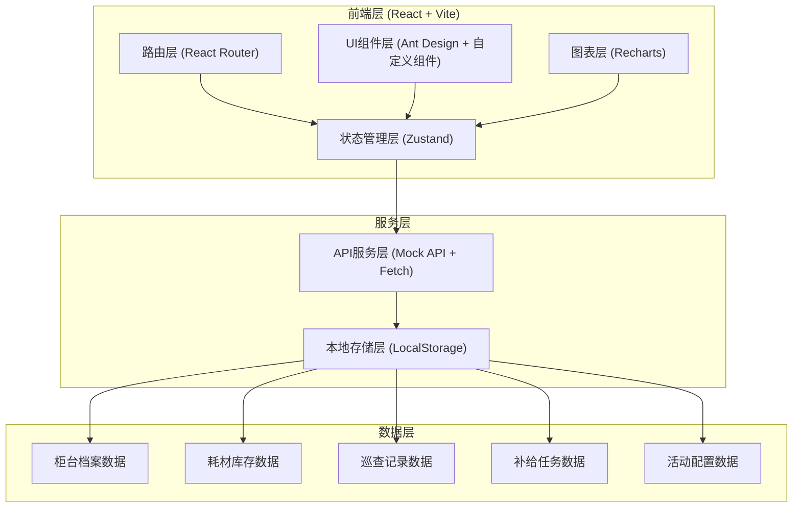
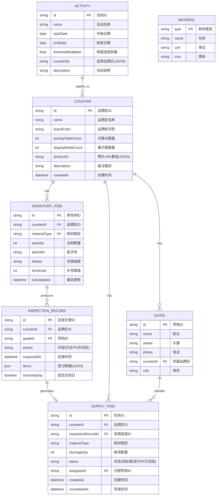

## 1. 架构设计



## 2. 技术描述

- **前端框架**：React@18 + TypeScript
- **构建工具**：Vite@5
- **UI组件库**：Ant Design@5 + 自定义样式组件
- **状态管理**：Zustand@4（轻量级，适合中小型应用）
- **路由管理**：React Router Dom@6
- **图表库**：Recharts@2（React原生图表库，轻量且美观）
- **日期处理**：Day.js
- **样式方案**：TailwindCSS@3 + SCSS Modules
- **数据持久化**：LocalStorage（模拟后端）
- **Mock数据**：内置完整Mock数据集，支持离线演示

## 3. 路由定义

| 路由路径 | 页面名称 | 说明 |
|-------|---------|------|
| /dashboard | 工作台首页 | 数据概览、任务时间线、快捷入口 |
| /counters | 柜台档案列表 | 品牌区列表展示、搜索筛选 |
| /counters/:id | 柜台档案详情 | 品牌区详细信息编辑、照片管理 |
| /inventory | 耗材库存总览 | 五大类耗材库存状态看板 |
| /inventory/:materialType | 耗材库存明细 | 批次、数量、存放、阈值管理 |
| /inspection | 巡查登记 | 每日三次巡查、库存登记 |
| /inspection/records | 巡查记录 | 历史巡查查询与对比 |
| /tasks | 补给任务看板 | 待办/进行中/已完成任务管理 |
| /tasks/:id | 任务详情 | 缺货明细、操作记录、状态流转 |
| /activities | 活动日历 | 活动日管理、阈值加倍配置 |
| /statistics/consumption | 消耗分析 | 各品牌区消耗趋势、对比分析 |
| /statistics/shortage | 缺货分析 | 缺货时长、品类分析 |
| /statistics/purchase | 采购建议 | 智能采购清单、导出功能 |

## 4. 数据模型

### 4.1 ER图



### 4.2 核心类型定义

```typescript
// 耗材类型枚举
type MaterialType = 'scentPaper' | 'coffeeBean' | 'sprayNozzle' | 'cleaningCloth' | 'labelSticker';

// 品牌区档案
interface Counter {
  id: string;
  name: string;
  brandColor: string;
  tastingTableCount: number;
  displayBottleCount: number;
  photoUrls: string[];
  guides: Guide[];
  description?: string;
  createdAt: string;
}

// 导购
interface Guide {
  id: string;
  name: string;
  avatar: string;
  phone: string;
  counterId: string;
  role: 'guide' | 'manager' | 'admin';
}

// 库存项
interface InventoryItem {
  id: string;
  counterId: string;
  materialType: MaterialType;
  quantity: number;
  batchNo: string;
  drawer: string;
  threshold: number;
  lastUpdated: string;
}

// 巡查记录
interface InspectionRecord {
  id: string;
  counterId: string;
  guideId: string;
  period: 'morning' | 'noon' | 'closing';
  inspectedAt: string;
  items: Array<{
    materialType: MaterialType;
    quantity: number;
    threshold: number;
    isShortage: boolean;
  }>;
  isActivityDay: boolean;
  thresholdMultiplier?: number;
}

// 补给任务
interface SupplyTask {
  id: string;
  counterId: string;
  inspectionRecordId: string;
  materialType: MaterialType;
  shortageQty: number;
  targetQty: number;
  status: 'pending' | 'inProgress' | 'completed';
  urgency: 'normal' | 'high' | 'urgent';
  assigneeId?: string;
  remarks?: string;
  operationLogs: Array<{
    action: string;
    operatorId: string;
    timestamp: string;
    note?: string;
  }>;
  createdAt: string;
  completedAt?: string;
}

// 活动配置
interface Activity {
  id: string;
  name: string;
  startDate: string;
  endDate: string;
  thresholdMultiplier: number;
  counterIds: string[];
  description?: string;
}
```

## 5. 目录结构

```
src/
├── assets/              # 静态资源
│   ├── images/          # 图片
│   └── styles/          # 全局样式
├── components/          # 通用组件
│   ├── layout/          # 布局组件（侧边栏、顶栏）
│   ├── cards/           # 卡片组件
│   ├── charts/          # 图表组件
│   ├── forms/           # 表单组件
│   └── common/          # 通用小组件
├── pages/               # 页面组件
│   ├── dashboard/       # 工作台
│   ├── counters/        # 柜台档案
│   ├── inventory/       # 耗材库存
│   ├── inspection/      # 巡查登记
│   ├── tasks/           # 补给任务
│   ├── activities/      # 活动管理
│   └── statistics/      # 数据统计
├── stores/              # Zustand状态管理
│   ├── counterStore.ts
│   ├── inventoryStore.ts
│   ├── inspectionStore.ts
│   ├── taskStore.ts
│   └── activityStore.ts
├── mock/                # Mock数据
│   ├── counters.ts
│   ├── inventory.ts
│   ├── inspections.ts
│   ├── tasks.ts
│   └── activities.ts
├── utils/               # 工具函数
│   ├── date.ts          # 日期处理
│   ├── calculations.ts  # 统计计算
│   └── storage.ts       # 本地存储
├── types/               # TypeScript类型定义
│   └── index.ts
├── App.tsx              # 根组件
├── main.tsx             # 入口文件
└── router.tsx           # 路由配置
```

## 6. 核心算法逻辑

### 6.1 缺货判断算法

```
输入：品牌区ID、当前数量、耗材类型、是否活动日
输出：是否缺货 + 缺货数量

步骤：
1. 获取该耗材的基础阈值 threshold
2. 检查当日是否为活动日，且该品牌区在活动范围内
3. 若为活动日，计算有效阈值 = threshold × activity.thresholdMultiplier
4. 若 currentQty < effectiveThreshold：
   - 标记为缺货
   - 缺货数量 = ceil(effectiveThreshold × 1.5) - currentQty
   - 根据缺货比例设置紧急程度：
     - < 50% 阈值：urgent
     - < 80% 阈值：high
     - 其他：normal
```

### 6.2 采购建议算法

```
输入：耗材类型、统计天数(默认30)、安全库存天数(默认7)
输出：建议采购数量

步骤：
1. 统计近N天该耗材总消耗量 totalConsumed
2. 计算日均消耗量 dailyAvg = totalConsumed / N
3. 获取当前总库存 currentTotal
4. 获取各品牌区阈值总和 thresholdSum
5. 计算可用天数 = currentTotal / dailyAvg
6. 若 availableDays < 安全库存天数：
   建议采购量 = ceil(dailyAvg × (30 + 安全库存天数) - currentTotal)
   建议采购日期 = 今天
7. 否则：
   建议采购量 = 0
   建议采购日期 = 今天 + (availableDays - 安全库存天数)
8. 参考活动日数据对采购量进行正向修正
```
