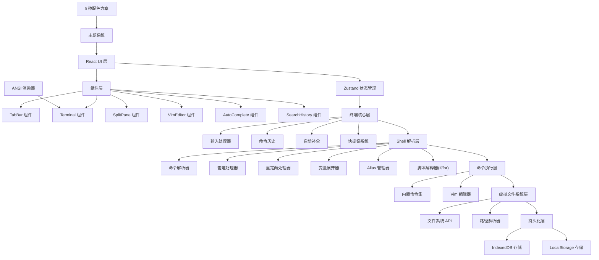
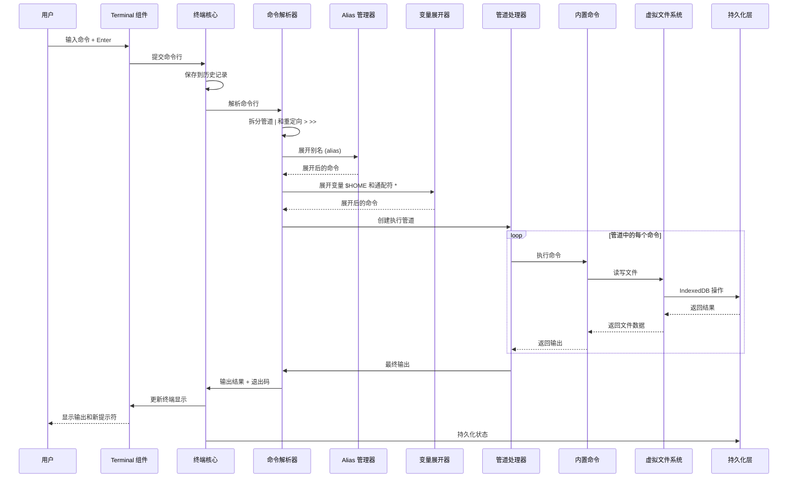

## 1. 架构设计



## 2. 技术描述

- **前端框架**: React@18 + TypeScript@5 + Vite@5
- **状态管理**: Zustand@4 (轻量级状态管理，适合复杂 UI 状态)
- **样式方案**: TailwindCSS@3 + CSS Variables (主题切换)
- **字体**: JetBrains Mono (Google Fonts CDN)
- **存储方案**: 
  - IndexedDB (idb 库): 存储虚拟文件系统、命令历史
  - LocalStorage: 存储标签状态、分屏布局、alias、主题设置
- **构建工具**: Vite@5
- **开发规范**: ESLint + Prettier

### 核心库选择理由
- **Zustand**: 相比 Redux 更轻量，API 更简洁，适合终端这种需要频繁更新状态的场景
- **idb**: IndexedDB 的 Promise 封装，简化异步文件系统操作
- **TailwindCSS**: 快速构建 UI，配合 CSS Variables 实现主题切换
- **JetBrains Mono**: 专为开发者设计的等宽字体，支持连字，适合终端场景

## 3. 目录结构

```
src/
├── types/              # TypeScript 类型定义
│   ├── terminal.ts     # 终端相关类型
│   ├── filesystem.ts   # 文件系统类型
│   └── theme.ts        # 主题类型
├── core/               # 终端核心逻辑
│   ├── Terminal.ts     # 终端核心类
│   ├── InputHandler.ts # 输入处理器
│   ├── History.ts      # 命令历史
│   ├── AutoComplete.ts # 自动补全
│   └── Keyboard.ts     # 快捷键系统
├── shell/              # Shell 解析层
│   ├── Parser.ts       # 命令解析器
│   ├── Pipeline.ts     # 管道处理
│   ├── Redirection.ts  # 重定向处理
│   ├── Expander.ts     # 变量/通配符展开
│   ├── Alias.ts        # Alias 管理
│   └── Script.ts       # 脚本解释器(if/for)
├── commands/           # 内置命令
│   ├── index.ts        # 命令注册
│   ├── filesystem.ts   # cd/ls/mkdir/touch/rm/cat/pwd/mv/cp
│   ├── text.ts         # head/tail/grep/wc/sort/uniq
│   ├── find.ts         # find 命令
│   ├── echo.ts         # echo 命令
│   └── theme.ts        # theme 切换命令
├── fs/                 # 虚拟文件系统
│   ├── VirtualFS.ts    # VFS 核心类
│   ├── Path.ts         # 路径解析
│   └── IndexedDBStore.ts # IndexedDB 存储
├── components/         # React 组件
│   ├── TerminalApp.tsx # 主应用组件
│   ├── TabBar.tsx      # 标签栏组件
│   ├── Terminal.tsx    # 终端组件
│   ├── SplitPane.tsx   # 分屏组件
│   ├── VimEditor.tsx   # Vim 编辑器组件
│   ├── AutoComplete.tsx # 自动补全组件
│   ├── SearchHistory.tsx # 历史搜索组件
│   └── AnsiRenderer.tsx # ANSI 渲染器
├── store/              # 状态管理
│   ├── useTerminalStore.ts # 终端状态
│   └── useThemeStore.ts    # 主题状态
├── themes/             # 主题配置
│   ├── index.ts        # 主题导出
│   ├── dracula.ts      # Dracula 主题
│   ├── solarized.ts    # Solarized 主题
│   ├── nord.ts         # Nord 主题
│   ├── onedark.ts      # OneDark 主题
│   └── monokai.ts      # Monokai 主题
├── utils/              # 工具函数
│   ├── ansi.ts         # ANSI 颜色解析
│   ├── storage.ts      # 存储工具
│   └── persistence.ts  # 状态持久化
├── App.tsx
├── main.tsx
└── index.css
```

## 4. 数据模型

### 4.1 虚拟文件系统

```typescript
interface FSNode {
  id: string;           // 唯一标识
  name: string;         // 名称
  type: 'file' | 'dir'; // 类型
  parentId: string | null; // 父目录 ID
  content?: string;     // 文件内容 (file 类型)
  createdAt: number;    // 创建时间
  updatedAt: number;    // 更新时间
  permissions: number;  // 权限位 (简单模拟)
  owner: string;        // 所有者 (默认 'user')
}

interface FileSystemState {
  nodes: Map<string, FSNode>;
  rootId: string;
  homeId: string;
}
```

### 4.2 终端状态

```typescript
interface Pane {
  id: string;
  cwd: string;                    // 当前工作目录
  history: HistoryEntry[];        // 命令历史
  historyIndex: number;           // 历史浏览位置
  env: Record<string, string>;    // 环境变量
  scrollBack: TerminalLine[];     // 回滚缓冲区
  cursorX: number;                // 光标列
  cursorY: number;                // 光标行
  isRunning: boolean;             // 是否有命令在执行
  currentCommand: string;         // 当前输入
  inputBuffer: string;            // 输入缓冲区
  vimState?: VimState;            // Vim 状态 (如果打开了 Vim)
}

interface Split {
  id: string;
  direction: 'horizontal' | 'vertical';
  sizes: number[];                // 各面板大小百分比
  children: (Split | string)[];   // 子分割或面板 ID
}

interface Tab {
  id: string;
  title: string;
  activePaneId: string;
  splitRoot: Split | string;      // 分屏树根节点或单个面板 ID
  panes: Record<string, Pane>;
}

interface TerminalState {
  tabs: Tab[];
  activeTabId: string;
  aliases: Record<string, string>;
  theme: string;
}

interface HistoryEntry {
  id: string;
  command: string;
  timestamp: number;
  exitCode: number;
}

interface TerminalLine {
  content: string;
  type: 'input' | 'output' | 'error' | 'prompt';
  timestamp: number;
  ansiStates?: AnsiState[];       // ANSI 颜色状态
}
```

### 4.3 Vim 编辑器状态

```typescript
interface VimState {
  mode: 'normal' | 'insert' | 'command';
  filePath: string;
  content: string[];              // 按行分割的内容
  originalContent: string[];      // 原始内容 (用于检测修改)
  cursor: { row: number; col: number };
  scrollOffset: number;           // 滚动偏移
  commandBuffer: string;          // : 命令缓冲区
  visualSelection?: { start: {row:number; col:number}, end: {row:number; col:number} };
}
```

### 4.4 主题类型

```typescript
interface Theme {
  name: string;
  background: string;
  foreground: string;
  cursor: string;
  cursorText: string;
  selectionBackground: string;
  selectionForeground: string;
  black: string;
  red: string;
  green: string;
  yellow: string;
  blue: string;
  magenta: string;
  cyan: string;
  white: string;
  brightBlack: string;
  brightRed: string;
  brightGreen: string;
  brightYellow: string;
  brightBlue: string;
  brightMagenta: string;
  brightCyan: string;
  brightWhite: string;
  tabBackground: string;
  tabActiveBackground: string;
  tabBorder: string;
  splitBorder: string;
}
```

### 4.5 持久化数据结构

```typescript
// LocalStorage 存储 (小数据)
interface PersistedAppState {
  version: string;
  tabs: {
    id: string;
    title: string;
    activePaneId: string;
    splitRoot: Split | string;
    panes: {
      id: string;
      cwd: string;
      env: Record<string, string>;
    }[];
  }[];
  activeTabId: string;
  aliases: Record<string, string>;
  theme: string;
  savedAt: number;
}

// IndexedDB 存储 (大数据)
interface PersistedFilesystem {
  nodes: FSNode[];
}

interface PersistedHistory {
  paneId: string;
  entries: HistoryEntry[];
}

interface PersistedScrollback {
  paneId: string;
  lines: TerminalLine[];
}
```

## 5. 核心流程

### 5.1 命令执行流程



### 5.2 ANSI 颜色渲染流程


支持的 ANSI 控制码：
- `\033[0m` - 重置
- `\033[1m` - 粗体
- `\033[3m` - 斜体
- `\033[4m` - 下划线
- `\033[30-37m` - 前景色
- `\033[40-47m` - 背景色
- `\033[90-97m` - 亮色前景
- `\033[100-107m` - 亮色背景

## 6. 命令解析器语法

命令行采用类似 Bash/Zsh 的语法：

```
command [arg1] [arg2] ... [ | command2 ... ] [ > file ] [ >> file ]
```

解析步骤：
1. 按分号 `;` 分割多个命令
2. 按管道符 `|` 分割管道阶段
3. 检测重定向 `>` `>>` `<`
4. 展开 alias
5. 展开环境变量 `$VAR` `${VAR}`
6. 展开通配符 `*` `?`
7. 拆分为命令名和参数列表
8. 查找命令实现（内置命令 or 外部命令）

## 7. Shell 脚本支持

### 7.1 Alias 语法
```bash
alias ll='ls -l'
alias grep='grep --color=auto'
unalias ll
```

### 7.2 If 语句
```bash
if [ -f file.txt ]; then
    echo "file exists"
elif [ -d dirname ]; then
    echo "dir exists"
else
    echo "not found"
fi
```

支持的条件测试：
- `-f file` - 文件存在
- `-d dir` - 目录存在
- `-n string` - 字符串非空
- `-z string` - 字符串为空
- `string1 == string2` - 字符串相等
- `string1 != string2` - 字符串不等

### 7.3 For 循环
```bash
for file in *.txt; do
    echo "Processing $file"
    cat $file
done

for i in 1 2 3 4 5; do
    echo "Number: $i"
done
```

## 8. 性能优化策略

1. **虚拟滚动**: 终端回滚缓冲区使用虚拟滚动，只渲染可见区域的行
2. **分片更新**: 大文本输出使用 requestIdleCallback 分片渲染
3. **防抖持久化**: 状态变化后防抖 500ms 再持久化
4. **IndexedDB 批量操作**: 文件系统操作使用批量事务减少 IO
5. **CSS 硬件加速**: 滚动和动画使用 transform 提升性能
6. **命令历史懒加载**: 只加载最近 1000 条历史，滚动时再加载更多

## 9. 安全考虑

1. **XSS 防护**: 所有用户输入在渲染前进行 HTML 转义
2. **路径遍历防护**: 文件系统操作严格验证路径，防止 `../../` 攻击
3. **命令注入防护**: 内置命令不执行 eval，严格解析参数
4. **存储隔离**: 使用独立的 IndexedDB 数据库和 LocalStorage 前缀
5. **内容安全策略**: 配置严格的 CSP，禁止内联脚本和 eval
