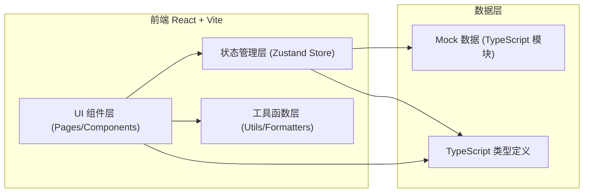
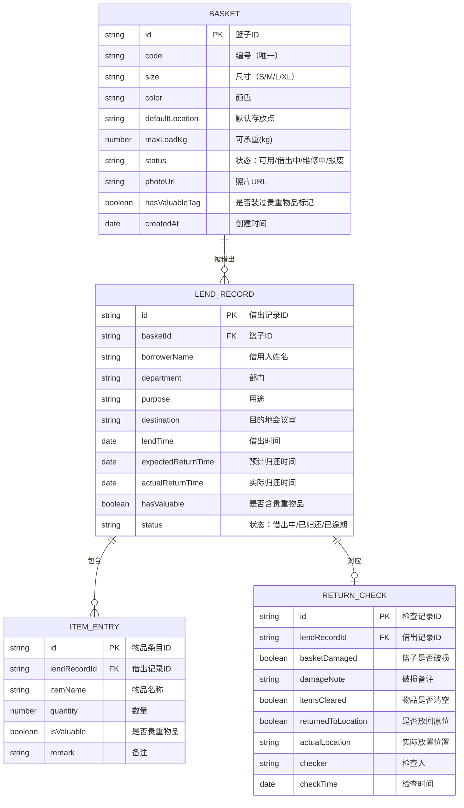

## 1. 架构设计



## 2. 技术说明

- **前端**：React@18 + TypeScript@5 + Vite@6
- **样式方案**：Tailwind CSS@3（自定义主题色、字体、阴影变量）
- **状态管理**：Zustand（集中管理篮子档案、借出记录、统计计算）
- **路由**：React Router DOM@6（hash 模式，5个主路由）
- **图标**：lucide-react（线性图标库）
- **后端**：无（纯前端，Mock 数据 + localStorage 持久化）
- **初始化工具**：vite-init（react-ts 模板）

## 3. 路由定义

| 路由 (Path) | 页面组件 | 功能说明 |
|-------------|----------|----------|
| `/` | Dashboard | 仪表盘首页：KPI卡片、逾期提醒、快捷操作、近期流水 |
| `/baskets` | BasketList | 储物篮档案：列表展示、筛选、搜索、新增/编辑档案 |
| `/baskets/new` | BasketForm | 新增储物篮档案表单 |
| `/baskets/:id/edit` | BasketForm | 编辑储物篮档案表单 |
| `/lend` | LendForm | 借出登记：选篮子+填借用信息+物品清单 |
| `/return` | ReturnCheck | 归还检查：借出列表+三项检查表单 |
| `/stats` | Statistics | 统计分析：库存饼图+逾期清单+部门排行+破损率趋势 |

## 4. 数据模型

### 4.1 数据模型定义（ER图）



### 4.2 TypeScript 类型定义

```typescript
type BasketStatus = 'available' | 'lent' | 'repair' | 'scrapped';
type BasketSize = 'S' | 'M' | 'L' | 'XL';
type LendStatus = 'active' | 'returned' | 'overdue';

interface Basket {
  id: string;
  code: string;
  size: BasketSize;
  color: string;
  defaultLocation: string;
  maxLoadKg: number;
  status: BasketStatus;
  photoUrl: string;
  hasValuableTag: boolean;
  createdAt: string;
}

interface ItemEntry {
  id: string;
  itemName: string;
  quantity: number;
  isValuable: boolean;
  remark?: string;
}

interface LendRecord {
  id: string;
  basketId: string;
  basketCode?: string;
  borrowerName: string;
  department: string;
  purpose: string;
  destination: string;
  lendTime: string;
  expectedReturnTime: string;
  actualReturnTime?: string;
  hasValuable: boolean;
  items: ItemEntry[];
  status: LendStatus;
}

interface ReturnCheck {
  id: string;
  lendRecordId: string;
  basketDamaged: boolean;
  damageNote?: string;
  itemsCleared: boolean;
  returnedToLocation: boolean;
  actualLocation?: string;
  checker: string;
  checkTime: string;
}
```

### 4.3 Mock 初始数据规划

- **储物篮档案**：15只篮子，覆盖各种尺寸、颜色、状态（可用10、借出中3、维修中1、报废1）
- **部门列表**：市场部、销售部、产品部、技术部、人力资源部、财务部、行政部
- **借出记录**：8条，其中5条已归还、2条借出中（1条逾期3天）、1条刚借出
- **归还检查记录**：对应5条已归还借出记录
- **会议室目的地**：A101、A203、B305、C501、培训中心、多功能厅
