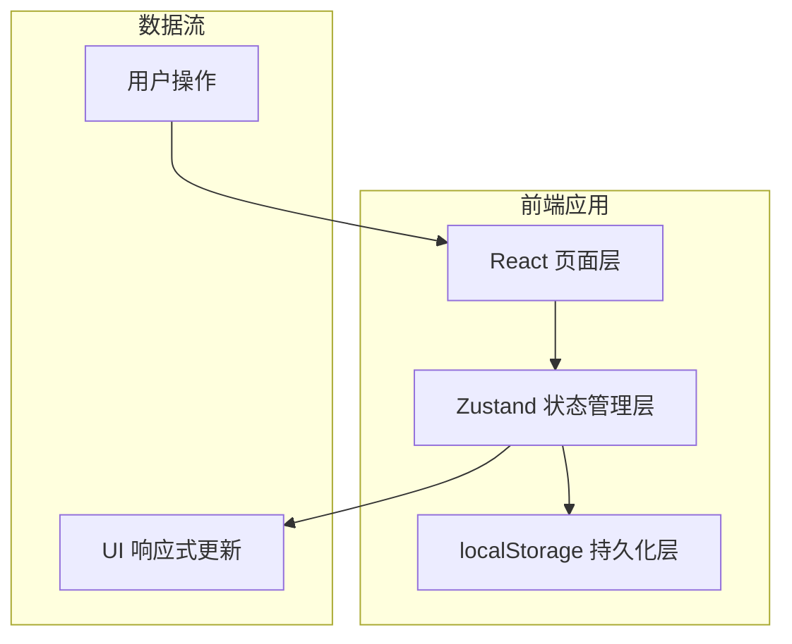

## 1. 架构设计



纯前端应用，数据存储在 localStorage，无需后端服务。

## 2. 技术说明
- 前端框架：React@18 + TypeScript
- 样式方案：Tailwind CSS@3
- 构建工具：Vite
- 状态管理：Zustand（含 persist 中间件实现 localStorage 持久化）
- 图标库：lucide-react
- 图表库：recharts
- 初始化工具：vite-init (react-ts 模板)
- 后端：无
- 数据库：localStorage（浏览器本地存储）

## 3. 路由定义
| 路由 | 用途 |
|------|------|
| / | 首页 - 一周排班日历视图 |
| /members | 家庭成员管理 |
| /recipes | 早餐菜谱管理 |
| /inventory | 食材库存管理 |
| /records | 就餐记录 |
| /stats | 统计分析 |

## 4. 数据模型

### 4.1 数据模型定义

```mermaid
erDiagram
    FamilyMember {
        string id PK
        string name
        string avatar
        string[] preferences
        string[] allergies
        string scheduleTime
        number budget
    }
    Recipe {
        string id PK
        string name
        number prepTime
        string[] ingredientIds
        string[] suitableFor
        number costPerServing
    }
    Ingredient {
        string id PK
        string name
        string category
        number stock
        number threshold
        string unit
    }
    DayPlan {
        string date PK
        string[] recipeIds
        string shopperId
        string cookId
        string cleanerId
    }
    MealRecord {
        string id PK
        string date
        string memberId
        string status
        string leftoverLevel
        string notes
    }
    Recipe }o--{ Ingredient : "需要"
    DayPlan }o--{ Recipe : "安排"
    DayPlan }o--o| FamilyMember : "买菜人"
    DayPlan }o--o| FamilyMember : "做饭人"
    DayPlan }o--o| FamilyMember : "收拾人"
    MealRecord }o--|| FamilyMember : "记录"
```

### 4.2 TypeScript 类型定义

```typescript
interface FamilyMember {
  id: string
  name: string
  avatar: string
  preferences: string[]
  allergies: string[]
  scheduleTime: string
  budget: number
}

interface Recipe {
  id: string
  name: string
  icon: string
  prepTime: number
  ingredientIds: string[]
  suitableFor: string[]
  costPerServing: number
}

interface Ingredient {
  id: string
  name: string
  category: string
  stock: number
  threshold: number
  unit: string
}

interface DayPlan {
  date: string
  recipeIds: string[]
  shopperId: string
  cookId: string
  cleanerId: string
}

interface MealRecord {
  id: string
  date: string
  memberId: string
  status: 'eaten' | 'skipped' | 'late'
  leftoverLevel: 'none' | 'little' | 'much'
  notes: string
}
```

## 5. 项目目录结构

```
src/
├── components/
│   ├── Layout.tsx
│   ├── Sidebar.tsx
│   └── ...
├── pages/
│   ├── Home.tsx
│   ├── Members.tsx
│   ├── Recipes.tsx
│   ├── Inventory.tsx
│   ├── Records.tsx
│   └── Stats.tsx
├── store/
│   └── index.ts
├── types/
│   └── index.ts
├── utils/
│   └── index.ts
├── App.tsx
└── main.tsx
```
