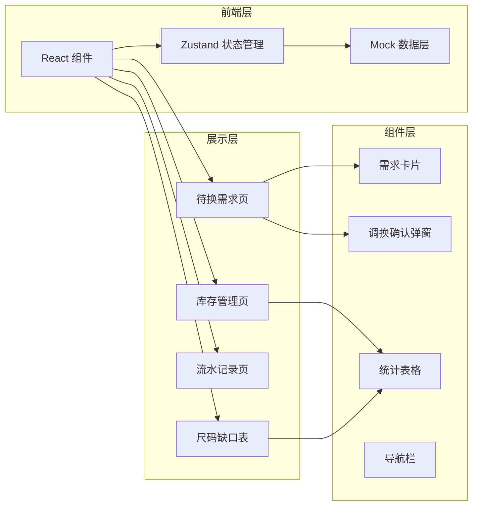
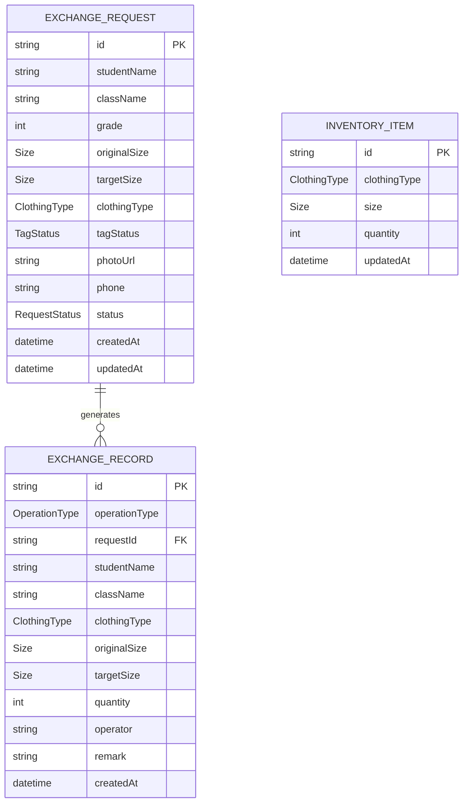

# 校服调换管理系统 技术架构文档

## 1. 架构设计



## 2. 技术描述

- **前端框架**：React 18 + TypeScript
- **构建工具**：Vite
- **样式方案**：TailwindCSS 3
- **状态管理**：Zustand
- **路由管理**：React Router DOM
- **图标库**：Lucide React
- **数据方案**：前端 Mock 数据 + LocalStorage 持久化

## 3. 路由定义

| 路由路径 | 页面名称 | 描述 |
|----------|----------|------|
| / | 待换需求 | 默认首页，按班级展示所有待换需求 |
| /inventory | 库存管理 | 展示各尺码各类型校服库存 |
| /records | 流水记录 | 展示所有换入换出操作流水 |
| /shortage | 尺码缺口表 | 按班级、尺码、衣服类型统计缺口 |

## 4. 数据模型

### 4.1 核心数据类型

```typescript
// 衣服类型
type ClothingType = 'summer_short' | 'summer_long' | 'winter_coat' | 'sportswear';

// 尺码
type Size = '120' | '130' | '140' | '150' | '160' | '170' | '180' | '190';

// 吊牌状态
type TagStatus = 'intact' | 'removed' | 'damaged';

// 需求状态
type RequestStatus = 'pending' | 'matched' | 'exchanged' | 'manual' | 'cancelled';

// 调换需求
interface ExchangeRequest {
  id: string;
  studentName: string;
  className: string;
  grade: number;
  originalSize: Size;
  targetSize: Size;
  clothingType: ClothingType;
  tagStatus: TagStatus;
  photoUrl?: string;
  phone: string;
  status: RequestStatus;
  createdAt: string;
  updatedAt: string;
}

// 库存记录
interface InventoryItem {
  id: string;
  clothingType: ClothingType;
  size: Size;
  quantity: number;
  updatedAt: string;
}

// 流水记录
type OperationType = 'exchange_in' | 'exchange_out' | 'match_stock' | 'match_swap' | 'manual_process' | 'stock_in' | 'stock_out';

interface ExchangeRecord {
  id: string;
  operationType: OperationType;
  requestId?: string;
  studentName?: string;
  className?: string;
  clothingType: ClothingType;
  originalSize?: Size;
  targetSize?: Size;
  quantity: number;
  operator: string;
  remark?: string;
  createdAt: string;
}
```

### 4.2 数据实体关系



## 5. 状态管理设计

### 5.1 Zustand Store 结构

```typescript
interface AppState {
  // 数据
  requests: ExchangeRequest[];
  inventory: InventoryItem[];
  records: ExchangeRecord[];
  
  // 筛选状态
  selectedClass: string | null;
  selectedClothingType: ClothingType | null;
  
  // 操作方法
  addRequest: (request: Omit<ExchangeRequest, 'id' | 'createdAt' | 'updatedAt'>) => void;
  updateRequestStatus: (id: string, status: RequestStatus) => void;
  matchStock: (requestId: string) => boolean;
  matchSwap: (requestId: string) => ExchangeRequest | null;
  confirmExchange: (requestId: string, type: 'stock' | 'swap', swapRequestId?: string) => void;
  markManual: (requestId: string) => void;
  updateInventory: (clothingType: ClothingType, size: Size, delta: number, operator: string, remark?: string) => void;
  
  // 统计方法
  getShortageByClass: () => Record<string, Record<ClothingType, Record<Size, number>>>;
}
```

## 6. 组件划分

| 组件名称 | 路径 | 职责 |
|----------|------|------|
| App | src/App.tsx | 根组件，路由配置 |
| Layout | src/components/Layout.tsx | 布局组件，导航栏 + 侧边栏 |
| ExchangeRequestCard | src/components/ExchangeRequestCard.tsx | 调换需求卡片 |
| ExchangeConfirmModal | src/components/ExchangeConfirmModal.tsx | 调换确认弹窗 |
| ClassGroup | src/components/ClassGroup.tsx | 班级分组折叠面板 |
| InventoryTable | src/components/InventoryTable.tsx | 库存表格 |
| RecordsList | src/components/RecordsList.tsx | 流水记录列表 |
| ShortageTable | src/components/ShortageTable.tsx | 缺口统计表 |
| StatusBadge | src/components/StatusBadge.tsx | 状态徽章 |

## 7. 目录结构

```
src/
├── components/          # 通用组件
│   ├── Layout.tsx
│   ├── ExchangeRequestCard.tsx
│   ├── ExchangeConfirmModal.tsx
│   ├── ClassGroup.tsx
│   ├── InventoryTable.tsx
│   ├── RecordsList.tsx
│   ├── ShortageTable.tsx
│   └── StatusBadge.tsx
├── pages/               # 页面组件
│   ├── RequestsPage.tsx
│   ├── InventoryPage.tsx
│   ├── RecordsPage.tsx
│   └── ShortagePage.tsx
├── store/               # 状态管理
│   └── useAppStore.ts
├── types/               # 类型定义
│   └── index.ts
├── data/                # Mock 数据
│   └── mockData.ts
├── utils/               # 工具函数
│   └── helpers.ts
├── App.tsx
├── main.tsx
└── index.css
```
