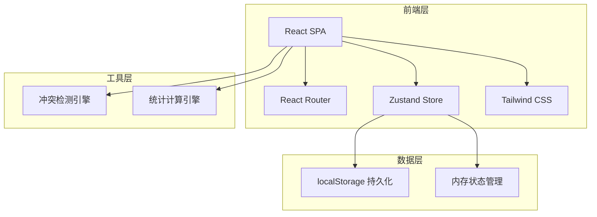
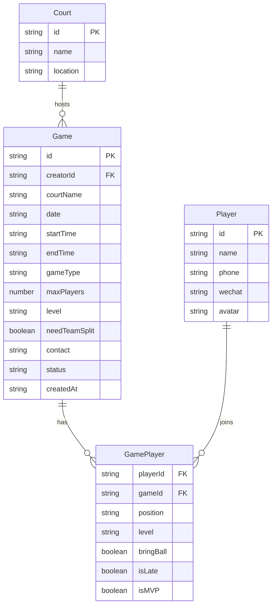

## 1. 架构设计



纯前端架构，数据持久化使用 localStorage，状态管理使用 Zustand + persist 中间件。

## 2. 技术说明
- 前端：React@18 + Tailwind CSS@3 + Vite
- 初始化工具：vite-init
- 后端：无（纯前端，localStorage持久化）
- 数据库：无（使用localStorage + Zustand persist模拟）
- 状态管理：Zustand@4 + persist中间件
- 图表：纯CSS/SVG实现（无额外图表库依赖）
- 路由：react-router-dom@6

## 3. 路由定义
| 路由 | 用途 |
|------|------|
| / | 首页，球局列表 |
| /create | 发起球局页 |
| /game/:id | 球局详情页（含报名、赛后记录） |
| /stats | 统计页 |

## 4. API定义
无后端API，所有数据通过Zustand Store在客户端管理。

### 核心数据类型定义

```typescript
interface Player {
  id: string
  name: string
  phone: string
  wechat: string
  avatar: string
}

interface GamePlayer {
  playerId: string
  position: 'G' | 'F' | 'C' | 'any'
  level: 'beginner' | 'casual' | 'competitive'
  bringBall: boolean
  isLate: boolean
  isMVP: boolean
}

interface Game {
  id: string
  creatorId: string
  courtName: string
  date: string
  startTime: string
  endTime: string
  gameType: 'half' | 'full'
  maxPlayers: number
  level: 'beginner' | 'casual' | 'competitive'
  needTeamSplit: boolean
  contact: string
  players: GamePlayer[]
  status: 'recruiting' | 'confirmed' | 'completed'
  score?: { teamA: number; teamB: number }
  mvpId?: string
  latePlayerIds?: string[]
  createdAt: string
}

interface GameConflict {
  hasConflict: boolean
  conflictingGame?: Game
}

interface WeeklyStats {
  weekLabel: string
  gameCount: number
  totalPlayers: number
}

interface PlayerRanking {
  playerId: string
  name: string
  gameCount: number
}

interface TimeSlotHeat {
  timeSlot: string
  gameCount: number
}
```

## 5. 服务端架构图
不适用（纯前端项目）

## 6. 数据模型

### 6.1 数据模型定义



### 6.2 数据定义语言
使用 localStorage 键值存储：
- `basketball_players`: Player[] - 球友列表
- `basketball_games`: Game[] - 球局列表
- `basketball_courts`: Court[] - 场地列表（预置数据）
- `basketball_current_user`: string - 当前用户ID

预置场地数据：
- A场（靠近东门）
- B场（靠近西门）
- C场（中心花园旁）
