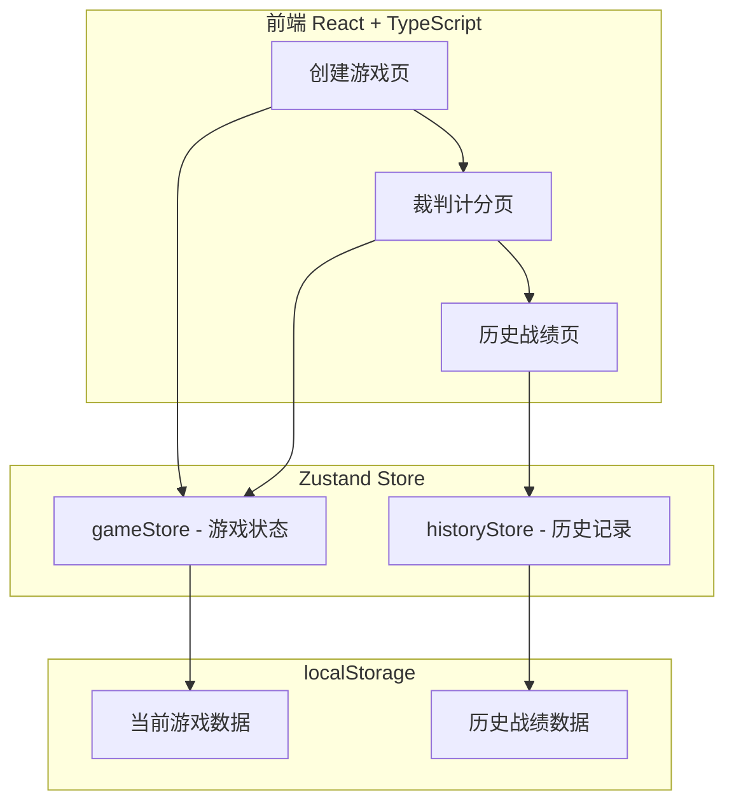
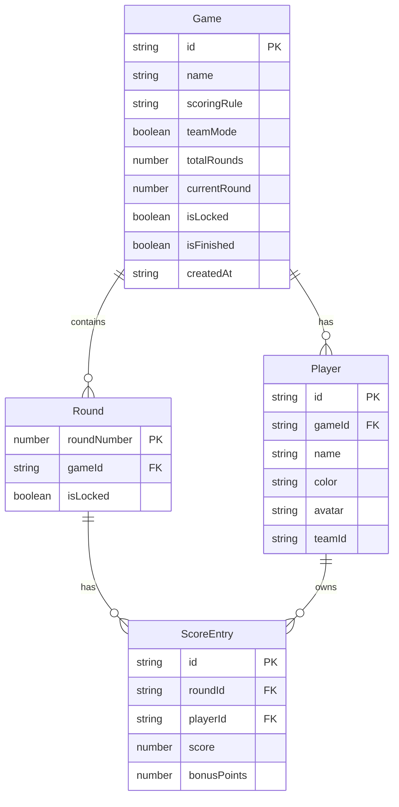

## 1. 架构设计



## 2. 技术说明
- 前端：React@18 + TypeScript + Tailwind CSS@3 + Vite
- 状态管理：Zustand（轻量、支持持久化中间件）
- 路由：react-router-dom@6
- 动画：framer-motion（排名变化、页面过渡动画）
- 图标：lucide-react
- 导出图片：html2canvas
- 持久化：localStorage（无需后端）
- 初始化工具：vite-init

## 3. 路由定义
| 路由 | 用途 |
|------|------|
| / | 首页，创建新游戏入口 |
| /game/:id | 裁判计分页，核心记分界面 |
| /history | 历史战绩页，查看所有存档 |

## 4. 数据模型

### 4.1 数据模型定义



### 4.2 计分规则枚举
```typescript
type ScoringRule = 
  | "highest_wins"     // 分高赢
  | "lowest_wins"      // 分低赢
  | "bonus_per_round"  // 每回合奖励分
  | "elimination"      // 淘汰制
```

### 4.3 玩家头像枚举
```typescript
type Avatar = "🦁" | "🐺" | "🦊" | "🐻" | "🐼" | "🐸" | "🦅" | "🐲"
```

### 4.4 玩家颜色预设
```typescript
const PLAYER_COLORS = [
  "#E74C3C", // 红
  "#3498DB", // 蓝
  "#2ECC71", // 绿
  "#F39C12", // 橙
  "#9B59B6", // 紫
  "#1ABC9C", // 青
  "#E67E22", // 深橙
  "#34495E", // 深灰蓝
]
```

## 5. 核心逻辑

### 5.1 排名计算
- 根据 scoringRule 排序：
  - highest_wins / bonus_per_round：总分降序
  - lowest_wins：总分升序
  - elimination：按淘汰顺序，未淘汰的按分排
- 领先差距 = 第一名总分 - 当前玩家总分

### 5.2 撤销/重做
- 使用 Zustand 中间件维护操作历史栈
- 每次分数变更 push 到 undoStack，清空 redoStack
- 撤销：pop undoStack → push redoStack
- 重做：pop redoStack → push undoStack

### 5.3 回合锁定
- 锁定后该回合分数不可编辑
- 解锁后恢复编辑

### 5.4 导出战绩图片
- 使用 html2canvas 截取计分表格区域
- 生成 PNG 供下载

### 5.5 历史统计
- 最多胜利：统计每个玩家在各局游戏中获得第一名的次数
- 逆转王：统计在游戏过程中从非第一名逆转到第一名的次数
