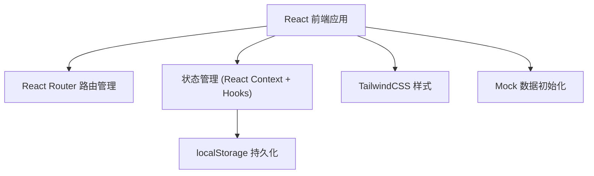
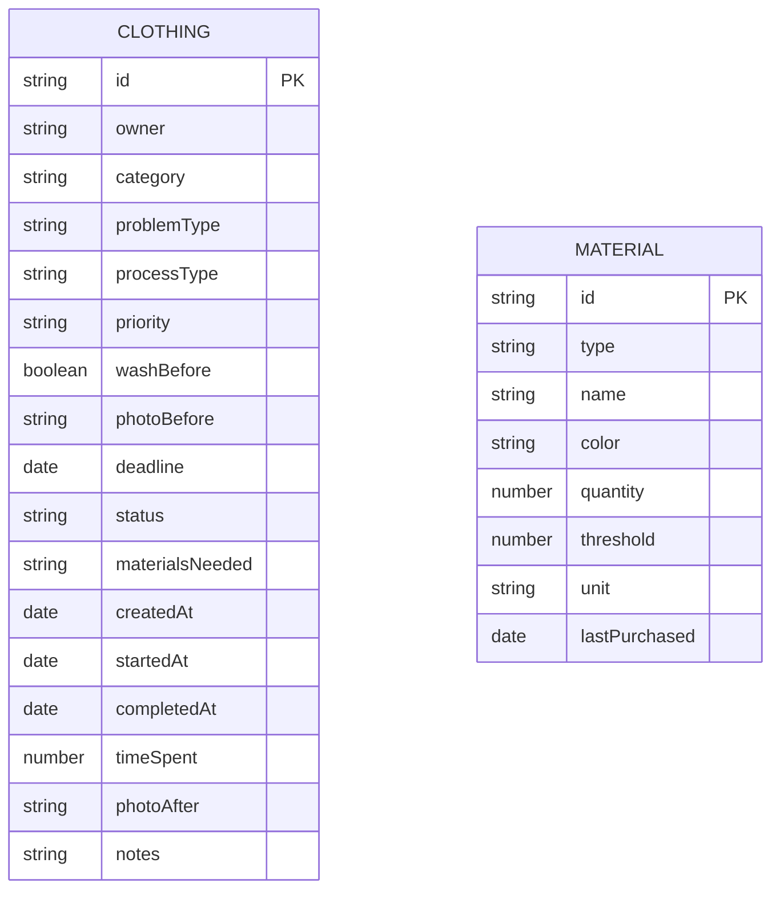

## 1. 架构设计

本项目为纯前端应用，数据存储在浏览器 localStorage 中，无需后端服务。



## 2. 技术描述

- **前端框架**：React@18 + TypeScript
- **构建工具**：Vite@5
- **样式方案**：TailwindCSS@3.4
- **路由管理**：React Router DOM@6
- **图标库**：Lucide React（手绘风格图标）
- **状态管理**：React Context + useReducer（轻量全局状态）
- **数据持久化**：localStorage（本地存储）
- **日期处理**：date-fns（轻量日期库）

## 3. 路由定义

| 路由 | 页面组件 | 用途 |
|------|---------|------|
| / | Dashboard | 首页仪表板 |
| /register | ClothingRegister | 衣物登记 |
| /queue | TaskQueue | 任务队列 |
| /materials | MaterialManager | 材料管理 |
| /records | CompletionRecords | 完成记录 |
| /queue/:id | TaskDetail | 任务详情/完成处理 |

## 4. 数据模型

### 4.1 ER 图



### 4.2 类型定义

```typescript
// 衣物状态
type ClothingStatus = 'pending' | 'in_progress' | 'completed';

// 优先级
type Priority = 'urgent' | 'normal' | 'low';

// 工序类型
type ProcessType = 'sew_button' | 'patch_hole' | 'alter_length' | 'replace_zipper' | 'iron';

// 衣物类别
type ClothingCategory = 'pants' | 'shirt' | 'coat' | 'dress' | 'uniform' | 'other';

// 问题类型
type ProblemType = 'button' | 'hole' | 'length' | 'zipper' | 'wrinkle' | 'other';

// 材料类型
type MaterialType = 'thread' | 'button' | 'zipper' | 'fabric';

interface Clothing {
  id: string;
  owner: string;
  category: ClothingCategory;
  problemType: ProblemType;
  processType: ProcessType;
  priority: Priority;
  washBefore: boolean;
  photoBefore?: string;
  photoAfter?: string;
  deadline: string;
  status: ClothingStatus;
  materialsNeeded: string[];
  createdAt: string;
  startedAt?: string;
  completedAt?: string;
  timeSpent?: number;
  notes?: string;
}

interface Material {
  id: string;
  type: MaterialType;
  name: string;
  color: string;
  quantity: number;
  threshold: number;
  unit: string;
  lastPurchased?: string;
}

interface AppState {
  clothings: Clothing[];
  materials: Material[];
}
```

### 4.3 Mock 初始数据

项目启动时自动注入以下示例数据：

**衣物数据（8-10条）**：
- 2条紧急任务（3天内截止）
- 3条本周待处理
- 2条长期搁置（超过2周未处理）
- 3条已完成记录

**材料数据（10-15条）**：
- 线：5种常用颜色
- 纽扣：3种规格
- 拉链：3种长度
- 备用布：3种颜色
- 其中2-3种材料库存低于阈值

## 5. 目录结构

```
src/
├── components/          # 公共组件
│   ├── Layout.tsx       # 布局组件（导航栏）
│   ├── Card.tsx         # 卡片组件
│   ├── StatusBadge.tsx  # 状态标签
│   ├── PriorityBadge.tsx # 优先级标签
│   ├── ProcessIcon.tsx  # 工序图标组件
│   └── PhotoUpload.tsx  # 照片上传组件
├── contexts/            # 状态管理
│   └── AppContext.tsx   # 全局状态 Context
├── pages/               # 页面组件
│   ├── Dashboard.tsx    # 首页仪表板
│   ├── ClothingRegister.tsx # 衣物登记
│   ├── TaskQueue.tsx    # 任务队列
│   ├── TaskDetail.tsx   # 任务详情
│   ├── MaterialManager.tsx # 材料管理
│   └── CompletionRecords.tsx # 完成记录
├── types/               # 类型定义
│   └── index.ts
├── utils/               # 工具函数
│   ├── storage.ts       # localStorage 封装
│   ├── dateUtils.ts     # 日期处理
│   └── mockData.ts      # Mock 数据
├── App.tsx              # 根组件
├── main.tsx             # 入口文件
└── index.css            # 全局样式
```

## 6. 核心功能实现要点

### 6.1 首页仪表板
- 使用 useMemo 计算统计数据：待处理总数、本周待处理、快到期（7天内）、长期搁置（>14天未开始）
- 材料库存检查：遍历 materials，筛选 quantity < threshold 的项目
- 卡片错落动画：CSS animation-delay 实现

### 6.2 衣物登记
- 表单验证：必填项（owner, category, problemType, processType, priority, deadline）
- 自动关联工序：根据 problemType 推荐 processType
- 照片上传：FileReader 转 base64 存储
- 材料需求关联：根据 processType 自动推荐所需材料

### 6.3 任务队列
- 工序分类筛选：5个标签页切换
- 排序功能：priority → deadline → createdAt 三级排序
- 状态流转按钮：待处理 → 进行中 → 已完成
- 材料状态指示：需要的材料不足时显示红色警告

### 6.4 材料管理
- 库存可视化：进度条显示百分比（quantity / (threshold * 2)）
- 低库存动画：pulse 动画提醒
- 快速补充：+1 / +5 快捷按钮

### 6.5 完成记录
- 对比图组件：左右并排显示前后照片
- 耗时记录：分钟为单位，可手动输入或计时器
- 时间轴展示：按完成日期倒序排列
