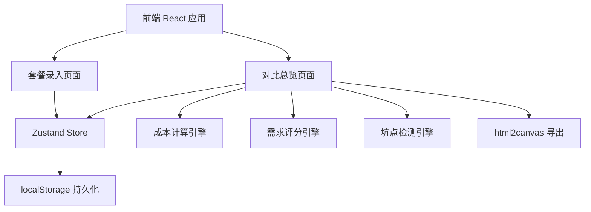
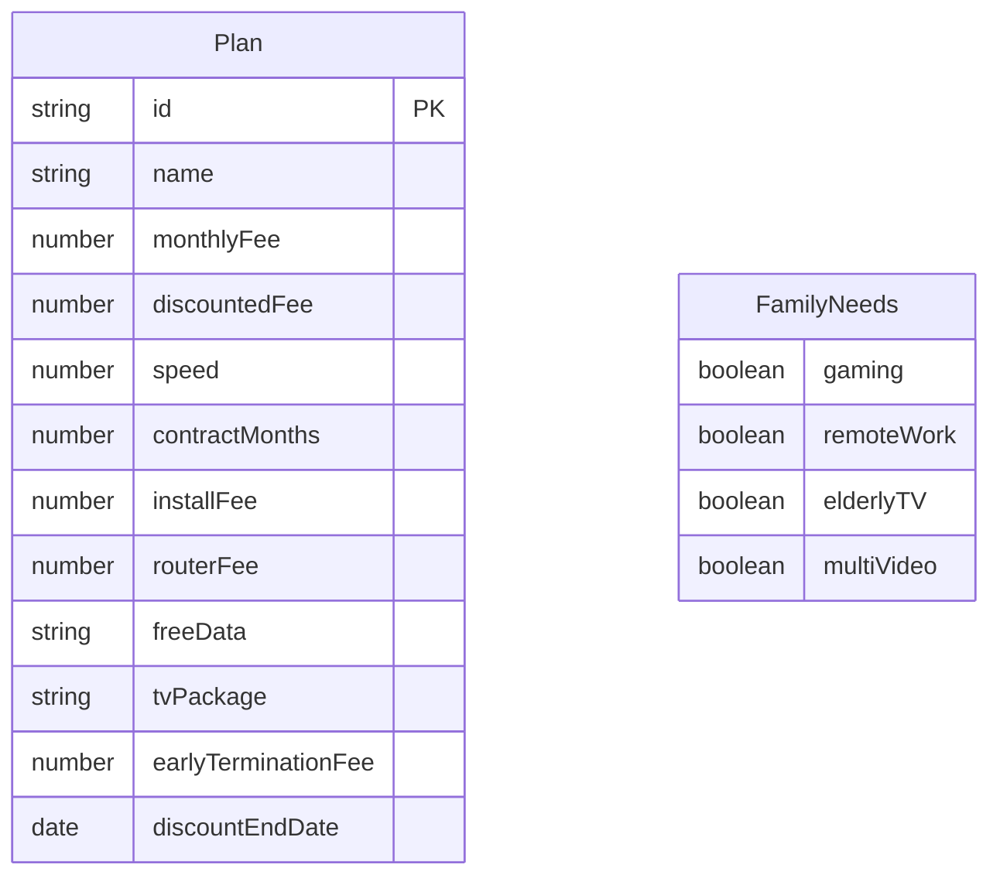

## 1. 架构设计



## 2. 技术说明

- 前端：React@18 + TypeScript + Tailwind CSS@3 + Vite
- 初始化工具：vite-init
- 后端：无（纯前端应用）
- 数据库：无（使用 localStorage 持久化 + Zustand 状态管理）
- 导出图片：html2canvas
- 图表：纯CSS+Canvas实现雷达图/评分条

## 3. 路由定义

| 路由 | 用途 |
|------|------|
| / | 主页面，包含套餐录入和对比总览两个Tab |

## 4. API定义

无后端API，所有数据在客户端处理

## 5. 服务端架构图

不适用

## 6. 数据模型

### 6.1 数据模型定义



### 6.2 数据定义语言

```typescript
interface Plan {
  id: string
  name: string
  monthlyFee: number
  discountedFee: number
  speed: number
  contractMonths: number
  installFee: number
  routerFee: number
  freeData: string
  tvPackage: string
  earlyTerminationFee: number
  discountEndDate: string
}

interface FamilyNeeds {
  gaming: boolean
  remoteWork: boolean
  elderlyTV: boolean
  multiVideo: boolean
}

interface CostResult {
  months12: number
  months24: number
  breakdown: CostBreakdown
}

interface CostBreakdown {
  monthlyTotal: number
  installFeeTotal: number
  routerFeeTotal: number
  discountSaving: number
}

interface Pitfall {
  type: 'warning' | 'danger'
  title: string
  description: string
}

interface MatchScore {
  gaming: number
  remoteWork: number
  elderlyTV: number
  multiVideo: number
  overall: number
}
```
