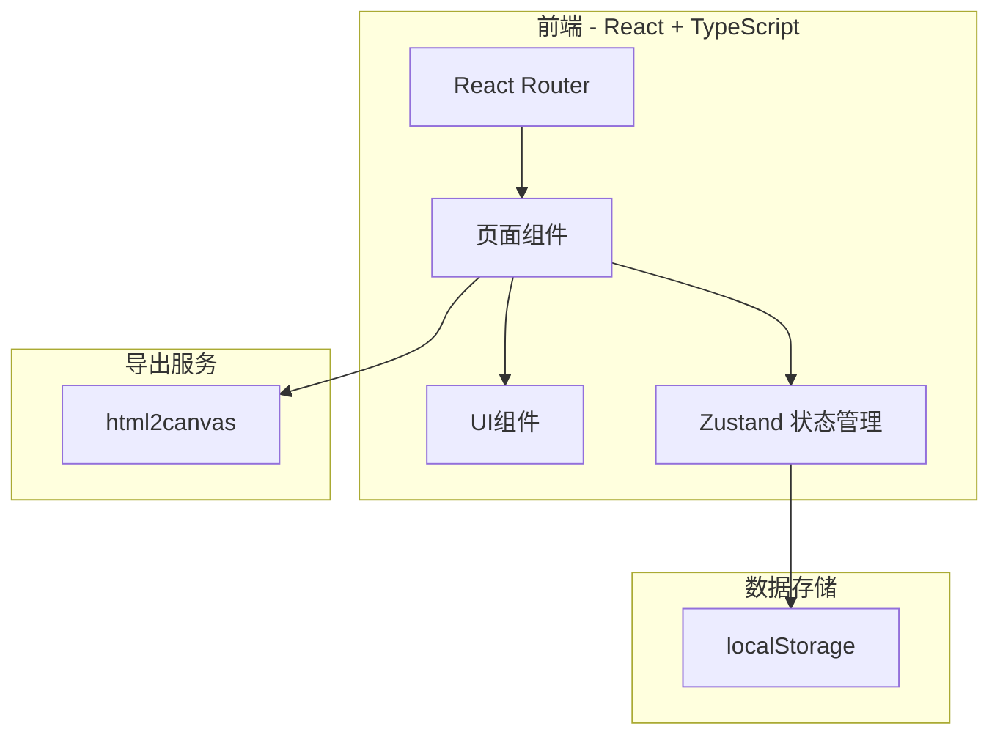
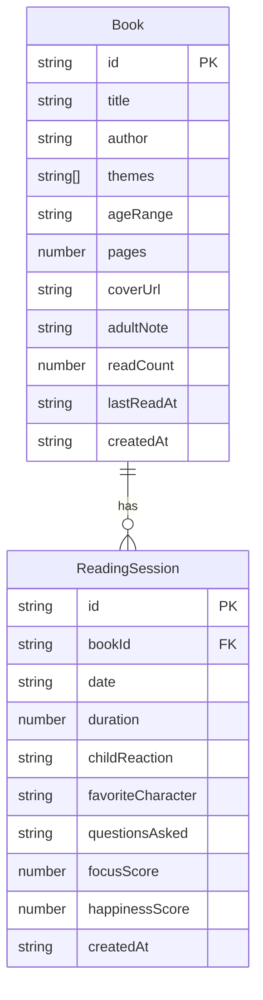

## 1. 架构设计



## 2. 技术说明

- 前端：React@18 + TypeScript + Tailwind CSS + Vite
- 初始化工具：vite-init (react-ts 模板)
- 后端：无（纯前端应用）
- 数据库：localStorage（本地持久化存储）
- 状态管理：Zustand
- 路由：React Router DOM
- 图标：lucide-react
- 月报导出：html2canvas
- 字体：Google Fonts（ZCOOL XiaoWei、Noto Sans SC）

## 3. 路由定义

| 路由 | 用途 |
|------|------|
| / | 小书架首页 |
| /book/:id | 绘本详情页（含共读时间线） |
| /calendar | 睡前阅读日历 |
| /report | 亲子阅读月报 |

## 4. 数据模型

### 4.1 数据模型定义



### 4.2 数据定义

**Book 数据结构：**
```typescript
interface Book {
  id: string
  title: string
  author: string
  themes: string[]
  ageRange: string
  pages: number
  coverUrl: string
  adultNote: string
  readCount: number
  lastReadAt: string
  createdAt: string
}
```

**ReadingSession 数据结构：**
```typescript
interface ReadingSession {
  id: string
  bookId: string
  date: string
  duration: number
  childReaction: string
  favoriteCharacter: string
  questionsAsked: string
  focusScore: number
  happinessScore: number
  createdAt: string
}
```

**主题标签预设：**
```typescript
const THEME_PRESETS = [
  '害怕', '分享', '上幼儿园', '睡觉',
  '勇气', '友谊', '情绪管理', '自然',
  '家庭', '成长', '想象力', '幽默'
]
```

## 5. 关键技术决策

1. **纯前端 + localStorage**：无需后端服务器，数据本地存储，家长隐私得到保障
2. **Zustand 状态管理**：轻量级，与 localStorage 配合做持久化中间件
3. **html2canvas 导出月报**：将 DOM 渲染为图片，无需服务端参与
4. **封面图片**：支持 URL 输入和本地文件（Base64 存储），同时提供默认封面
5. **排序策略**：书架按 lastReadAt 降序排列，最近常读的放前面；未读的排在后面
