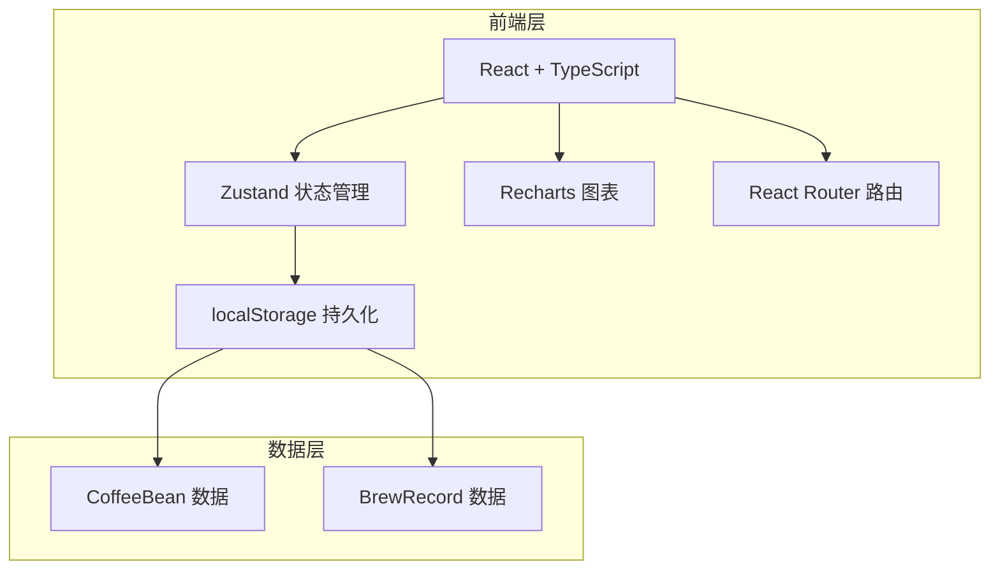
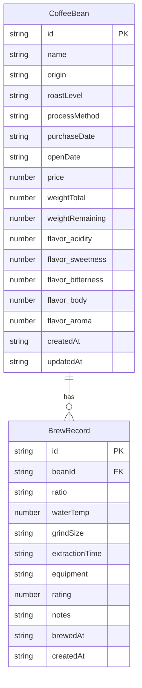

## 1. 架构设计



纯前端应用，无后端服务。所有数据存储在浏览器 localStorage 中，通过 Zustand 中间件实现自动持久化。

## 2. 技术说明

- **前端框架**：React@18 + TypeScript + Vite
- **样式方案**：Tailwind CSS@3
- **状态管理**：Zustand（带 persist 中间件）
- **图表库**：Recharts（雷达图 + 折线图）
- **路由**：React Router DOM@6
- **图标**：lucide-react
- **数据持久化**：localStorage（Zustand persist）
- **导出功能**：原生 Blob + URL.createObjectURL 实现 JSON/CSV 导出
- **初始化工具**：vite-init（react-ts 模板）

## 3. 路由定义

| 路由 | 用途 |
|------|------|
| `/` | 首页 - 咖啡豆卡片墙、筛选、提醒 |
| `/beans/new` | 新增咖啡豆 |
| `/beans/:id` | 咖啡豆详情 - 风味雷达图、冲煮历史 |
| `/beans/:id/edit` | 编辑咖啡豆 |
| `/brews/new?beanId=xxx` | 新增冲煮记录 |
| `/brews/:brewId` | 冲煮记录详情（可选，暂用弹窗代替） |

## 4. API 定义

无后端 API，所有数据操作通过 Zustand store 完成。

### Store 接口定义

```typescript
interface CoffeeBean {
  id: string
  name: string
  origin: string
  roastLevel: 'light' | 'medium-light' | 'medium' | 'medium-dark' | 'dark'
  processMethod: 'washed' | 'natural' | 'honey' | 'anaerobic' | 'other'
  purchaseDate: string
  openDate: string | null
  price: number | null
  weightTotal: number
  weightRemaining: number
  flavor: {
    acidity: number
    sweetness: number
    bitterness: number
    body: number
    aroma: number
  }
  createdAt: string
  updatedAt: string
}

interface BrewRecord {
  id: string
  beanId: string
  ratio: string
  waterTemp: number
  grindSize: 'fine' | 'medium-fine' | 'medium' | 'medium-coarse' | 'coarse'
  extractionTime: string
  equipment: string
  rating: number
  notes: string
  brewedAt: string
  createdAt: string
}

interface CoffeeStore {
  beans: CoffeeBean[]
  brews: BrewRecord[]
  addBean: (bean: Omit<CoffeeBean, 'id' | 'createdAt' | 'updatedAt'>) => void
  updateBean: (id: string, data: Partial<CoffeeBean>) => void
  deleteBean: (id: string) => void
  addBrew: (brew: Omit<BrewRecord, 'id' | 'createdAt'>) => void
  updateBrew: (id: string, data: Partial<BrewRecord>) => void
  deleteBrew: (id: string) => void
  getBrewsByBeanId: (beanId: string) => BrewRecord[]
  getAlerts: () => Alert[]
}
```

## 5. 服务器架构图

不适用（纯前端应用）

## 6. 数据模型

### 6.1 数据模型定义



### 6.2 数据定义语言

使用 localStorage 存储，键名为 `coffee-bean-vault`，值为 JSON 序列化的 `{ beans: CoffeeBean[], brews: BrewRecord[] }`。

### 6.3 提醒逻辑

- **库存不足提醒**：`weightRemaining < 50` 时触发
- **开封过久提醒**：`openDate` 存在且距当前日期超过 30 天时触发
- **已喝完标记**：`weightRemaining <= 0` 时在卡片上显示"已喝完"标签
