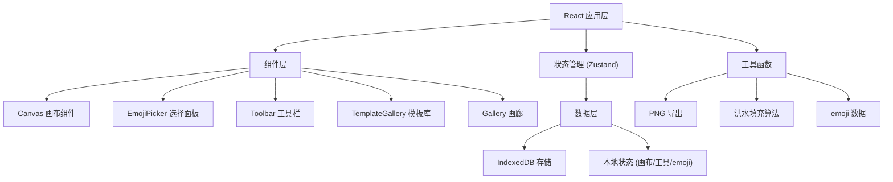

## 1. 架构设计



## 2. 技术描述

- **前端**: React@18 + TypeScript + Vite
- **样式**: TailwindCSS@3 + CSS 动画
- **状态管理**: Zustand
- **路由**: React Router DOM
- **数据库**: IndexedDB (idb 库封装)
- **图标**: Lucide React
- **初始化工具**: Vite init

## 3. 路由定义

| 路由 | 用途 |
|-------|---------|
| / | 主编辑页面，包含画布、emoji 选择器、工具栏 |
| /gallery | 画廊页面，浏览保存的作品 |

## 4. 数据模型

### 4.1 画布状态

```typescript
interface CanvasState {
  grid: string[][]; // 32x32 二维数组，存储每个格子的 emoji
  currentEmoji: string; // 当前选中的 emoji
  currentTool: 'pixel' | 'column' | 'row' | 'bucket'; // 当前工具
  history: string[][][]; // 历史记录用于撤销
  historyIndex: number;
}
```

### 4.2 作品数据

```typescript
interface Artwork {
  id: string;
  title: string;
  grid: string[][];
  thumbnail: string; // base64 缩略图
  createdAt: number;
  updatedAt: number;
}
```

### 4.3 Emoji 分类

```typescript
interface EmojiCategory {
  name: string;
  icon: string;
  emojis: string[];
}
```

## 5. 核心工具函数

### 5.1 洪水填充算法 (油漆桶工具)
```typescript
function floodFill(
  grid: string[][],
  x: number,
  y: number,
  targetEmoji: string,
  replaceEmoji: string
): string[][]
```

### 5.2 PNG 导出
```typescript
function exportToPNG(grid: string[][], size: number): Promise<string>
```

### 5.3 IndexedDB 操作
```typescript
interface ArtworkDB {
  saveArtwork(artwork: Omit<Artwork, 'id' | 'createdAt' | 'updatedAt'>): Promise<string>;
  getArtworks(): Promise<Artwork[]>;
  deleteArtwork(id: string): Promise<void>;
}
```

## 6. 项目结构

```
src/
├── components/
│   ├── Canvas/          # 32x32 画布组件
│   ├── EmojiPicker/     # emoji 选择面板
│   ├── Toolbar/         # 绘图工具栏
│   ├── TemplateGallery/ # 预设模板
│   ├── Gallery/         # 作品画廊
│   └── Header/          # 顶部导航
├── hooks/
│   ├── useCanvas.ts     # 画布操作 hook
│   └── useIndexedDB.ts  # IndexedDB hook
├── store/
│   └── useStore.ts      # Zustand 状态管理
├── data/
│   └── emojis.ts        # emoji 分类数据
│   └── templates.ts     # 预设模板数据
├── utils/
│   ├── floodFill.ts     # 洪水填充算法
│   ├── exportPNG.ts     # PNG 导出
│   └── db.ts            # IndexedDB 封装
├── pages/
│   ├── Editor.tsx       # 编辑页
│   └── Gallery.tsx      # 画廊页
├── App.tsx
├── main.tsx
└── index.css
```
