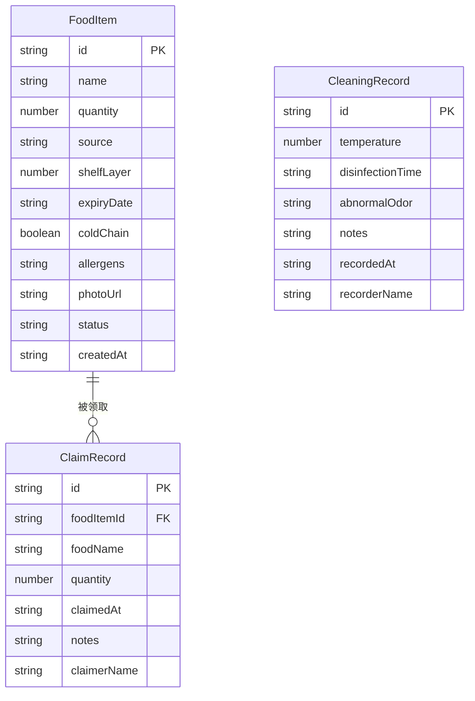

## 1. 架构设计

## 2. 技术说明

- **前端**：React@18 + TypeScript + Tailwind CSS@3 + Vite
- **初始化工具**：vite-init
- **后端**：无（纯前端项目，数据存储在 LocalStorage）
- **数据库**：无（使用 LocalStorage + Zustand persist 中间件）
- **状态管理**：Zustand + persist 中间件
- **路由**：react-router-dom

## 3. 路由定义

| 路由 | 用途 |
|------|------|
| / | 首页 - 冰箱分层看板 |
| /register | 食物登记页 |
| /claim | 食物领取页 |
| /cleaning | 清洁记录页 |
| /stats | 统计页 |

## 4. 数据模型

### 4.1 数据模型定义

### 4.2 数据定义

**FoodItem（食物项）**
- id: string - 唯一标识
- name: string - 食物名称
- quantity: number - 当前库存数量
- source: string - 来源（如"张阿姨捐赠"、"超市余量"）
- shelfLayer: number - 存放层（1-5层）
- expiryDate: string - 保质期截止日期（ISO格式）
- coldChain: boolean - 是否需要冷链
- allergens: string - 过敏原（逗号分隔，如"花生,牛奶"）
- photoUrl: string - 照片URL（base64或在线地址）
- status: "available" | "expired" | "depleted" - 状态
- createdAt: string - 入库时间

**ClaimRecord（领取记录）**
- id: string
- foodItemId: string - 关联食物ID
- foodName: string - 食物名称（冗余存储，方便展示）
- quantity: number - 领取数量
- claimedAt: string - 领取时间
- notes: string - 备注
- claimerName: string - 领取人

**CleaningRecord（清洁记录）**
- id: string
- temperature: number - 冰箱温度（℃）
- disinfectionTime: string - 消毒时间
- abnormalOdor: string - 异味描述（空表示无异常）
- notes: string - 备注
- recordedAt: string - 记录时间
- recorderName: string - 记录人

## 5. 关键业务逻辑

### 5.1 过期自动下架

- 每次页面加载和状态变更时，遍历所有 status="available" 的食物
- 若 expiryDate < 今天日期，自动将 status 更新为 "expired"
- 过期食物在看板中显示为"已下架"，不可领取

### 5.2 领取库存校验

- 领取时校验 quantity <= foodItem.quantity
- 领取成功后扣减库存：foodItem.quantity -= claimQuantity
- 若库存降为 0，更新 status 为 "depleted"

### 5.3 统计计算

- 减少浪费份数 = 本月所有 ClaimRecord 的 quantity 之和
- 热门食物 = 按 ClaimRecord 分组统计，按总领取数量降序
- 过期报废 = 本月 status 变为 "expired" 的食物数量之和
