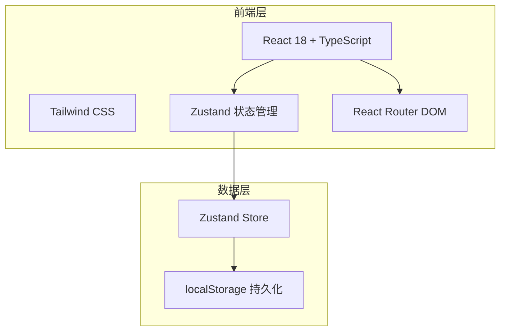
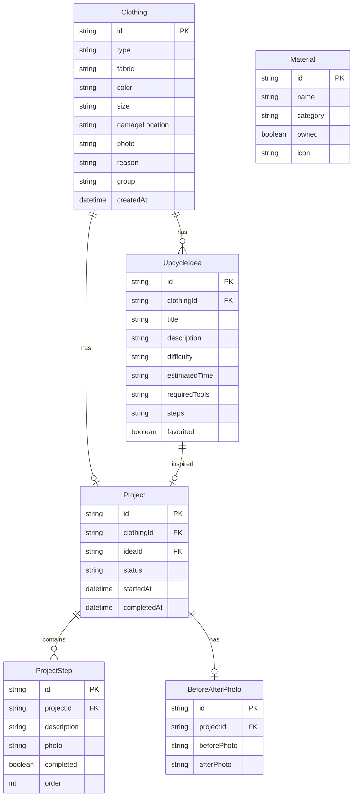

## 1. 架构设计

纯前端架构，无需后端服务。所有数据通过 Zustand 管理状态，并自动持久化到 localStorage。

## 2. 技术说明

- 前端：React@18 + TypeScript + Tailwind CSS@3 + Vite
- 初始化工具：vite-init
- 后端：无（纯前端应用）
- 数据库：无（使用 localStorage 持久化，zustand/middleware 的 persist 中间件）
- 动画库：framer-motion（页面过渡与微交互）

## 3. 路由定义

| 路由 | 用途 |
|------|------|
| / | 灵感首页，分组展示旧衣改造推荐卡片 |
| /register | 旧衣登记页，填写信息并获取推荐 |
| /project/:id | 改造工坊详情页，查看步骤、记录改造、前后照片 |
| /materials | 材料箱页，管理材料清单与缺料提示 |
| /stats | 年度统计页，环保成果可视化 |

## 4. API 定义

无后端 API。所有数据通过 Zustand store 管理，使用 localStorage 持久化。

## 5. 数据模型

### 5.1 数据模型定义

### 5.2 数据定义

**Clothing（旧衣）**
- type: "衬衫" | "牛仔裤" | "毛衣" | "T恤" | "裙子" | "外套"
- fabric: "棉" | "麻" | "丝绸" | "羊毛" | "化纤" | "混纺"
- damageLocation: "领口" | "袖口" | "膝盖" | "拉链" | "纽扣" | "面料磨损" | "无破损"
- group: "easy" | "missing" | "inspiration" (容易改/材料缺/等灵感)

**UpcycleIdea（改造方案）**
- difficulty: "简单" | "中等" | "困难"
- requiredTools: 材料ID数组

**Material（材料）**
- category: "工具" | "辅料" | "布料"
- 预置材料列表：剪刀、针线包、纽扣、拉链、缝纫机、布料胶水、珠针、卷尺、拆线器、织补针、旧布料、蕾丝花边、绣线、热熔胶枪

**推荐规则（前端逻辑）**
- 衬衫 → 围裙、抱枕套、布艺花
- 牛仔裤 → 手提包、短裤、拼布坐垫
- 毛衣 → 抱枕、毛线帽、围脖
- T恤 → 拖把布、购物袋、头带
- 裙子 → 围巾、桌布、布艺蝴蝶结
- 外套 → 野餐垫、宠物窝、拼布毯
